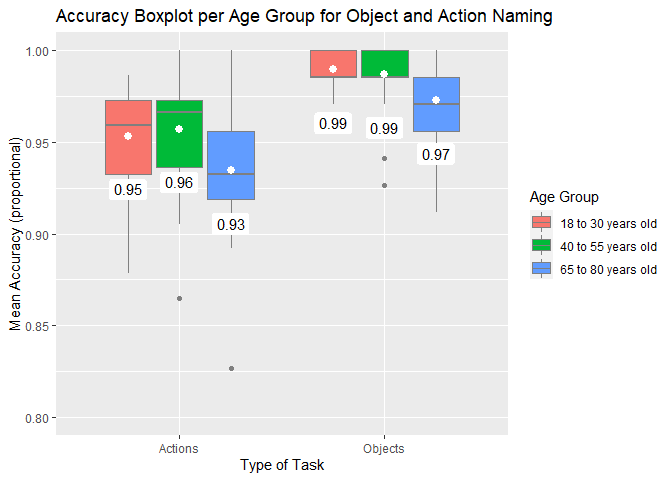
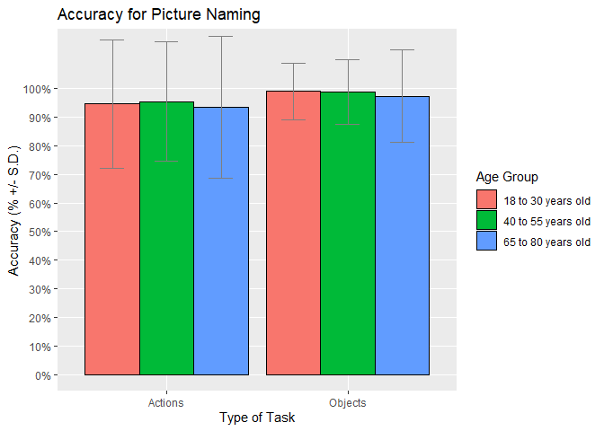
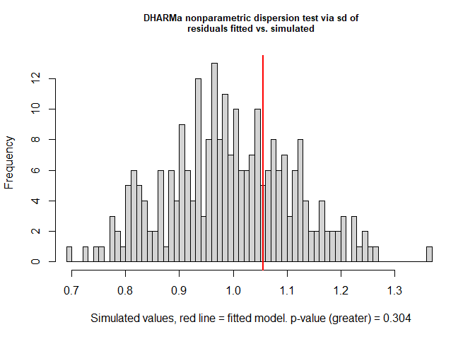
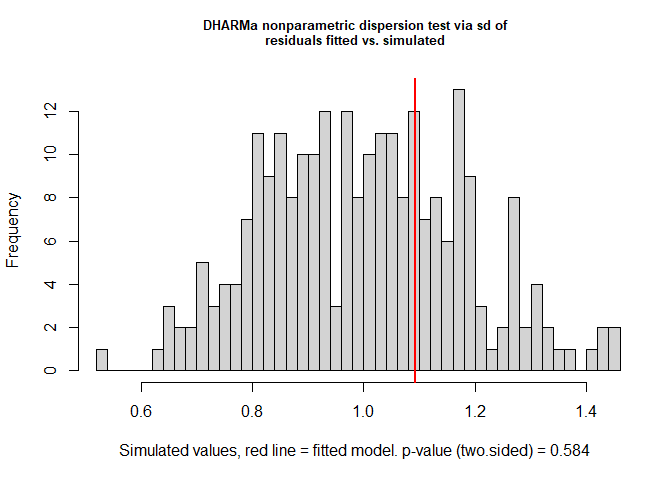
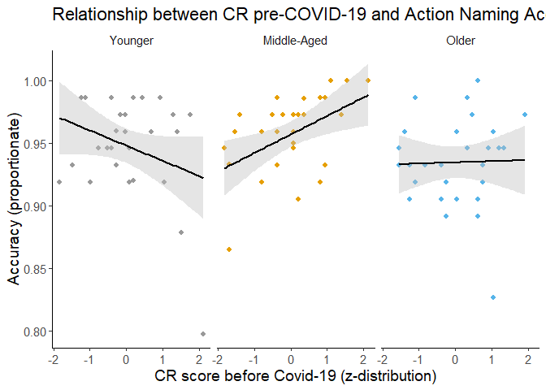
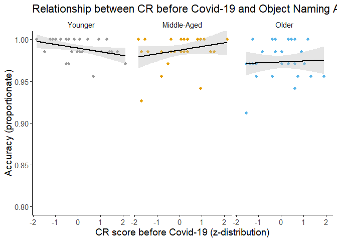

R Code Full Analysis Picture Naming Reaction Times
================
Elise Oosterhuis
Last compiled on 23/12/21

# Analysis Picture Naming Accuracy GBG online study

##### Read in data

``` r
##### Read files ####
PNobjects <- read.csv("../Data/Tidy/PNobjects_complete_final.csv") %>%
  filter(Age.Category !="")

PNactions <- read.csv("../Data/Tidy/PNactions_complete_final.csv") %>%
  filter(Age.Category !="")

# head(PNobjects[1:6,1:4])
# tail(PNobjects[1:6,1:4])
```

## Descriptives

*Mean and standard deviations picture naming tasks*

``` r
options(dplyr.summarise.inform = FALSE) #Suppress summarise message (`summarise()` has grouped output by 'Task.Name', 'Age.Category'. You can override using the `.groups` argument.) in output

# Combine both picture-naming datasets
PN_all <- rbind(PNobjects, PNactions) %>%
  convert(chr(type)) %>%
  #Change task names
  dplyr::mutate(Task.Name=dplyr::recode(Task.Name, 'Picture Naming Task - Actions' 
                                = "Actions", 'Picture Naming Task - Objects' 
                                = "Objects")) %>%
  #Recode age groups as numeric values
  dplyr::mutate(Age.Category=as.factor(dplyr::recode(Age.Category, '18 to 30 years old'=1,
                                    '40 to 55 years old'=2,
                                    '65 to 80 years old'=3)))
  


# Mean and SD (in %) for picture naming - Accuracy
(PNacc_sum <- PN_all %>%
  group_by(Task.Name,Age.Category) %>%
#Obtain mean and standard deviation for reaction time per task (actions and objects     separately) and Age Group
  dplyr::summarise(mean_Acc = round((mean(Acc,na.rm=T)*100),2), #in percentages
            sd_Acc = round((sd(Acc,na.rm = T)*100),2)))  #in percentages
```

    ## # A tibble: 6 x 4
    ## # Groups:   Task.Name [2]
    ##   Task.Name Age.Category mean_Acc sd_Acc
    ##   <chr>     <fct>           <dbl>  <dbl>
    ## 1 Actions   1                94.7   22.4
    ## 2 Actions   2                95.4   20.9
    ## 3 Actions   3                93.5   24.7
    ## 4 Objects   1                99.0   10.0
    ## 5 Objects   2                98.7   11.2
    ## 6 Objects   3                97.3   16.1

``` r
## Save output table as .csv file
# write.csv(PNacc_sum, "./Figures and Tables/Descriptives_PNacc.csv", row.names = F)
```

### Plots for Accuracy

<!-- -->

``` r
# Barplot for Accuracy

# png(file="./Figures and Tables/Barplot_PNacc.png",
# width=600, height=350)

(Barplot_PNacc <-ggplot(PN_all, aes(x=Task.Name, y=Acc, fill=as.factor(Age.Category))) +
  stat_summary(geom="bar", fun=mean, position="dodge", colour="black") +
  geom_errorbar(stat="summary", fun.data = mean_sdl, fun.args = list(mult=1),  
                width=0.4, position=position_dodge(0.9), colour="grey50") +
  coord_cartesian(ylim = c(0,1.15)) +
  scale_y_continuous(labels = scales::label_percent(accuracy = 1L), minor_breaks = seq(0,1,0.1),
                     breaks = seq(0,1,.1)) +
  labs(title = "Accuracy for Picture Naming",
       x="Type of Task",
       y="Accuracy (% +/- S.D.)") +
     scale_fill_discrete(guide=guide_legend(title = "Age Group"), labels=c("18 to 30 years old","40 to 55 years old", "65 to 80 years old"))+
  theme_grey())
```

<!-- -->

``` r
# dev.off()
```

## Statistical Analysis

### Generalised Linear Mixed Models - Action naming

``` r
# Only include trials for action naming (i.e., type==1)
PNactions_Acc <- PN_all %>%
  dplyr::filter(type==1)
  # Check
    # unique(PNactions_Acc$Task.Name) #actions
```

*Should we include random effects for ID and Trial.Number?*

``` r
#Base model with Accuracy as outcome variable. Family binomial.
Mbase_act <- glm(Acc ~ 1, family = "binomial", data=PNactions_Acc)

#Base model with only ID/individual variability as random effect
Mrandom.ID_act <- glmer(Acc ~ 1 +(1|ID) , family = binomial(link="cloglog"), control=glmerControl(optimizer = "bobyqa"), data=PNactions_Acc)
#Base model with only Trial.Number/trial variability as random effect
Mrandom.Trial_act <- glmer(Acc ~ 1 +(1|Trial.Number), family = binomial(link="cloglog"), data=PNactions_Acc)
#Base model with both random effects
Mrandom.All_act <- glmer(Acc ~ 1 +(1|ID) + (1|Trial.Number), family = binomial(link="cloglog"), data=PNactions_Acc)
```

AIC base model

``` r
#Obtain AIC values for each model
(AIC.base <- AIC(logLik(Mbase_act)))
```

    ## [1] 2993.509

AIC - only ID as random effect

``` r
(AIC.reID <- AIC(logLik(Mrandom.ID_act)))
```

    ## [1] 2964.431

AIC - only trial as random effect

``` r
(AIC.reTrial <- AIC(logLik(Mrandom.Trial_act)))
```

    ## [1] 2805.476

AIC - both ID and trial as random effect

``` r
(AIC.reBoth <- AIC(logLik(Mrandom.All_act)))
```

    ## [1] 2771.056

The AIC for the model including both random effects is lowest –&gt; we
justified inclusion of both Trial and Subject as random effects.

*Null model of accuracy for action naming with random effects included*
cloglog was used because accuracy is a binomial variable with a highly
skewed distribution (i.e., more 1’s than 0’s)

``` r
M0_PNactAcc <- lme4::glmer(Acc ~ 1 +(1|ID) + (1|Trial.Number), data=PNactions_Acc, family=binomial(link = "cloglog")) 
summary(M0_PNactAcc)
```

    ## Generalized linear mixed model fit by maximum likelihood (Laplace
    ##   Approximation) [glmerMod]
    ##  Family: binomial  ( cloglog )
    ## Formula: Acc ~ 1 + (1 | ID) + (1 | Trial.Number)
    ##    Data: PNactions_Acc
    ## 
    ##      AIC      BIC   logLik deviance df.resid 
    ##   2771.1   2791.6  -1382.5   2765.1     7033 
    ## 
    ## Scaled residuals: 
    ##     Min      1Q  Median      3Q     Max 
    ## -9.9155  0.1001  0.1699  0.2612  0.6963 
    ## 
    ## Random effects:
    ##  Groups       Name        Variance Std.Dev.
    ##  ID           (Intercept) 0.03682  0.1919  
    ##  Trial.Number (Intercept) 0.13512  0.3676  
    ## Number of obs: 7036, groups:  ID, 90; Trial.Number, 79
    ## 
    ## Fixed effects:
    ##             Estimate Std. Error z value Pr(>|z|)    
    ## (Intercept)  1.25372    0.05396   23.24   <2e-16 ***
    ## ---
    ## Signif. codes:  0 '***' 0.001 '**' 0.01 '*' 0.05 '.' 0.1 ' ' 1

*Unconditional model, i.e., the model without covariates/control
measures*

``` r
Muncond_PNactAcc <- glmer(Acc ~ Age.Category*CR.composite.before + (1|ID)  + (1|Trial.Number), data=PNactions_Acc, family = binomial(link="cloglog"))
```

*Full model, i.e., model with covariates/control measures. RT not
log-transformed*

``` r
Mfull_PNactAcc <- lme4::glmer(Acc ~ Age.Category*CR.composite.before + zSoP.comp + zWM.Score + zStroop.SRC + (1|ID)  + (1|Trial.Number), data=PNactions_Acc, family = binomial(link="cloglog"))
```

    ## Warning in checkConv(attr(opt, "derivs"), opt$par, ctrl = control$checkConv, :
    ## Model failed to converge with max|grad| = 0.0250799 (tol = 0.002, component 1)

### Check model convergence problems

``` r
# Check for singularity issues (often indicates overfitting of the model)
tt <- getME(Mfull_PNactAcc,"theta")
ll <- getME(Mfull_PNactAcc,"lower")
min(tt[ll==0]) 
```

    ## [1] 0.1554364

Value = \~ .16 so singularity seems not to be the problem

``` r
# Restart the model from previous fit
ss <- getME(Mfull_PNactAcc,c("theta","fixef"))

Mfull2_PNactAcc <- update(Mfull_PNactAcc, control=glmerControl(optCtrl=list(maxfun=2e4)), start=ss)
summary(Mfull2_PNactAcc) 
```

    ## Generalized linear mixed model fit by maximum likelihood (Laplace
    ##   Approximation) [glmerMod]
    ##  Family: binomial  ( cloglog )
    ## Formula: Acc ~ Age.Category * CR.composite.before + zSoP.comp + zWM.Score +  
    ##     zStroop.SRC + (1 | ID) + (1 | Trial.Number)
    ##    Data: PNactions_Acc
    ## Control: glmerControl(optCtrl = list(maxfun = 20000))
    ## 
    ##      AIC      BIC   logLik deviance df.resid 
    ##   2768.1   2843.6  -1373.1   2746.1     7025 
    ## 
    ## Scaled residuals: 
    ##     Min      1Q  Median      3Q     Max 
    ## -9.5167  0.0981  0.1690  0.2633  0.6908 
    ## 
    ## Random effects:
    ##  Groups       Name        Variance Std.Dev.
    ##  ID           (Intercept) 0.02412  0.1553  
    ##  Trial.Number (Intercept) 0.13467  0.3670  
    ## Number of obs: 7036, groups:  ID, 90; Trial.Number, 79
    ## 
    ## Fixed effects:
    ##                                   Estimate Std. Error z value Pr(>|z|)    
    ## (Intercept)                        1.27184    0.07085  17.951  < 2e-16 ***
    ## Age.Category2                      0.07876    0.07075   1.113 0.265627    
    ## Age.Category3                     -0.12913    0.08671  -1.489 0.136430    
    ## CR.composite.before               -0.08753    0.04480  -1.954 0.050730 .  
    ## zSoP.comp                          0.02918    0.04901   0.595 0.551546    
    ## zWM.Score                         -0.01990    0.03078  -0.646 0.518033    
    ## zStroop.SRC                       -0.01142    0.03077  -0.371 0.710479    
    ## Age.Category2:CR.composite.before  0.23016    0.06690   3.440 0.000581 ***
    ## Age.Category3:CR.composite.before  0.10186    0.06380   1.597 0.110334    
    ## ---
    ## Signif. codes:  0 '***' 0.001 '**' 0.01 '*' 0.05 '.' 0.1 ' ' 1
    ## 
    ## Correlation of Fixed Effects:
    ##             (Intr) Ag.Ct2 Ag.Ct3 CR.cm. zSP.cm zWM.Sc zS.SRC A.C2:C
    ## Age.Catgry2 -0.550                                                 
    ## Age.Catgry3 -0.631  0.574                                          
    ## CR.cmpst.bf -0.037  0.024  0.033                                   
    ## zSoP.comp    0.365 -0.247 -0.613 -0.056                            
    ## zWM.Score   -0.066  0.052  0.117  0.030 -0.176                     
    ## zStroop.SRC  0.116 -0.214 -0.147  0.108 -0.267 -0.068              
    ## Ag.Ct2:CR..  0.028  0.076 -0.013 -0.672  0.053  0.076 -0.146       
    ## Ag.Ct3:CR..  0.023 -0.002 -0.020 -0.711  0.068 -0.085 -0.148  0.478

Warnings are gone so we proceed with this model (model restarted from
previous fit, with max num of iterations set to 20000)

#### Checking Assumptions GLMER Actions

*The chosen link function is appropriate*

    ## Warning in checkConv(attr(opt, "derivs"), opt$par, ctrl = control$checkConv, :
    ## Model failed to converge with max|grad| = 0.883343 (tol = 0.002, component 1)

    ## [1] 2768.112

    ## [1] 2769.599

The logit link resulted in convergence errors. Hence, we chose for the
cloglog link as it resulted in a better model fit + it’s a better link
for highly skewed binomial distributions. In addition, the AIC value of
the fitted model with the cloglog link is (slightly) lower than that of
the logit one. The lower, the better fit the model.

*Appropriate estimation of variance* (i.e. no over- or underdispersion)

Non-significant p-value so it seems to be ok to approach with this
model.

Using a more formal test with the DHARMa package, which is based on
simulations:

``` r
sim_Mfull2_PNactAcc <- simulateResiduals(fittedModel = Mfull2_PNactAcc)

testDispersion(simulationOutput = sim_Mfull2_PNactAcc, alternative = "greater", plot = TRUE) # "less" to indicate we're testing for underdispersion
```

<!-- -->

    ## 
    ##  DHARMa nonparametric dispersion test via sd of residuals fitted vs.
    ##  simulated
    ## 
    ## data:  simulationOutput
    ## dispersion = 1.061, p-value = 0.304
    ## alternative hypothesis: greater

According to this method, there is no under- or overdispersion (value
close to 1; 1.0564). In general, glmers with binomial data seem to be
under-/overdispersed often but this model fit seems to be ok.
(non-significant p-value)

*Checking variance explained by random factors:*

``` r
0.02412/(0.02412+0.13467) #~15.2% of variance that's left over after the variance explained by our predictor variables is explained by ID (i.e. subject)
```

    ## [1] 0.1518987

``` r
0.13467/(0.02412+0.13467) #~84.8% of variance that's left over after the variance explained by our predictor variables is explained by trial (i.e. stimuli)
```

    ## [1] 0.8481013

### Model comparison Acc action naming

``` r
#Quick overview full model outcome
broom.mixed::glance(M0_PNactAcc)
```

    ## # A tibble: 1 x 6
    ##   sigma logLik   AIC   BIC deviance df.residual
    ##   <dbl>  <dbl> <dbl> <dbl>    <dbl>       <int>
    ## 1     1 -1383. 2771. 2792.    2468.        7033

``` r
broom.mixed::glance(Mfull2_PNactAcc)
```

    ## # A tibble: 1 x 6
    ##   sigma logLik   AIC   BIC deviance df.residual
    ##   <dbl>  <dbl> <dbl> <dbl>    <dbl>       <int>
    ## 1     1 -1373. 2768. 2844.    2476.        7025

``` r
#AIC null model = 2771.056; AIC full model = 2768.112 --> the full model fits the data slightly better than the null model

#Tidy model summary
(tidyMfull2_PNactAcc <- broom.mixed::tidy(Mfull2_PNactAcc, effects = "fixed", conf.int=T, conf.level=0.95))
```

    ## # A tibble: 9 x 8
    ##   effect term           estimate std.error statistic  p.value conf.low conf.high
    ##   <chr>  <chr>             <dbl>     <dbl>     <dbl>    <dbl>    <dbl>     <dbl>
    ## 1 fixed  (Intercept)      1.27      0.0709    18.0   4.72e-72   1.13    1.41    
    ## 2 fixed  Age.Category2    0.0788    0.0708     1.11  2.66e- 1  -0.0599  0.217   
    ## 3 fixed  Age.Category3   -0.129     0.0867    -1.49  1.36e- 1  -0.299   0.0408  
    ## 4 fixed  CR.composite.~  -0.0875    0.0448    -1.95  5.07e- 2  -0.175   0.000278
    ## 5 fixed  zSoP.comp        0.0292    0.0490     0.595 5.52e- 1  -0.0669  0.125   
    ## 6 fixed  zWM.Score       -0.0199    0.0308    -0.646 5.18e- 1  -0.0802  0.0404  
    ## 7 fixed  zStroop.SRC     -0.0114    0.0308    -0.371 7.10e- 1  -0.0717  0.0489  
    ## 8 fixed  Age.Category2~   0.230     0.0669     3.44  5.81e- 4   0.0990  0.361   
    ## 9 fixed  Age.Category3~   0.102     0.0638     1.60  1.10e- 1  -0.0232  0.227

``` r
## Write tidy table to .csv file
# write.csv(tidyMfull2_PNactAcc, "./Figures and Tables/PNactAcc_glmerFull.csv", row.names = F)
```

*Concordance and Somer’s D to assess predictive performance of the
model*

``` r
# Calculate probability of fitted effects full model
probs.PNactAcc = binomial()$linkinv(fitted(Mfull2_PNactAcc))
# Calculate Concordance Somer's D
somers2(probs.PNactAcc, as.numeric(PNactions_Acc$Acc))
```

    ##            C          Dxy            n      Missing 
    ##    0.8239737    0.6479473 7036.0000000    0.0000000

Concordance = .824 –&gt; When C takes the value 0.5, the predictions are
random, when it is 1, prediction is perfect. A value above 0.8 indicates
that the model may have some real predictive capacity (Baayen 2008,
204). Somer’s D = .648 –&gt; Predicted probabilities and observed
responses ranges between 0 (randomness) and 1 (perfect prediction). The
value should be higher than .5 for the model to be meaningful (Baayen,
2008; p.204)

The larger the values, the better the predictive performance of the
model. The values for Concordance and Somer’s D seem to indicate that
the model has some meaningful predictive power.

*Effect Size - R squared*

``` r
MuMIn::r.squaredGLMM(object = Mfull2_PNactAcc, null=Mrandom.All_act)
```

    ## Warning: 'r.squaredGLMM' now calculates a revised statistic. See the help page.

    ##                     R2m        R2c
    ## theoretical 0.008543553 0.09582954
    ## delta       0.005928826 0.06650122

Marginal R2(R2m) is the variance explained by fixed effects. Conditional
R2 (R2c) is the variance explained by the whole model. Theoretical is
for binomial distributions.

0.85% of the variance in the data is explained by the fixed effects
only. 9.6% of the variance is explained by the whole model.

From: <https://www.investopedia.com/terms/r/r-squared.asp> R-squared
will give you an estimate of the relationship between movements of a
dependent variable based on an independent variable’s movements. It
doesn’t tell you whether your chosen model is good or bad, nor will it
tell you whether the data and predictions are biased. A high or low
R-square isn’t necessarily good or bad, as it doesn’t convey the
reliability of the model, nor whether you’ve chosen the right
regression. You can get a low R-squared for a good model, or a high
R-square for a poorly fitted model, and vice versa.

### Generalised Linear Mixed Models - Object naming

``` r
PNobjects_Acc <- PN_all %>%
  # Only include trials for object naming (i.e., type==2)
  dplyr::filter(type==2)
  # Check
    # unique(PNobjects_Acc$Task.Name) #objects
```

*Should we include random effects for ID and Trial.Number?*

``` r
#Base model with Accuracy as outcome variable. Family = binomial
Mbase_obj <- glm(Acc ~ 1, family = "binomial", data=PNobjects_Acc)

#Base model with only ID/individual variability as random effect
Mrandom.ID_obj <- glmer(Acc ~ 1 +(1|ID) , family = binomial(link="cloglog"), control=glmerControl(optimizer = "bobyqa"), data=PNobjects_Acc)
#Base model with only Trial.Number/trial variability as random effect
Mrandom.Trial_obj <- glmer(Acc ~ 1 +(1|Trial.Number), family = binomial(link="cloglog"), control=glmerControl(optimizer = "bobyqa"), data=PNobjects_Acc)
#Base model with both random effects
Mrandom.All_obj <- glmer(Acc ~ 1 +(1|ID) + (1|Trial.Number), family = binomial(link="cloglog"), data=PNobjects_Acc)
```

AIC base model

``` r
#Obtain AIC values for each model
(AIC.base_obj <- AIC(logLik(Mbase_obj)))
```

    ## [1] 1091.77

AIC - only ID as random effect

``` r
(AIC.reID_obj <- AIC(logLik(Mrandom.ID_obj)))
```

    ## [1] 1085.729

AIC - only trial as random effect

``` r
(AIC.reTrial_obj <- AIC(logLik(Mrandom.Trial_obj)))
```

    ## [1] 1039.468

AIC - both ID and trial as random effect

``` r
(AIC.reBoth_obj <- AIC(logLik(Mrandom.All_obj)))
```

    ## [1] 1033.103

The AIC for the model including both random effects is lowest –&gt; we
justified inclusion of both Trial and Subject as random effects.

*Null model of reaction times for object naming with random effects
included*

``` r
# Null model
M0_PNobjAcc <- lme4::glmer(Acc ~ 1 +(1|ID) + (1|Trial.Number), data=PNobjects_Acc, family=binomial(link = "cloglog"))
summary(M0_PNobjAcc)
```

    ## Generalized linear mixed model fit by maximum likelihood (Laplace
    ##   Approximation) [glmerMod]
    ##  Family: binomial  ( cloglog )
    ## Formula: Acc ~ 1 + (1 | ID) + (1 | Trial.Number)
    ##    Data: PNobjects_Acc
    ## 
    ##      AIC      BIC   logLik deviance df.resid 
    ##   1033.1   1053.4   -513.6   1027.1     6458 
    ## 
    ## Scaled residuals: 
    ##      Min       1Q   Median       3Q      Max 
    ## -10.1421   0.0516   0.0760   0.1249   0.4293 
    ## 
    ## Random effects:
    ##  Groups       Name        Variance Std.Dev.
    ##  ID           (Intercept) 0.03303  0.1818  
    ##  Trial.Number (Intercept) 0.09644  0.3105  
    ## Number of obs: 6461, groups:  ID, 90; Trial.Number, 70
    ## 
    ## Fixed effects:
    ##             Estimate Std. Error z value Pr(>|z|)    
    ## (Intercept)  1.62511    0.06902   23.55   <2e-16 ***
    ## ---
    ## Signif. codes:  0 '***' 0.001 '**' 0.01 '*' 0.05 '.' 0.1 ' ' 1

*Unconditional model, i.e., the model without covariates/control
measures*

``` r
#Model without covariates
Muncond_PNobjAcc <- glmer(Acc ~ Age.Category*CR.composite.before + (1|ID)  + (1|Trial.Number), data=PNobjects_Acc, family=binomial(link = "cloglog"))
```

*Full model, i.e., model with covariates/control measures*

``` r
Mfull_PNobjAcc <- lme4::glmer(Acc ~ Age.Category*CR.composite.before + zSoP.comp + zWM.Score + zStroop.SRC + (1|ID)  + (1|Trial.Number), data=PNobjects_Acc, family = binomial(link="cloglog"))
```

    ## Warning in checkConv(attr(opt, "derivs"), opt$par, ctrl = control$checkConv, :
    ## Model failed to converge with max|grad| = 0.0410549 (tol = 0.002, component 1)

``` r
# summary(Mfull_PNobjAcc)
```

### Check model convergence problems

``` r
# Checking for singularity problems
tt <- getME(Mfull_PNobjAcc,"theta")
ll <- getME(Mfull_PNobjAcc,"lower")
min(tt[ll==0]) 
```

    ## [1] 0.1204527

Value = \~ .12 so singularity seems not to be problem

``` r
# Restart from previous fit
ss_obj <- getME(Mfull_PNobjAcc,c("theta","fixef"))

Mfull2_PNobjAcc <- update(Mfull_PNobjAcc, control=glmerControl(optCtrl=list(maxfun=2e4)), start=ss_obj)
# summary(Mfull2_PNobjAcc) #Warnings gone

##Create a tidy output table for the fixed effects
(tidyMfull_PNobjacc <- broom.mixed::tidy(Mfull2_PNobjAcc, effect = "fixed",conf.int=T, conf.level=0.95))
```

    ## # A tibble: 9 x 8
    ##   effect term           estimate std.error statistic  p.value conf.low conf.high
    ##   <chr>  <chr>             <dbl>     <dbl>     <dbl>    <dbl>    <dbl>     <dbl>
    ## 1 fixed  (Intercept)      1.77      0.0941    18.8   8.64e-79  1.58     1.95    
    ## 2 fixed  Age.Category2   -0.0975    0.0909    -1.07  2.84e- 1 -0.276    0.0808  
    ## 3 fixed  Age.Category3   -0.330     0.105     -3.16  1.59e- 3 -0.535   -0.125   
    ## 4 fixed  CR.composite.~  -0.120     0.0607    -1.97  4.87e- 2 -0.238   -0.000673
    ## 5 fixed  zSoP.comp        0.0453    0.0585     0.774 4.39e- 1 -0.0693   0.160   
    ## 6 fixed  zWM.Score        0.0640    0.0362     1.77  7.70e- 2 -0.00692  0.135   
    ## 7 fixed  zStroop.SRC     -0.0104    0.0369    -0.283 7.77e- 1 -0.0828   0.0619  
    ## 8 fixed  Age.Category2~   0.208     0.0837     2.49  1.29e- 2  0.0440   0.372   
    ## 9 fixed  Age.Category3~   0.116     0.0777     1.49  1.37e- 1 -0.0366   0.268

Warnings are gone so we proceed with this model (model restarted from
previous fit, with max num of iterations set to 20000)

### Checking Assumptions GLMER

*The chosen link function is appropriate*

    ## Warning in checkConv(attr(opt, "derivs"), opt$par, ctrl = control$checkConv, :
    ## Model failed to converge with max|grad| = 1.86687 (tol = 0.002, component 1)

    ## [1] 1027.17

    ## [1] 1023.53

The logit link resulted in convergence errors. Hence, we chose for the
cloglog link as it resulted in a better model fit + it’s a better link
for highly skewed binomial distributions.

*Appropriate estimation of variance* (i.e. no over- or underdispersion)

``` r
# Function to calculate overdispersion of residuals
overdisp_fun <- function(model) {
     rdf <- df.residual(model)
     rp <- residuals(model,type="pearson")
     Pearson.chisq <- sum(rp^2)
     prat <- Pearson.chisq/rdf
     pval <- pchisq(Pearson.chisq, df=rdf, lower.tail=FALSE)
     c(chisq=Pearson.chisq,ratio=prat,rdf=rdf,p=pval)
}

overdisp_fun(Mfull2_PNobjAcc)
```

    ##        chisq        ratio          rdf            p 
    ## 3734.8088316    0.5790401 6450.0000000    1.0000000

P value is non-significant so we don’t assume overdispersion

Using a more formal test with the DHARMa package, which is based on
simulations:

``` r
sim_Mfull2_PNobjAcc <- simulateResiduals(fittedModel = Mfull2_PNobjAcc)

testDispersion(simulationOutput = sim_Mfull2_PNobjAcc,  plot = TRUE) #two sided (both under- and over dispersion)
```

<!-- -->

    ## 
    ##  DHARMa nonparametric dispersion test via sd of residuals fitted vs.
    ##  simulated
    ## 
    ## data:  simulationOutput
    ## dispersion = 1.0968, p-value = 0.584
    ## alternative hypothesis: two.sided

According to this method, there is no over- or underdispersion (value
close to 1; 1.0822). This model fit seems to be ok.

*Checking variance explained by random factors:*

``` r
0.01453/(0.01453+0.09485) #~13.3% of variance that's left over after the variance explained by our predictor variables is explained by ID (i.e. subject)
```

    ## [1] 0.1328396

``` r
0.09485/(0.01453+0.09485) #~86.7% of variance that's left over after the variance explained by our predictor variables is explained by trial (i.e. stimuli)
```

    ## [1] 0.8671604

### Model comparison Acc object naming

``` r
#Quick overview full model outcome
broom.mixed::glance(M0_PNobjAcc) #AIC null model = 1033.103 
```

    ## # A tibble: 1 x 6
    ##   sigma logLik   AIC   BIC deviance df.residual
    ##   <dbl>  <dbl> <dbl> <dbl>    <dbl>       <int>
    ## 1     1  -514. 1033. 1053.     859.        6458

``` r
broom.mixed::glance(Mfull2_PNobjAcc) #AIC full model = 1027.17
```

    ## # A tibble: 1 x 6
    ##   sigma logLik   AIC   BIC deviance df.residual
    ##   <dbl>  <dbl> <dbl> <dbl>    <dbl>       <int>
    ## 1     1  -503. 1027. 1102.     868.        6450

``` r
# The full model fits the data better than the null model

#Tidy model summary
(tidyMfull2_PNobjAcc <- broom.mixed::tidy(Mfull2_PNobjAcc, effects = "fixed", conf.int=T, conf.level=0.95))
```

    ## # A tibble: 9 x 8
    ##   effect term           estimate std.error statistic  p.value conf.low conf.high
    ##   <chr>  <chr>             <dbl>     <dbl>     <dbl>    <dbl>    <dbl>     <dbl>
    ## 1 fixed  (Intercept)      1.77      0.0941    18.8   8.64e-79  1.58     1.95    
    ## 2 fixed  Age.Category2   -0.0975    0.0909    -1.07  2.84e- 1 -0.276    0.0808  
    ## 3 fixed  Age.Category3   -0.330     0.105     -3.16  1.59e- 3 -0.535   -0.125   
    ## 4 fixed  CR.composite.~  -0.120     0.0607    -1.97  4.87e- 2 -0.238   -0.000673
    ## 5 fixed  zSoP.comp        0.0453    0.0585     0.774 4.39e- 1 -0.0693   0.160   
    ## 6 fixed  zWM.Score        0.0640    0.0362     1.77  7.70e- 2 -0.00692  0.135   
    ## 7 fixed  zStroop.SRC     -0.0104    0.0369    -0.283 7.77e- 1 -0.0828   0.0619  
    ## 8 fixed  Age.Category2~   0.208     0.0837     2.49  1.29e- 2  0.0440   0.372   
    ## 9 fixed  Age.Category3~   0.116     0.0777     1.49  1.37e- 1 -0.0366   0.268

``` r
## Write tidy table to .csv file
# write.csv(tidyMfull2_PNobjAcc, "./Figures and Tables/PNobjAcc_glmerFull.csv", row.names = F)
```

*Concordance and Somer’s D to assess predictive performance of the
model*

``` r
# Calculate probability of fitted effects full model
probs.PNobjAcc = binomial()$linkinv(fitted(Mfull2_PNobjAcc))
# Calculate Concordance Somer's D
somers2(probs.PNobjAcc, as.numeric(PNobjects_Acc$Acc))
```

    ##            C          Dxy            n      Missing 
    ##    0.8821678    0.7643357 6461.0000000    0.0000000

Concordance = .882 –&gt; When C takes the value 0.5, the predictions are
random, when it is 1, prediction is perfect. A value above 0.8 indicates
that the model may have some real predictive capacity (Baayen 2008,
204). Somer’s D = .764 –&gt; Predicted probabilities and observed
responses ranges between 0 (randomness) and 1 (perfect prediction). The
value should be higher than .5 for the model to be meaningful (Baayen,
2008; p.204)

The larger the values, the better the predictive performance of the
model.

*Effect Size - R squared*

``` r
MuMIn::r.squaredGLMM(object = Mfull2_PNobjAcc, null=Mrandom.All_obj)
```

    ##                     R2m        R2c
    ## theoretical 0.013375664 0.07489081
    ## delta       0.004260014 0.02385197

Marginal R2 is the variance explained by fixed effects. Conditional R2
is the variance explained by the whole model. Theoretical is for
binomial distributions.

1.34% of the variance in the data is explained by the fixed effects
only. 7.5% of the variance is explained by the whole model.

## Visualising significant predictors

``` r
#Create labels for legend per age group
Ages = as_labeller(c(`1`="Younger", `2`="Middle-Aged", `3`="Older"))

#Colour Palette - colourblind friendly
cbbPalette <- c("#999999", "#E69F00", "#56B4E9")
```

``` r
# Create means per participant for Acc and CR Action Naming
meanAcc_act <- PNactions_Acc %>%
  group_by(Age.Category, ID) %>%
  summarise(meanAcc = mean(Acc, na.rm=T),
            CR = mean(CR.composite.before))

# png(file="./Figures and Tables/RelationCR-PNactAcc.png",
# width=600, height=350)

#Relationship Acc and CR pre-pandemic of picture naming Actions
(plot.PNactACC_CR <- ggplot(meanAcc_act, aes(x=CR, y=meanAcc, colour=as.factor(Age.Category))) +
    geom_point(width = 0.25, size=1.8, show.legend = F) +
   geom_smooth(method = "glm", formula = y~x, fill="grey", colour="black", show.legend = F) +
   labs(x = "CR score before Covid-19 (z-distribution)",
        y= "Accuracy (proportionate)",
        title = "Relationship between CR pre-COVID-19 and Action Naming Accuracy") +
   scale_x_continuous(breaks = seq(-3, 3, 1)) +
   facet_grid(~Age.Category, labeller=labeller(Age.Category=Ages)) +   
    theme(text = element_text(size = 14),
          panel.background  = element_rect(fill="white"),
          plot.background = element_rect(fill = "white"),
          strip.background = element_rect(fill="white"),
          axis.line.x = element_line(color="black"),
         axis.line.y = element_line(color="black")) +
         scale_colour_manual(values = cbbPalette))
```

<!-- -->

``` r
# dev.off()
```

``` r
# Create means per participant for Acc and CR Object Naming
meanAcc_obj <- PNobjects_Acc %>%
  group_by(Age.Category, ID) %>%
  summarise(meanAcc = mean(Acc, na.rm=T),
            CR = mean(CR.composite.before))

# png(file="./Figures and Tables/RelationCR-PNobjAcc.png",
# width=600, height=350)

#Relationship Acc and CR pre-pandemic of picture naming Objects
(plot.PNobjACC_CR <- ggplot(meanAcc_obj, aes(x=CR, y=meanAcc, colour=as.factor(Age.Category))) +
   geom_point(width = 0.25, size=1.8, show.legend = F) +
   geom_smooth(method = "glm", formula = y~x, fill="grey", colour="black", show.legend = F) +
   labs(x = "CR score before Covid-19 (z-distribution)",
        y= "Accuracy (proportionate)",
        title = "Relationship between CR before Covid-19 and Object Naming Accuracy") +
   coord_cartesian(ylim = c(0.8,1)) +
   facet_grid(~Age.Category, labeller=labeller(Age.Category=Ages))+
        theme(text = element_text(size = 14),
          panel.background  = element_rect(fill="white"),
          plot.background = element_rect(fill = "white"),
          strip.background = element_rect(fill="white"),
          axis.line.x = element_line(color="black"),
         axis.line.y = element_line(color="black")) +
         scale_colour_manual(values = cbbPalette))
```

<!-- -->

``` r
# dev.off()
```

### Model comparisons for the CR measure preciding and coinciding with the COVID-19 pandemic

The effect of the COVID-19 pandemic on CR and subsequent behavioural
performance

``` r
# Action Naming
Mfull_PNactAcc.during <- lme4::glmer(Acc ~ Age.Category*CR.composite.during + zSoP.comp + zWM.Score + zStroop.SRC + (1|ID)  + (1|Trial.Number), data=PNactions_Acc, family = binomial(link="cloglog"))
```

No convergence errors (as opposed to the model with the CR before
composite score). To be able to compare the models better, we will
restart the model as done with the model that has the CR composite
before as predictor

tt.during &lt;- getME(Mfull\_PNactAcc.during,“theta”) ll.during &lt;-
getME(Mfull\_PNactAcc.during,“lower”) min(tt.during\[ll==0\]) \# \~ .174
so singularity is not a problems

``` r
# Restart from previous fit
ss_act.during <- getME(Mfull_PNactAcc.during,c("theta","fixef"))

Mfull2_PNactAcc.during <- update(Mfull_PNactAcc.during, control=glmerControl(optCtrl=list(maxfun=2e4)), start=ss_act.during) #convergence errors
```

The significant predictive effect of CR has disappeared. That is, the CR
composite during Covid does not significantly predict Accuracy for
Action naming

``` r
#Comparing the models
anova(Mfull2_PNactAcc, Mfull2_PNactAcc.during)
```

    ## Data: PNactions_Acc
    ## Models:
    ## Mfull2_PNactAcc: Acc ~ Age.Category * CR.composite.before + zSoP.comp + zWM.Score + 
    ## Mfull2_PNactAcc:     zStroop.SRC + (1 | ID) + (1 | Trial.Number)
    ## Mfull2_PNactAcc.during: Acc ~ Age.Category * CR.composite.during + zSoP.comp + zWM.Score + 
    ## Mfull2_PNactAcc.during:     zStroop.SRC + (1 | ID) + (1 | Trial.Number)
    ##                        npar    AIC    BIC  logLik deviance Chisq Df Pr(>Chisq)
    ## Mfull2_PNactAcc          11 2768.1 2843.6 -1373.1   2746.1                    
    ## Mfull2_PNactAcc.during   11 2777.3 2852.7 -1377.6   2755.3     0  0

There are barely any differences between the two models. The AIC is a
tiny bit lower for the CR composite score before the pandemic, meaning
that that model fits the data slightly better. This model is also the
one with the significant effect of CR.

``` r
# Object Naming
Mfull_PNobjAcc.during <- lme4::glmer(Acc ~ Age.Category*CR.composite.during + zSoP.comp + zWM.Score + zStroop.SRC + (1|ID)  + (1|Trial.Number), data=PNobjects_Acc, family = binomial(link="cloglog")) #convergence errors
```

    ## Warning in checkConv(attr(opt, "derivs"), opt$par, ctrl = control$checkConv, :
    ## Model failed to converge with max|grad| = 0.166524 (tol = 0.002, component 1)

``` r
tt.during <- getME(Mfull_PNobjAcc.during,"theta")
ll.during <- getME(Mfull_PNobjAcc.during,"lower")
min(tt.during[ll==0]) # ~ .443 so singularity is not a problems
```

    ## [1] 0.1262563

``` r
# Restart from previous fit
ss_obj.during <- getME(Mfull_PNobjAcc.during,c("theta","fixef"))

Mfull2_PNobjAcc.during <- update(Mfull_PNobjAcc.during, control=glmerControl(optCtrl=list(maxfun=2e4)), start=ss_obj.during)
```

    ## Warning in checkConv(attr(opt, "derivs"), opt$par, ctrl = control$checkConv, :
    ## Model failed to converge with max|grad| = 0.00343985 (tol = 0.002, component 1)

Again convergence errors. Let’s try different optimizer.

``` r
Mfull3_PNobjAcc.during <- update(Mfull2_PNobjAcc.during, control=glmerControl(optimizer = "bobyqa"))
# summary(Mfull3_PNobjAcc.during)
```

Warnings are gone

``` r
anova(Mfull2_PNobjAcc, Mfull3_PNobjAcc.during)
```

    ## Data: PNobjects_Acc
    ## Models:
    ## Mfull2_PNobjAcc: Acc ~ Age.Category * CR.composite.before + zSoP.comp + zWM.Score + 
    ## Mfull2_PNobjAcc:     zStroop.SRC + (1 | ID) + (1 | Trial.Number)
    ## Mfull3_PNobjAcc.during: Acc ~ Age.Category * CR.composite.during + zSoP.comp + zWM.Score + 
    ## Mfull3_PNobjAcc.during:     zStroop.SRC + (1 | ID) + (1 | Trial.Number)
    ##                        npar    AIC    BIC  logLik deviance Chisq Df Pr(>Chisq)
    ## Mfull2_PNobjAcc          11 1027.2 1101.7 -502.59   1005.2                    
    ## Mfull3_PNobjAcc.during   11 1030.9 1105.4 -504.43   1008.9     0  0

There are barely any differences between the two models. The AIC is a
bit lower for the CR composite score before the pandemic, meaning that
that model fits the data slightly better. In the model with CR during,
the interaction term between CR score and being a middle-aged adult has
also disappeared.

## References

<div id="refs" class="references csl-bib-body hanging-indent">

<div id="ref-BaayenHarald2008ALDA" class="csl-entry">

Baayen, Harald. 2008. *Analyzing Linguistic Data: A Practical
Introduction to Statistics Using r*. Cambridge: Cambridge University
Press.

</div>

<div id="ref-R-MuMIn" class="csl-entry">

Barton, Kamil. 2020. *MuMIn: Multi-Model Inference*.
<https://CRAN.R-project.org/package=MuMIn>.

</div>

<div id="ref-R-Matrix" class="csl-entry">

Bates, Douglas, and Martin Maechler. 2019. *Matrix: Sparse and Dense
Matrix Classes and Methods*. <http://Matrix.R-forge.R-project.org/>.

</div>

<div id="ref-R-lme4" class="csl-entry">

Bates, Douglas, Martin Maechler, Ben Bolker, and Steven Walker. 2020.
*Lme4: Linear Mixed-Effects Models Using Eigen and S4*.
<https://github.com/lme4/lme4/>.

</div>

<div id="ref-lme42015" class="csl-entry">

Bates, Douglas, Martin Mächler, Ben Bolker, and Steve Walker. 2015.
“Fitting Linear Mixed-Effects Models Using <span
class="nocase">lme4</span>.” *Journal of Statistical Software* 67 (1):
1–48. <https://doi.org/10.18637/jss.v067.i01>.

</div>

<div id="ref-R-rio" class="csl-entry">

Chan, Chung-hong, and Thomas J. Leeper. 2021. *Rio: A Swiss-Army Knife
for Data i/o*. <https://github.com/leeper/rio>.

</div>

<div id="ref-fernando_2021" class="csl-entry">

Fernando, Jason. 2021. “What Is r-Squared?” *Investopedia*.
Investopedia. <https://www.investopedia.com/terms/r/r-squared.asp>.

</div>

<div id="ref-car2019" class="csl-entry">

Fox, John, and Sanford Weisberg. 2019. *An R Companion to Applied
Regression*. Third. Thousand Oaks CA: Sage.
<https://socialsciences.mcmaster.ca/jfox/Books/Companion/>.

</div>

<div id="ref-R-carData" class="csl-entry">

Fox, John, Sanford Weisberg, and Brad Price. 2020. *carData: Companion
to Applied Regression Data Sets*.
<https://CRAN.R-project.org/package=carData>.

</div>

<div id="ref-R-car" class="csl-entry">

———. 2021. *Car: Companion to Applied Regression*.
<https://CRAN.R-project.org/package=car>.

</div>

<div id="ref-R-Hmisc" class="csl-entry">

Harrell, Frank E, Jr. 2021. *Hmisc: Harrell Miscellaneous*.
<https://CRAN.R-project.org/package=Hmisc>.

</div>

<div id="ref-R-DHARMa" class="csl-entry">

Hartig, Florian. 2021. *DHARMa: Residual Diagnostics for Hierarchical
(Multi-Level / Mixed) Regression Models*.
<http://florianhartig.github.io/DHARMa/>.

</div>

<div id="ref-R-purrr" class="csl-entry">

Henry, Lionel, and Hadley Wickham. 2020. *Purrr: Functional Programming
Tools*. <https://CRAN.R-project.org/package=purrr>.

</div>

<div id="ref-R-fs" class="csl-entry">

Hester, Jim, and Hadley Wickham. 2020. *Fs: Cross-Platform File System
Operations Based on Libuv*. <https://CRAN.R-project.org/package=fs>.

</div>

<div id="ref-lmerTest2017" class="csl-entry">

Kuznetsova, Alexandra, Per B. Brockhoff, and Rune H. B. Christensen.
2017. “<span class="nocase">lmerTest</span> Package: Tests in Linear
Mixed Effects Models.” *Journal of Statistical Software* 82 (13): 1–26.
<https://doi.org/10.18637/jss.v082.i13>.

</div>

<div id="ref-R-lmerTest" class="csl-entry">

Kuznetsova, Alexandra, Per Bruun Brockhoff, and Rune Haubo Bojesen
Christensen. 2020. *lmerTest: Tests in Linear Mixed Effects Models*.
<https://github.com/runehaubo/lmerTestR>.

</div>

<div id="ref-performance2021" class="csl-entry">

Lüdecke, Daniel, Mattan S. Ben-Shachar, Indrajeet Patil, Philip
Waggoner, and Dominique Makowski. 2021. “<span
class="nocase">performance</span>: An R Package for Assessment,
Comparison and Testing of Statistical Models.” *Journal of Open Source
Software* 6 (60): 3139. <https://doi.org/10.21105/joss.03139>.

</div>

<div id="ref-R-performance" class="csl-entry">

Lüdecke, Daniel, Dominique Makowski, Mattan S. Ben-Shachar, Indrajeet
Patil, Philip Waggoner, and Brenton M. Wiernik. 2021. *Performance:
Assessment of Regression Models Performance*.
<https://easystats.github.io/performance/>.

</div>

<div id="ref-R-e1071" class="csl-entry">

Meyer, David, Evgenia Dimitriadou, Kurt Hornik, Andreas Weingessel, and
Friedrich Leisch. 2021. *E1071: Misc Functions of the Department of
Statistics, Probability Theory Group (Formerly: E1071), TU Wien*.
<https://CRAN.R-project.org/package=e1071>.

</div>

<div id="ref-R-tibble" class="csl-entry">

Müller, Kirill, and Hadley Wickham. 2021. *Tibble: Simple Data Frames*.
<https://CRAN.R-project.org/package=tibble>.

</div>

<div id="ref-R-base" class="csl-entry">

R Core Team. 2020. *R: A Language and Environment for Statistical
Computing*. Vienna, Austria: R Foundation for Statistical Computing.
<https://www.R-project.org/>.

</div>

<div id="ref-R-broom" class="csl-entry">

Robinson, David, Alex Hayes, and Simon Couch. 2021. *Broom: Convert
Statistical Objects into Tidy Tibbles*.
<https://CRAN.R-project.org/package=broom>.

</div>

<div id="ref-lattice2008" class="csl-entry">

Sarkar, Deepayan. 2008. *Lattice: Multivariate Data Visualization with
r*. New York: Springer. <http://lmdvr.r-forge.r-project.org>.

</div>

<div id="ref-R-lattice" class="csl-entry">

———. 2021. *Lattice: Trellis Graphics for r*.
<http://lattice.r-forge.r-project.org/>.

</div>

<div id="ref-R-hablar" class="csl-entry">

Sjoberg, David. 2020. *Hablar: Non-Astonishing Results in r*.
<https://davidsjoberg.github.io/>.

</div>

<div id="ref-survival-book" class="csl-entry">

Terry M. Therneau, and Patricia M. Grambsch. 2000. *Modeling Survival
Data: Extending the Cox Model*. New York: Springer.

</div>

<div id="ref-R-survival" class="csl-entry">

Therneau, Terry M. 2021. *Survival: Survival Analysis*.
<https://github.com/therneau/survival>.

</div>

<div id="ref-ggplot22016" class="csl-entry">

Wickham, Hadley. 2016. *Ggplot2: Elegant Graphics for Data Analysis*.
Springer-Verlag New York. <https://ggplot2.tidyverse.org>.

</div>

<div id="ref-R-stringr" class="csl-entry">

———. 2019. *Stringr: Simple, Consistent Wrappers for Common String
Operations*. <https://CRAN.R-project.org/package=stringr>.

</div>

<div id="ref-R-forcats" class="csl-entry">

———. 2021a. *Forcats: Tools for Working with Categorical Variables
(Factors)*. <https://CRAN.R-project.org/package=forcats>.

</div>

<div id="ref-R-tidyr" class="csl-entry">

———. 2021b. *Tidyr: Tidy Messy Data*.
<https://CRAN.R-project.org/package=tidyr>.

</div>

<div id="ref-R-tidyverse" class="csl-entry">

———. 2021c. *Tidyverse: Easily Install and Load the Tidyverse*.
<https://CRAN.R-project.org/package=tidyverse>.

</div>

<div id="ref-tidyverse2019" class="csl-entry">

Wickham, Hadley, Mara Averick, Jennifer Bryan, Winston Chang, Lucy
D’Agostino McGowan, Romain François, Garrett Grolemund, et al. 2019.
“Welcome to the <span class="nocase">tidyverse</span>.” *Journal of Open
Source Software* 4 (43): 1686. <https://doi.org/10.21105/joss.01686>.

</div>

<div id="ref-R-readxl" class="csl-entry">

Wickham, Hadley, and Jennifer Bryan. 2019. *Readxl: Read Excel Files*.
<https://CRAN.R-project.org/package=readxl>.

</div>

<div id="ref-R-ggplot2" class="csl-entry">

Wickham, Hadley, Winston Chang, Lionel Henry, Thomas Lin Pedersen,
Kohske Takahashi, Claus Wilke, Kara Woo, Hiroaki Yutani, and Dewey
Dunnington. 2021. *Ggplot2: Create Elegant Data Visualisations Using the
Grammar of Graphics*. <https://CRAN.R-project.org/package=ggplot2>.

</div>

<div id="ref-R-dplyr" class="csl-entry">

Wickham, Hadley, Romain François, Lionel Henry, and Kirill Müller. 2021.
*Dplyr: A Grammar of Data Manipulation*.
<https://CRAN.R-project.org/package=dplyr>.

</div>

<div id="ref-R-readr" class="csl-entry">

Wickham, Hadley, and Jim Hester. 2021. *Readr: Read Rectangular Text
Data*. <https://CRAN.R-project.org/package=readr>.

</div>

<div id="ref-knitr2014" class="csl-entry">

Xie, Yihui. 2014. “Knitr: A Comprehensive Tool for Reproducible Research
in R.” In *Implementing Reproducible Computational Research*, edited by
Victoria Stodden, Friedrich Leisch, and Roger D. Peng. Chapman;
Hall/CRC. <http://www.crcpress.com/product/isbn/9781466561595>.

</div>

<div id="ref-knitr2015" class="csl-entry">

———. 2015. *Dynamic Documents with R and Knitr*. 2nd ed. Boca Raton,
Florida: Chapman; Hall/CRC. <https://yihui.org/knitr/>.

</div>

<div id="ref-R-knitr" class="csl-entry">

———. 2021. *Knitr: A General-Purpose Package for Dynamic Report
Generation in r*. <https://yihui.org/knitr/>.

</div>

<div id="ref-Formula2010" class="csl-entry">

Zeileis, Achim, and Yves Croissant. 2010. “Extended Model Formulas in R:
Multiple Parts and Multiple Responses.” *Journal of Statistical
Software* 34 (1): 1–13. <https://doi.org/10.18637/jss.v034.i01>.

</div>

<div id="ref-R-Formula" class="csl-entry">

———. 2020. *Formula: Extended Model Formulas*.
<https://CRAN.R-project.org/package=Formula>.

</div>

</div>
