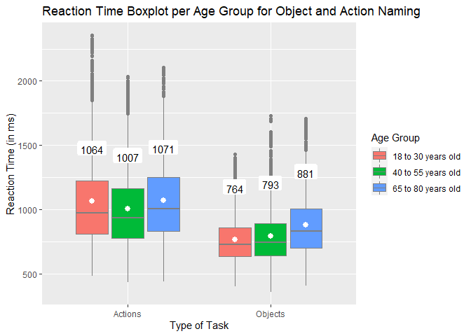
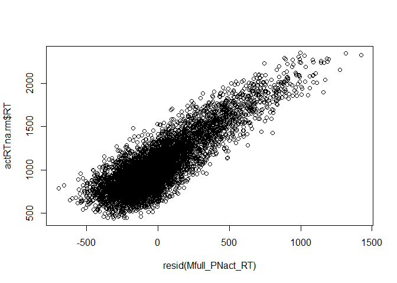
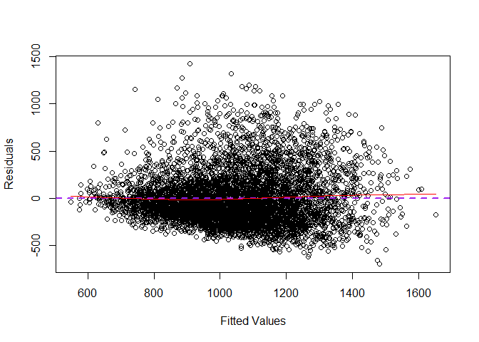
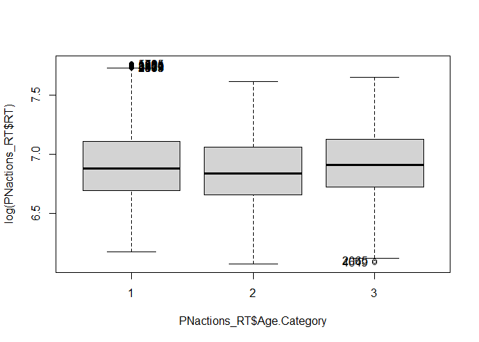
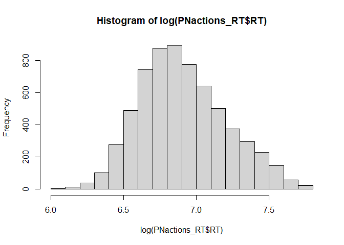
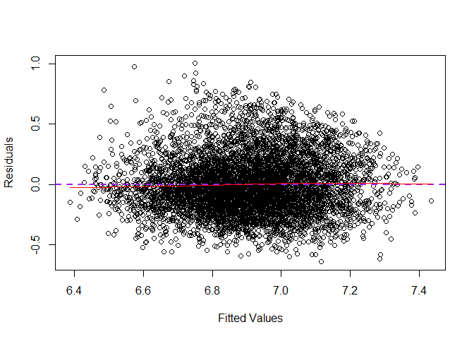
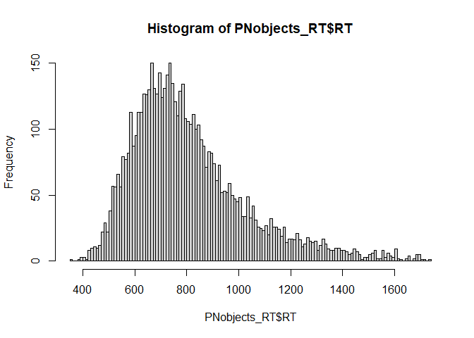
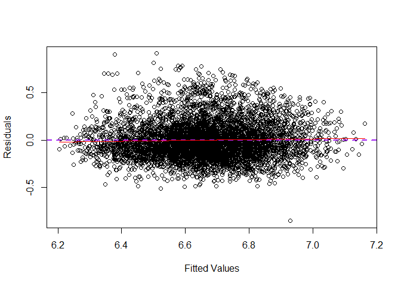
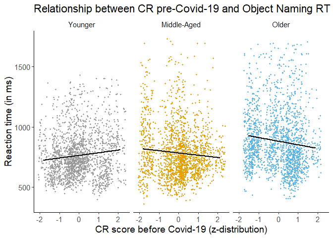
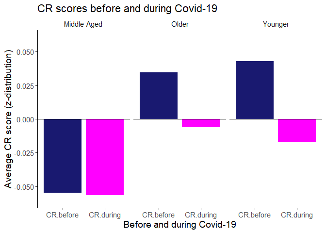

R Code Full Analysis Picture Naming Reaction Times
================
Elise Oosterhuis
Last compiled on 02/08/22

# Analysis Picture Naming Reaction Times GBG online study

##### Read in data

``` r
##### Read files ####
PNobjects <- read.csv("../Data/Tidy/PNobjects_complete_final.csv") %>%
  filter(Age.Category !="")

PNactions <- read.csv("../Data/Tidy/PNactions_complete_final.csv") %>%
  filter(Age.Category !="")
 
# head(PNobjects[1:6,1:4])
# tail(PNobjects[1:6,1:4])
```

## Descriptives

*Mean and standard deviations picture naming tasks*

``` r
options(dplyr.summarise.inform = FALSE) #Suppress summarise message (`summarise()` has grouped output by 'Task.Name', 'Age.Category'. You can override using the `.groups` argument.) in output

# Combine both picture-naming datasets
PN_all <- rbind(PNobjects, PNactions) %>%
  convert(chr(type)) %>%
  dplyr::mutate(Task.Name=dplyr::recode(Task.Name, 'Picture Naming Task - Actions' #Change task names
                                = "Actions", 'Picture Naming Task - Objects' 
                                = "Objects"))%>%
  dplyr::mutate(Age.Category=as.factor(dplyr::recode(Age.Category, '18 to 30 years old'="Younger", #Recode age groups as numeric values
                                    '40 to 55 years old'="Middle-Aged",
                                    '65 to 80 years old'="Older")))

#Filter out outliers for Reaction Time for the combined dataset
PN_RT <- PN_all %>%
  dplyr::filter(Acc==1) %>% #Acc==1 means only correctly answered trials will be included, i.e., removing all incorrect trials
#Create z scores for reaction time per age group (younger, middle-aged, and older adults) and per type (Actions and Objects separately)
  group_by(Age.Category, type) %>%
  mutate(zRT = scale(RT)) %>% 
#Use the z scores to filter out outliers (i.e., exclude values +/-2.5 SD per trial )
  filter(between(zRT, -2.5, +2.5)) %>% 
  ungroup()

# Mean and SD for picture naming
## Reaction Time (only correct trials; outliers excluded)
(PNrt_sum <- PN_RT %>%
    group_by(Task.Name, Age.Category) %>%
#Obtain mean and standard deviation for reaction time per task (actions and objects separately) and Age Group
    dplyr::summarise(mean_RT = round(mean(RT, na.rm=T),2),
            sd_RT = round(sd(RT,na.rm=T),2)))
```

    ## # A tibble: 6 x 4
    ## # Groups:   Task.Name [2]
    ##   Task.Name Age.Category mean_RT sd_RT
    ##   <chr>     <fct>          <dbl> <dbl>
    ## 1 Actions   Middle-Aged    1007.  312.
    ## 2 Actions   Older          1071.  327.
    ## 3 Actions   Younger        1063.  348.
    ## 4 Objects   Middle-Aged     793.  222.
    ## 5 Objects   Older           881.  247.
    ## 6 Objects   Younger         766.  183.

``` r
## Save output table as .csv fil
# write.csv(PNrt_sum, file = "./Figures and Tables/Descriptives_PNrt.csv", row.names = F)e
```

### Plots for Reaction Time

``` r
# Boxplot for Reaction Time
# png(file="./Figures and Tables/Boxplot_PNrt.png",
# width=600, height=350)

(Boxplot_PNrt <- ggplot(PN_RT, aes(x=Task.Name, y=RT, fill = as.factor(Age.Category))) +
    geom_boxplot(colour="grey50")+
    stat_summary(aes(label=round(..y..), group=as.factor(Age.Category)), 
               fun=mean, geom = "label", size=4,
               fill="white", show.legend=NA, label.size=NA,
               position = position_dodge(.75), vjust=-3) +
      stat_summary(fun = "mean", position = position_dodge(.75), 
               show.legend=F, colour="white")+ #Mean as white dot
    labs(x = "Type of Task",
         y = "Reaction Time (in ms)",
         title = "Reaction Time Boxplot per Age Group for Object and Action Naming")+
        scale_fill_manual(values = cbPalette, guide=guide_legend(title = "Age Group"), labels=c("18 to 30 years old","40 to 55 years old", "65 to 80 years old")))
```

<!-- -->

``` r
# dev.off()
```

``` r
# Barplot Picture Naming Reaction times
tiff(file="../Figures and Tables/PNrt_AgeGroups.tiff",
width=800, height=700)
# Ages = as_labeller(c(`1`="Younger", `2`="Middle-Aged", `3`="Older"))

(Barplot_PNrt <- PN_RT %>% 
      mutate(Age.Category_ordered = factor(Age.Category, levels=c("Younger", "Middle-Aged", "Older"))) %>%
   # filter(Task.Name == "Objects") %>%
   ggplot(aes(x=Task.Name, y=RT, fill=as.factor(Age.Category_ordered))) +
  stat_summary(geom="bar", fun=mean, position="dodge", colour="black", show.legend = F) +
  geom_errorbar(stat="summary", fun.data = mean_sdl, fun.args = list(mult=0.5),  
                width=0.4, size=1.4,position=position_dodge(0.9), colour="#CCCCCC") +
  coord_cartesian(ylim = c(0,1250)) +
  scale_y_continuous(breaks = seq(0,1250,250)) +
  labs(
       x="",
       y="Reaction Time in ms (+/- 0.5 SD)") +
    theme(text = element_text(size = 30),
          panel.background  = element_rect(fill="white"),
          plot.background = element_rect(fill = "white"),
          strip.background = element_rect(fill="white"),
          axis.line.x = element_line(color="black"),
         axis.line.y = element_line(color="black"),
         axis.text.x = element_text(size=25)) +
         scale_fill_manual(values = confPalette, guide=guide_legend(title = "Age Group")))


dev.off()
```

    ## png 
    ##   2

#### Missing data CR composite variable

The missing data for the CR composite variable posed a problem in that
it removed all data of participants with missing data in the LMEs. To
solve this problem, we agreed on replacing values with the means per age
category per CR subscale. As some participants were extreme outliers, we
decided to winsorize at -2.5 and 2.5 SD. In this way, extreme values
were still extreme values but wouldn’t be excluded and, hence, result in
missing values. This procedure led to no missing values and no excluded
participants in our statistical models.

## Statistical Analysis

### Linear Mixed Models - Action naming

``` r
# Only include trials for action naming (i.e., type==1)
PNactions_RT <- PN_RT %>%
  dplyr::filter(type==1)
  # Check
    # unique(PNactions_RT$Task.Name) #actions

## Create histogram for distribution
hist(PNactions_RT$RT, breaks = 100)
```

<!-- -->

*Create user-defined contrasts for the Age Category variable* We will
use Reverse Helmert coding where the first contrast in the model will
reflect the difference between Middle-Aged and Younger adults, and the
second contrast will reflect the difference between the Older adults and
the mean of the Middle-Aged and Younger adults.

``` r
PNactions_RT <- mutate(PNactions_RT,
                    Age.Category = 
                      factor(Age.Category, levels = c("Middle-Aged", "Younger", "Older")))

PNactions_RT_coded <- PNactions_RT
contrasts(PNactions_RT_coded$Age.Category) <- contr.helmert(3)
contrasts(PNactions_RT_coded$Age.Category)
```

    ##             [,1] [,2]
    ## Middle-Aged   -1   -1
    ## Younger        1   -1
    ## Older          0    2

#### Check for Skewness seen the histograms

``` r
skewness(log(PNactions_RT_coded$RT)) 
```

    ## [1] 0.3440173

Skewness for action naming is 0.24 –&gt; positively skewed but within
limits (Bryne, 2010; George & Mallery, 2010)

*Should we include random effects for ID and Trial.Number?*

``` r
#Base model with log-transformed reaction time
Mbase_act <- lm(log(RT) ~ 1, data=PNactions_RT_coded)

#Base model with only ID/individual variability as random effect
Mrandom.ID_act <- lmer(log(RT) ~ 1 +(1|ID), data=PNactions_RT_coded)
#Base model with only Trial.Number/trial variability as random effect
Mrandom.Trial_act <- lmer(log(RT) ~ 1 +(1|Trial.Number), data=PNactions_RT_coded)
#Base model with both random effects
Mrandom.All_act <- lmer(log(RT) ~ 1 +(1|ID) + (1|Trial.Number), data=PNactions_RT_coded)
```

AIC base model

``` r
#Obtain AIC values for each model
(AIC.base_act <- AIC(logLik(Mbase_act)))
```

    ## [1] 2668.325

AIC - only ID as random effect

``` r
(AIC.reID_act <- AIC(logLik(Mrandom.ID_act)))
```

    ## [1] 1780.433

AIC - only trial as random effect

``` r
(AIC.reTrial_act <- AIC(logLik(Mrandom.Trial_act)))
```

    ## [1] 1802.905

AIC - both ID and trial as random effect

``` r
(AIC.reBoth_act <- AIC(logLik(Mrandom.All_act)))
```

    ## [1] 614.1539

The AIC for the model including both random effects is lowest –&gt; we
justified inclusion of both Trial and Subject as random effects.

*Null model of reaction times for action naming with random effects
included*

``` r
M0_PNactRT <- lmer(RT ~ 1 +(1|ID) + (1|Trial.Number), data=PNactions_RT_coded, REML=FALSE)
summary(M0_PNactRT)
```

    ## Linear mixed model fit by maximum likelihood . t-tests use Satterthwaite's
    ##   method [lmerModLmerTest]
    ## Formula: RT ~ 1 + (1 | ID) + (1 | Trial.Number)
    ##    Data: PNactions_RT_coded
    ## 
    ##      AIC      BIC   logLik deviance df.resid 
    ##  91971.4  91998.5 -45981.7  91963.4     6481 
    ## 
    ## Scaled residuals: 
    ##     Min      1Q  Median      3Q     Max 
    ## -2.4811 -0.6633 -0.1851  0.4393  5.0931 
    ## 
    ## Random effects:
    ##  Groups       Name        Variance Std.Dev.
    ##  ID           (Intercept) 15603    124.9   
    ##  Trial.Number (Intercept) 16806    129.6   
    ##  Residual                 78463    280.1   
    ## Number of obs: 6485, groups:  ID, 90; Trial.Number, 79
    ## 
    ## Fixed effects:
    ##             Estimate Std. Error      df t value Pr(>|t|)    
    ## (Intercept)  1053.09      19.98  153.56   52.71   <2e-16 ***
    ## ---
    ## Signif. codes:  0 '***' 0.001 '**' 0.01 '*' 0.05 '.' 0.1 ' ' 1

*Unconditional model, i.e., the model without covariates/control
measures*

``` r
Muncond_PNactRT <- lmer(RT ~ Age.Category*CR.composite.before + (1|ID)  + (1|Trial.Number), data=PNactions_RT_coded, REML=FALSE)
```

*Full model, i.e., model with covariates/control measures. RT not
log-transformed*

``` r
Mfull_PNact_RT <- lmer(RT ~ Age.Category*CR.composite.before + GenCogProc.composite + (1|ID)  + (1|Trial.Number), data=PNactions_RT_coded, REML=FALSE)
# summary(Mfull_PNact_RT)

##Create a tidy output table for the fixed effects
(tidyMfull_PNactRT <- broom.mixed::tidy(Mfull_PNact_RT, effect = "fixed",conf.int=T, conf.level=0.95))
```

    ## # A tibble: 7 x 9
    ##   effect term    estimate std.error statistic    df   p.value conf.low conf.high
    ##   <chr>  <chr>      <dbl>     <dbl>     <dbl> <dbl>     <dbl>    <dbl>     <dbl>
    ## 1 fixed  (Inter~  1053.       19.5     53.9   151.  2.38e-100  1014.     1092.  
    ## 2 fixed  Age.Ca~    29.1      16.8      1.73   89.5 8.64e-  2    -4.25     62.4 
    ## 3 fixed  Age.Ca~    13.3      10.6      1.25   89.5 2.13e-  1    -7.75     34.3 
    ## 4 fixed  CR.com~    -6.58     13.2     -0.499  89.5 6.19e-  1   -32.8      19.7 
    ## 5 fixed  GenCog~    -8.05     30.1     -0.268  89.4 7.90e-  1   -67.8      51.7 
    ## 6 fixed  Age.Ca~    16.4      16.2      1.01   89.4 3.15e-  1   -15.8      48.5 
    ## 7 fixed  Age.Ca~   -15.0       9.33    -1.61   89.7 1.12e-  1   -33.5       3.56

``` r
##Write tidy output data to .csv file
#write.csv(tidyMfull_PNactRT, file = "./Figures and Tables/PNact_lmerFull.csv", row.names=F)
```

#### Checking Assumptions LMER Actions

##### Assumption 1 - Linearity

``` r
plot(resid(Mfull_PNact_RT), actRTna.rm$RT)
```

<!-- -->
We can assume linearity.

##### Assumption 2 - Homogeneity of Variance / Homoscedasticity

``` r
#Extracts the residuals and places them in a new column in RTna.rm
actRTna.rm$Mfull.Res <- residuals(Mfull_PNact_RT) 
#Takes the absolute values of the residuals
actRTna.rm$Abs.Mfull.Res <- abs(actRTna.rm$Mfull.Res) 
#Squares the absolute values to provide the more robust estimate
actRTna.rm$Mfull.Res2 <- actRTna.rm$Abs.Mfull.Res^2 

#ANOVA of the squared residuals
Levene.Mfull <- lm(Mfull.Res2 ~ ID, data=actRTna.rm) 
anova(Levene.Mfull) #Displays the results
```

    ## Analysis of Variance Table
    ## 
    ## Response: Mfull.Res2
    ##             Df     Sum Sq    Mean Sq F value Pr(>F)
    ## ID           1 3.0258e+10 3.0258e+10  1.3514 0.2451
    ## Residuals 6483 1.4516e+14 2.2390e+10

p&gt;0.05,so we can assume homogeneity of variance/homoscedasticity

``` r
#Create plot for homogeneity of variance
plot(fitted(Mfull_PNact_RT), residuals(Mfull_PNact_RT),
     xlab = "Fitted Values", ylab="Residuals")
abline(h=0, lty=2, lwd=2, col="purple")
lines(smooth.spline(fitted(Mfull_PNact_RT), residuals(Mfull_PNact_RT)), col="red") 
```

<!-- -->
Purple and red line roughly overlap, so we can assume homoscedasticity

##### Assumption 3 - Residuals are normally distributed

``` r
#Create qq plot of the full model
qqmath(Mfull_PNact_RT)
```

<!-- -->

Where does the bulk on the right and the outliers on the left come from?

After checking outliers: outliers on the left are now gone and were
driven by a typo in the RT transcription of one participant

``` r
#Check whether the deviations from the QQplot are due to age category
dda <- cbind(augment(Mfull_PNact_RT), group=actRTna.rm$Age.Category)
sample_var <- "RT"
group_var  <- "Age.Category"

# code to compute the slope and the intercept of the qq-line per group

qqlines <- function(vec, group) {
    x <- qnorm(c(0.25, 0.75))    
    y <- quantile(vec[!is.na(vec)], c(0.25, 0.75))
    slope <- diff(y)/diff(x)
    int <- y[1] - slope * x[1]
    data.frame(slope, int, group)
}

slopedf <- do.call(rbind,lapply(unique(dda$group), function(grp) qqlines(dda[dda$group == grp,sample_var], grp)))

#Create ggplot of the qq-line per age group to check for differences between age groups
p <- ggplot(dda)+stat_qq(aes_string(sample=sample_var, colour=group_var)) + 
    geom_abline(data = slopedf, aes(slope = slope, intercept = int, colour = group)) +
    scale_colour_discrete(guide=guide_legend(title = "Age Group"), labels=c("Younger","Middle-Aged", "Older"))
p
```

<!-- -->

The younger age category seems to have a bigger bulk at the right but
all age groups follow a similar pattern.

Try log transformation.

``` r
#Full model with log-transformed Reaction Times as outcome variable
logMfull_PNact_RT <- lmer(log(RT) ~ Age.Category*CR.composite.before + GenCogProc.composite + (1|ID)  + (1|Trial.Number), data=PNactions_RT_coded, REML=FALSE)
summary(logMfull_PNact_RT)
```

    ## Linear mixed model fit by maximum likelihood . t-tests use Satterthwaite's
    ##   method [lmerModLmerTest]
    ## Formula: log(RT) ~ Age.Category * CR.composite.before + GenCogProc.composite +  
    ##     (1 | ID) + (1 | Trial.Number)
    ##    Data: PNactions_RT_coded
    ## 
    ##      AIC      BIC   logLik deviance df.resid 
    ##    611.8    679.6   -295.9    591.8     6475 
    ## 
    ## Scaled residuals: 
    ##     Min      1Q  Median      3Q     Max 
    ## -2.6392 -0.6922 -0.1197  0.5831  4.1195 
    ## 
    ## Random effects:
    ##  Groups       Name        Variance Std.Dev.
    ##  ID           (Intercept) 0.01394  0.1181  
    ##  Trial.Number (Intercept) 0.01462  0.1209  
    ##  Residual                 0.05943  0.2438  
    ## Number of obs: 6485, groups:  ID, 90; Trial.Number, 79
    ## 
    ## Fixed effects:
    ##                                     Estimate Std. Error         df t value
    ## (Intercept)                         6.914043   0.018703 155.583427 369.670
    ## Age.Category1                       0.026507   0.016579  89.574143   1.599
    ## Age.Category2                       0.013426   0.010449  89.567971   1.285
    ## CR.composite.before                -0.005814   0.013052  89.623453  -0.445
    ## GenCogProc.composite               -0.008328   0.029717  89.511114  -0.280
    ## Age.Category1:CR.composite.before   0.013292   0.016011  89.552670   0.830
    ## Age.Category2:CR.composite.before  -0.014677   0.009220  89.785734  -1.592
    ##                                   Pr(>|t|)    
    ## (Intercept)                         <2e-16 ***
    ## Age.Category1                        0.113    
    ## Age.Category2                        0.202    
    ## CR.composite.before                  0.657    
    ## GenCogProc.composite                 0.780    
    ## Age.Category1:CR.composite.before    0.409    
    ## Age.Category2:CR.composite.before    0.115    
    ## ---
    ## Signif. codes:  0 '***' 0.001 '**' 0.01 '*' 0.05 '.' 0.1 ' ' 1
    ## 
    ## Correlation of Fixed Effects:
    ##             (Intr) Ag.Ct1 Ag.Ct2 CR.cm. GnCgP. A.C1:C
    ## Age.Catgry1 -0.002                                   
    ## Age.Catgry2  0.003 -0.160                            
    ## CR.cmpst.bf  0.000 -0.017  0.025                     
    ## GnCgPrc.cmp  0.004 -0.323  0.497  0.052              
    ## Ag.Ct1:CR.. -0.001  0.026 -0.040 -0.004 -0.082       
    ## Ag.Ct2:CR..  0.000  0.004 -0.006  0.000 -0.010  0.000

*Checking the dimensionality of the variance-covariance matrices of
random effects assumed in a maximal LMM*

The number of principal components that cumulatively account for 100% of
the variance is a reasonably stringent criterion for settling on the
reduced dimensionality (Bates et al., 2015)

``` r
summary(rePCA(logMfull_PNact_RT))
```

    ## $ID
    ## Importance of components:
    ##                          [,1]
    ## Standard deviation     0.4843
    ## Proportion of Variance 1.0000
    ## Cumulative Proportion  1.0000
    ## 
    ## $Trial.Number
    ## Importance of components:
    ##                         [,1]
    ## Standard deviation     0.496
    ## Proportion of Variance 1.000
    ## Cumulative Proportion  1.000

To assess overfitting of the model, we conducted a principal components
analysis (PCA) of the random effects variance-covariance structure. The
PCA did not indicate overspecification of the random effects for ID or
Trial. Hence, we report the analysis using the full model with both
random effects.

*Checking variance explained by random factors:*

``` r
0.01316/(0.01316+0.01362+0.05426) #~16.2% of variance that's left over after the variance explained by our predictor variables is explained by ID (i.e. subject)
```

    ## [1] 0.1623889

``` r
0.01362/(0.01316+0.01362+0.05426) #~16.8% of variance that's left over after the variance explained by our predictor variables is explained by trial (i.e. stimuli)
```

    ## [1] 0.1680652

*Recheck model fit after log transformation*

``` r
## Normality of residuals
qqmath(logMfull_PNact_RT)
```

<!-- --> Looks
much better now. Except the bulk on the left and right. But we will
assume the assumption of normality of residuals is met.

*Data per participant:*

``` r
actdataPP <- PNactions_RT_coded %>%
  dplyr::group_by(ID, Age.Category) %>%
  dplyr::summarise(meanRT = mean(RT, na.rm=T),
            sdRT = sd(RT, na.rm=T))

#To look more into depth for any outliers and deviations.
car::Boxplot(log(PNactions_RT_coded$RT) ~ PNactions_RT_coded$Age.Category, id.method="identify")
```

<!-- -->

    ##  [1] "1203" "587"  "1272" "3976" "3137" "4579" "2189" "2441" "5911" "5827"
    ## [11] "2073" "4657"

Check each row in the table that was detected as outlier.

–&gt; these outliers don’t seem to strange seen the frequencies of the
words/pictures. A possibility would be the effect of online study.
Distractions from home (longer RTs), differences in microphone or
distance from microphone (causing either smaller or longer RTs than
average), maybe they were positively/negatively primed somehow.

*Histogram of transformed RTs for action naming*

``` r
hist(log(PNactions_RT_coded$RT)) 
```

<!-- -->

*Homoscedasticity with log-transformed reaction time*

``` r
plot(fitted(logMfull_PNact_RT), residuals(logMfull_PNact_RT),
     xlab = "Fitted Values", ylab="Residuals")
abline(h=0, lty=2, lwd=2, col="purple")
lines(smooth.spline(fitted(logMfull_PNact_RT), residuals(logMfull_PNact_RT)), col="red") 
```

<!-- -->
Purple and red line roughly overlap, so we can assume homoscedasticity

### Results log RT action naming

``` r
#Quick overview full model outcome
glance(logMfull_PNact_RT)
```

    ## # A tibble: 1 x 6
    ##   sigma logLik   AIC   BIC deviance df.residual
    ##   <dbl>  <dbl> <dbl> <dbl>    <dbl>       <int>
    ## 1 0.244  -296.  612.  680.     592.        6475

``` r
#Tidy model summary
(log_tidyMfull_PNactRT <- broom.mixed::tidy(logMfull_PNact_RT, effects = "fixed", conf.int=T, conf.level=0.95))
```

    ## # A tibble: 7 x 9
    ##   effect term    estimate std.error statistic    df   p.value conf.low conf.high
    ##   <chr>  <chr>      <dbl>     <dbl>     <dbl> <dbl>     <dbl>    <dbl>     <dbl>
    ## 1 fixed  (Inter~  6.91      0.0187    370.    156.  5.95e-231  6.88      6.95   
    ## 2 fixed  Age.Ca~  0.0265    0.0166      1.60   89.6 1.13e-  1 -0.00643   0.0594 
    ## 3 fixed  Age.Ca~  0.0134    0.0104      1.29   89.6 2.02e-  1 -0.00733   0.0342 
    ## 4 fixed  CR.com~ -0.00581   0.0131     -0.445  89.6 6.57e-  1 -0.0317    0.0201 
    ## 5 fixed  GenCog~ -0.00833   0.0297     -0.280  89.5 7.80e-  1 -0.0674    0.0507 
    ## 6 fixed  Age.Ca~  0.0133    0.0160      0.830  89.6 4.09e-  1 -0.0185    0.0451 
    ## 7 fixed  Age.Ca~ -0.0147    0.00922    -1.59   89.8 1.15e-  1 -0.0330    0.00364

``` r
## Write tidy table to .csv file
# write.csv(log_tidyMfull_PNactRT, file = "./Figures and Tables/logPNact_lmerFull.csv", row.names=F)
```

*Effect Size - R squared*

``` r
r2_nakagawa(logMfull_PNact_RT)
```

    ## # R2 for Mixed Models
    ## 
    ##   Conditional R2: 0.335
    ##      Marginal R2: 0.016

Marginal R2 is the variance explained by fixed effects. Theoretical is
for binomial distributions. Conditional R2 is the variance explained by
the whole model.

1.4% of the variance in the data is explained by the fixed effects only.
34% of the variance is explained by the whole model.

## Picture Naming Objects

``` r
PNobjects_RT <- PN_RT %>%
  # Only include trials for object naming (i.e., type==2)
  dplyr::filter(type==2) %>%
  group_by(ID, Name) %>%
  slice(1) %>%
  ungroup()
  # Check
    # unique(PNobjects_RT$Task.Name) #objects

## Create histogram for distribution
hist(PNobjects_RT$RT, breaks = 100)
```

<!-- -->

*Create user-defined contrasts for the Age Category variable* We will
use Reverse Helmert coding where the first contrast in the model will
reflect the difference between Middle-Aged and Younger adults, and the
second contrast will reflect the difference between the Older adults and
the mean of the Middle-Aged and Younger adults.

``` r
PNobjects_RT <- mutate(PNobjects_RT,
                    Age.Category = 
                      factor(Age.Category, levels = c("Middle-Aged", "Younger", "Older")))

PNobjects_RT_coded <- PNobjects_RT
contrasts(PNobjects_RT_coded$Age.Category) <- contr.helmert(3)
contrasts(PNobjects_RT_coded$Age.Category)
```

    ##             [,1] [,2]
    ## Middle-Aged   -1   -1
    ## Younger        1   -1
    ## Older          0    2

``` r
skewness(log(PNobjects_RT_coded$RT))
```

    ## [1] 0.4228504

0.61 -&gt; positively skewed but within limits (Bryne, 2010; George &
Mallery, 2010)

### LMER for Objects

*Should we include Trial and ID as random effects?*

``` r
#Base model with log-transformed reaction time
Mbase_obj <- lm(log(RT) ~ 1, data=PNobjects_RT_coded)
#Base model with only ID/individual variability as random effect
Mrandom.ID_obj <- lmer(log(RT) ~ 1 +(1|ID), data=PNobjects_RT_coded)
#Base model with only Trial.Number/trial variability as random effect
Mrandom.Trial_obj <- lmer(log(RT) ~ 1 +(1|Trial.Number), data=PNobjects_RT_coded)
#Base model with both random effects
Mrandom.All_obj <- lmer(log(RT) ~ 1 +(1|ID) + (1|Trial.Number), data=PNobjects_RT_coded)
```

AIC base model

``` r
#Obtain AIC values for each model
(AIC.base_obj <- AIC(logLik(Mbase_obj)))
```

    ## [1] 675.5985

AIC - only ID as random effect

``` r
(AIC.reID_obj <- AIC(logLik(Mrandom.ID_obj)))
```

    ## [1] -1139.688

AIC - only trial as random effect

``` r
(AIC.reTrial_obj <- AIC(logLik(Mrandom.Trial_obj)))
```

    ## [1] 387.129

AIC - both ID and trial as random effect

``` r
(AIC.reBoth_obj <- AIC(logLik(Mrandom.All_obj)))
```

    ## [1] -1674.576

The AIC for the model including both random effects is lowest –&gt; we
justified inclusion of both Trial and Subject as random effects.

*Null model of reaction times for object naming with random effects
included*

``` r
M0_PNobjRT <- lmer(RT ~ 1 +(1|ID) + (1|Trial.Number), data=PNobjects_RT_coded, REML=FALSE)
summary(M0_PNobjRT)
```

    ## Linear mixed model fit by maximum likelihood . t-tests use Satterthwaite's
    ##   method [lmerModLmerTest]
    ## Formula: RT ~ 1 + (1 | ID) + (1 | Trial.Number)
    ##    Data: PNobjects_RT_coded
    ## 
    ##      AIC      BIC   logLik deviance df.resid 
    ##  76227.2  76253.8 -38109.6  76219.2     5724 
    ## 
    ## Scaled residuals: 
    ##     Min      1Q  Median      3Q     Max 
    ## -3.2500 -0.6200 -0.1837  0.3745  5.3856 
    ## 
    ## Random effects:
    ##  Groups       Name        Variance Std.Dev.
    ##  ID           (Intercept) 13336    115.48  
    ##  Trial.Number (Intercept)  4136     64.31  
    ##  Residual                 32476    180.21  
    ## Number of obs: 5728, groups:  ID, 88; Trial.Number, 70
    ## 
    ## Fixed effects:
    ##             Estimate Std. Error     df t value Pr(>|t|)    
    ## (Intercept)   814.34      14.71 136.34   55.35   <2e-16 ***
    ## ---
    ## Signif. codes:  0 '***' 0.001 '**' 0.01 '*' 0.05 '.' 0.1 ' ' 1

*Unconditional model, i.e., the model without covariates/control
measures*

``` r
Muncond_PNobjRT <- lmer(RT ~ Age.Category*CR.composite.before + (1|ID)  + (1|Trial.Number), data=PNobjects_RT_coded, REML=FALSE)
```

*Full model, i.e., model with covariates/control measures. RT not
log-transformed*

``` r
Mfull_PNobj_RT <- lmer(RT ~ Age.Category*CR.composite.before + GenCogProc.composite + (1|ID)  + (1|Trial.Number), data=PNobjects_RT_coded, REML=FALSE)
# summary(Mfull_PNobj_RT)

##Create a tidy output table for the fixed effects
(tidyMfull_PNobjRT <- broom.mixed::tidy(Mfull_PNobj_RT, effect = "fixed",conf.int=T, conf.level=0.95))
```

    ## # A tibble: 7 x 9
    ##   effect term    estimate std.error statistic    df   p.value conf.low conf.high
    ##   <chr>  <chr>      <dbl>     <dbl>     <dbl> <dbl>     <dbl>    <dbl>     <dbl>
    ## 1 fixed  (Inter~   814.       13.3     61.0   142.  6.91e-104   787.      840.  
    ## 2 fixed  Age.Ca~   -10.2      14.3     -0.712  87.8 4.78e-  1   -38.6      18.2 
    ## 3 fixed  Age.Ca~    38.9       8.91     4.37   87.9 3.38e-  5    21.2      56.6 
    ## 4 fixed  CR.com~    -6.37     11.1     -0.573  88.0 5.68e-  1   -28.5      15.7 
    ## 5 fixed  GenCog~    17.2      25.3      0.680  87.9 4.98e-  1   -33.0      67.4 
    ## 6 fixed  Age.Ca~    23.4      13.7      1.70   87.9 9.26e-  2    -3.95     50.7 
    ## 7 fixed  Age.Ca~   -11.4       7.80    -1.46   88.0 1.49e-  1   -26.9       4.13

#### Checking Assumptions LMER Objects

##### Assumption 1 - Linearity

``` r
plot(resid(Mfull_PNobj_RT), objRTna.rm$RT)
```

<!-- -->

We can assume linearity.

##### Assumption 2 - Homogeneity of Variance / Homoscedasticity

``` r
#Extracts the residuals and places them in a new column in RTna.rm
objRTna.rm$Mfull.Res <- residuals(Mfull_PNobj_RT) 
#Takes the absolute values of the residuals
objRTna.rm$Abs.Mfull.Res <- abs(objRTna.rm$Mfull.Res)
#Squares the absolute values to provide the more robust estimate
objRTna.rm$Mfull.Res2 <- objRTna.rm$Abs.Mfull.Res^2

#ANOVA of the squared residuals
Levene.Mfull <- lm(Mfull.Res2 ~ ID, data=objRTna.rm) 
anova(Levene.Mfull) #Displays the results 
```

    ## Analysis of Variance Table
    ## 
    ## Response: Mfull.Res2
    ##             Df     Sum Sq    Mean Sq F value Pr(>F)
    ## ID           1 1.0094e+09 1009391423  0.2035 0.6519
    ## Residuals 5726 2.8401e+13 4960046836

p&gt;0.05,so we can assume homogeneity of variance/homoscedasticity

``` r
#Create plot for homogeneity of variance
plot(fitted(Mfull_PNobj_RT), residuals(Mfull_PNobj_RT),
     xlab = "Fitted Values", ylab="Residuals")
abline(h=0, lty=2, lwd=2, col="purple")
lines(smooth.spline(fitted(Mfull_PNobj_RT), residuals(Mfull_PNobj_RT)), col="red") 
```

<!-- -->
Purple and red line roughly overlap, so we can assume homoscedasticity

##### Assumption 3 - Residuals are normally distributed

``` r
#QQ plot to check normality of residuals
qqmath(Mfull_PNobj_RT)
```

<!-- -->

Where does the bulk on the right come from? (CHECK OUTLIERS)

``` r
#Check whether the deviations from the QQplot are due to age category
dda <- cbind(augment(Mfull_PNobj_RT), group=objRTna.rm$Age.Category)
sample_var <- "RT"
group_var  <- "Age.Category"

# code to compute the slope and the intercept of the qq-line 

qqlines <- function(vec, group) {
    x <- qnorm(c(0.25, 0.75))    
    y <- quantile(vec[!is.na(vec)], c(0.25, 0.75))
    slope <- diff(y)/diff(x)
    int <- y[1] - slope * x[1]
    data.frame(slope, int, group)
}

slopedf <- do.call(rbind,lapply(unique(dda$group), function(grp) qqlines(dda[dda$group == grp,sample_var], grp)))

#Create ggplot of the qq-line per age group to check for differences between age groups
p <- ggplot(dda)+stat_qq(aes_string(sample=sample_var, colour=group_var)) + 
    geom_abline(data = slopedf, aes(slope = slope, intercept = int, colour = group))+
      scale_colour_discrete(guide=guide_legend(title = "Age Group"), labels=c("Younger","Middle-Aged", "Older"))

p
```

<!-- -->

The Older age group seems to have a bigger bulk at the right but all age
groups follow a similar pattern.

Try log transformation.

``` r
#Full model with log-transformed Reaction Times as outcome variable
logMfull_PNobj_RT <- lmer(log(RT) ~ Age.Category*CR.composite.before + GenCogProc.composite + (1|ID)  + (1|Trial.Number), data=PNobjects_RT_coded, REML=FALSE)
summary(logMfull_PNobj_RT)
```

    ## Linear mixed model fit by maximum likelihood . t-tests use Satterthwaite's
    ##   method [lmerModLmerTest]
    ## Formula: log(RT) ~ Age.Category * CR.composite.before + GenCogProc.composite +  
    ##     (1 | ID) + (1 | Trial.Number)
    ##    Data: PNobjects_RT_coded
    ## 
    ##      AIC      BIC   logLik deviance df.resid 
    ##  -1689.4  -1622.9    854.7  -1709.4     5718 
    ## 
    ## Scaled residuals: 
    ##     Min      1Q  Median      3Q     Max 
    ## -4.2356 -0.6575 -0.1344  0.5036  4.5861 
    ## 
    ## Random effects:
    ##  Groups       Name        Variance Std.Dev.
    ##  ID           (Intercept) 0.016308 0.12770 
    ##  Trial.Number (Intercept) 0.005553 0.07452 
    ##  Residual                 0.040059 0.20015 
    ## Number of obs: 5728, groups:  ID, 88; Trial.Number, 70
    ## 
    ## Fixed effects:
    ##                                     Estimate Std. Error         df t value
    ## (Intercept)                         6.667351   0.016501 139.110812 404.046
    ## Age.Category1                      -0.008959   0.018198  87.882353  -0.492
    ## Age.Category2                       0.044685   0.011337  87.974684   3.941
    ## CR.composite.before                -0.005458   0.014144  88.004762  -0.386
    ## GenCogProc.composite                0.019031   0.032137  87.946566   0.592
    ## Age.Category1:CR.composite.before   0.023820   0.017494  87.978047   1.362
    ## Age.Category2:CR.composite.before  -0.015575   0.009930  88.038358  -1.569
    ##                                   Pr(>|t|)    
    ## (Intercept)                        < 2e-16 ***
    ## Age.Category1                     0.623708    
    ## Age.Category2                     0.000162 ***
    ## CR.composite.before               0.700496    
    ## GenCogProc.composite              0.555254    
    ## Age.Category1:CR.composite.before 0.176794    
    ## Age.Category2:CR.composite.before 0.120350    
    ## ---
    ## Signif. codes:  0 '***' 0.001 '**' 0.01 '*' 0.05 '.' 0.1 ' ' 1
    ## 
    ## Correlation of Fixed Effects:
    ##             (Intr) Ag.Ct1 Ag.Ct2 CR.cm. GnCgP. A.C1:C
    ## Age.Catgry1  0.027                                   
    ## Age.Catgry2 -0.017 -0.191                            
    ## CR.cmpst.bf  0.017  0.010  0.008                     
    ## GnCgPrc.cmp -0.010 -0.341  0.509  0.041              
    ## Ag.Ct1:CR..  0.022  0.061 -0.063  0.027 -0.094       
    ## Ag.Ct2:CR.. -0.012 -0.017  0.009 -0.018  0.000 -0.022

``` r
#Look at pairwise comparisons between contrasts
logMfull_PNobj_RT.emmeans <- emmeans::emmeans(logMfull_PNobj_RT, ~Age.Category)
pairs(logMfull_PNobj_RT.emmeans)
```

    ##  contrast                estimate     SE  df z.ratio p.value
    ##  (Middle-Aged) - Younger   0.0188 0.0364 Inf   0.516  0.8635
    ##  (Middle-Aged) - Older    -0.1255 0.0354 Inf  -3.546  0.0011
    ##  Younger - Older          -0.1443 0.0415 Inf  -3.477  0.0015
    ## 
    ## Degrees-of-freedom method: asymptotic 
    ## Results are given on the log (not the response) scale. 
    ## P value adjustment: tukey method for comparing a family of 3 estimates

*Checking the dimensionality of the variance-covariance matrices of
random effects assumed in a maximal LMM*

The number of principal components that cumulatively account for 100% of
the variance is a reasonably stringent criterion for settling on the
reduced dimensionality (Bates et al., 2015)

``` r
summary(rePCA(logMfull_PNobj_RT))
```

    ## $ID
    ## Importance of components:
    ##                         [,1]
    ## Standard deviation     0.638
    ## Proportion of Variance 1.000
    ## Cumulative Proportion  1.000
    ## 
    ## $Trial.Number
    ## Importance of components:
    ##                          [,1]
    ## Standard deviation     0.3723
    ## Proportion of Variance 1.0000
    ## Cumulative Proportion  1.0000

To assess overfitting of the model, we conducted a principal components
analysis (PCA) of the random effects variance-covariance structure. The
PCA did not indicate overspecification of the random effects for ID or
Trial. Hence, we report the analysis using the full model with both
random effects.

*Checking variance explained by random factors:*

``` r
0.017115 /(0.017115 + 0.006495  +0.046923  ) #~24.3% of variance that's left over after the variance explained by our predictor variables is explained by ID (i.e. subject)
```

    ## [1] 0.2426524

``` r
 0.006495  /(0.017115 + 0.006495  +0.046923  ) #~9.2% of variance that's left over after the variance explained by our predictor variables is explained by trial (i.e. stimuli)
```

    ## [1] 0.09208456

*Recheck model fit after log transformation*

``` r
## Normality of residuals
qqmath(logMfull_PNobj_RT)
```

<!-- --> Looks
much better now. Except the outliers on the right. We will assume
normality of residuals.

*Data per participant:*

``` r
objdataPP <- PNobjects_RT %>%
  dplyr::group_by(ID) %>%
  dplyr::summarise(meanRT = mean(RT, na.rm=T),
            sdRT = sd(RT, na.rm=T))

#To look more into depth for any outliers and deviations.
car::Boxplot(log(PNobjects_RT$RT) ~ PNobjects_RT$Age.Category, id.method="identify")
```

<!-- -->

    ##  [1] "3070" "3811" "5187" "1672" "3640" "5385" "3530" "1097" "3619" "1380"
    ## [11] "941"  "3639" "3168" "1597" "2105" "2987" "3250" "3311" "3356" "4334"
    ## [21] "4354" "4362" "4700" "5437" "1750" "4288" "4293" "5065"

Check each row in the table that was detected as outlier.

*Histogram of transformed RTs for object naming*

``` r
hist(log(PNobjects$RT),breaks=50) 
```

<!-- -->

*Homoscedasticity with log-transformed reaction time*

``` r
plot(fitted(logMfull_PNobj_RT), residuals(logMfull_PNobj_RT),
     xlab = "Fitted Values", ylab="Residuals")
abline(h=0, lty=2, lwd=2, col="purple")
lines(smooth.spline(fitted(logMfull_PNobj_RT), residuals(logMfull_PNobj_RT)), col="red") 
```

<!-- -->
Purple and red line roughly overlap, so we can assume homoscedasticity

### Results RT object naming

``` r
#Quick overview full model outcome
glance(logMfull_PNobj_RT)
```

    ## # A tibble: 1 x 6
    ##   sigma logLik    AIC    BIC deviance df.residual
    ##   <dbl>  <dbl>  <dbl>  <dbl>    <dbl>       <int>
    ## 1 0.200   855. -1689. -1623.   -1709.        5718

``` r
#Tidy model summary
(log_tidyMfull_PNobjRT <- broom.mixed::tidy(logMfull_PNobj_RT, effects = "fixed", conf.int=T, conf.level=0.95))
```

    ## # A tibble: 7 x 9
    ##   effect term    estimate std.error statistic    df   p.value conf.low conf.high
    ##   <chr>  <chr>      <dbl>     <dbl>     <dbl> <dbl>     <dbl>    <dbl>     <dbl>
    ## 1 fixed  (Inter~  6.67      0.0165    404.    139.  2.01e-215   6.63     6.70   
    ## 2 fixed  Age.Ca~ -0.00896   0.0182     -0.492  87.9 6.24e-  1  -0.0451   0.0272 
    ## 3 fixed  Age.Ca~  0.0447    0.0113      3.94   88.0 1.62e-  4   0.0222   0.0672 
    ## 4 fixed  CR.com~ -0.00546   0.0141     -0.386  88.0 7.00e-  1  -0.0336   0.0226 
    ## 5 fixed  GenCog~  0.0190    0.0321      0.592  87.9 5.55e-  1  -0.0448   0.0829 
    ## 6 fixed  Age.Ca~  0.0238    0.0175      1.36   88.0 1.77e-  1  -0.0109   0.0586 
    ## 7 fixed  Age.Ca~ -0.0156    0.00993    -1.57   88.0 1.20e-  1  -0.0353   0.00416

``` r
## Write tidy table to .csv file
# write.csv(log_tidyMfull_PNobjRT, file = "./Figures and Tables/logPNobj_lmerFull.csv", row.names=F)
```

*Effect Size - R squared*

``` r
r2_nakagawa(logMfull_PNobj_RT)
```

    ## # R2 for Mixed Models
    ## 
    ##   Conditional R2: 0.396
    ##      Marginal R2: 0.067

Marginal R2 is the variance explained by fixed effects. Theoretical is
for binomial distributions. Conditional R2 is the variance explained by
the whole model.

5.9% of the variance in the data is explained by the fixed effects only.
37.4% of the variance is explained by the whole model.

## Visualising significant predictors

``` r
#Create labels for legend per age group
# Ages = as_labeller(c(`1`="Younger", `2`="Middle-Aged", `3`="Older"))

#Colour Palette - colourblind friendly
cbbPalette <- c("#999999", "#E69F00", "#56B4E9")
```

*Relationship RT and Cognitive Processing speed for reaction time
(outcome) of picture naming Actions*

``` r
(plot.PNact_GenCog <- ggplot(PNactions_RT, aes(x=GenCogProc.composite, y=RT, colour=as.factor(Age.Category))) +
   geom_jitter(width = 0.25, size=0.8, show.legend =F) +
   geom_smooth(method = "lm", formula = y~x, fill="white", colour="black", show.legend=F) +
   labs(x = "General Cognitive Processing (z-distribution)",
        y= "Reaction time (in ms)",
        title = "Relationship between General Cognitive Processing 
        and Picture Naming Reaction Time Actions") +
   facet_grid(~Age.Category) +
    theme(text = element_text(size = 14),
          panel.background  = element_rect(fill="white"),
          plot.background = element_rect(fill = "white"),
          strip.background = element_rect(fill="white"),
          axis.line.x = element_line(color="black"),
         axis.line.y = element_line(color="black")) +
         scale_colour_manual(values = cbbPalette))
```

<!-- -->
*Relationship RT and General Cognitive Processing for reaction time
(outcome) of picture naming Objects*

``` r
(plot.PNobj_GenCog <- ggplot(PNobjects_RT, aes(x=GenCogProc.composite, y=RT, colour=as.factor(Age.Category))) +
   geom_jitter(size=0.8, width = 0.25, show.legend=F) +
   geom_smooth(method = "lm", formula = y~x, fill="white", size=1, colour="black") +
   labs(x = "General Cognitive Processing (z-distribution)",
        y= "Reaction time (in ms)",
        title = "The relationship between General Cognitive Processing
        and Picture Naming Reaction Time Objects")+
   facet_grid(~Age.Category) +
   theme(text = element_text(size = 14),
          panel.background  = element_rect(fill="white"),
          plot.background = element_rect(fill = "white"),
          strip.background = element_rect(fill="white"),
          axis.line.x = element_line(color="black"),
         axis.line.y = element_line(color="black")) +
         scale_colour_manual(values = cbbPalette))
```

<!-- -->

*Relationship Reaction Times and Cognitive Reserve (CR) for the period
preceding the COVID-19 pandemic for reaction time (outcome) of picture
naming Actions*

``` r
#Save figure as tiff file
# tiff(file="D:/OneDrive - Lancaster University/PhD project/Presentations/SciBar 2022/PNactionsRT_CR_AllAges.tiff",
# res = 300, family = "sans", width = 7, height=4.5, units="in")

PNact_CR_means <- PNactions_RT %>%
  group_by(ID, Age.Category,CR.composite.before) %>%
  summarise(meanRT = mean(RT, na.rm=T),
            sdRT = sd(RT, na.rm = T),
            n = n())

(plot.PNact_CR <- ggplot(PNactions_RT, aes(x=CR.composite.before, y=RT, shape=as.factor(Age.Category),colour = as.factor(Age.Category))) +
   geom_point(size=1, show.legend = F, alpha=.8) +
   geom_smooth(method = "lm", formula = y~x, fill="white", colour="black", show.legend = F, size=.8) +
   labs(x = "\n CR Score Before COVID-19 (Z-Scores)",
        y= "Reaction Time (in milliseconds) \n",
        title = "Relationship between CR pre-Covid-19 and Action Naming
        Reaction Times") +
      facet_grid(.~Age.Category) +
    theme(text = element_text(size = 14),
          panel.background  = element_rect(fill="white"),
          plot.background = element_rect(fill = "white"),
          strip.background = element_rect(fill="white"),
          axis.line.x = element_line(color="black"),
        axis.line.y = element_line(color="black")) +
  scale_colour_manual(values = cbbPalette))
```

<!-- -->

``` r
# dev.off()
```

*Relationship Reaction Times and Cognitive reserve for the period
preceding the COVID-19 pandemic for reaction time (outcome) of picture
naming Objects*

``` r
# png(file="./Figures and Tables/RelationCR-PNobjRT.png",
# width=600, height=350)

(plot.PNobj_CR <- ggplot(PNobjects_RT, aes(x=CR.composite.before, y=RT, colour=as.factor(Age.Category))) +
   geom_jitter(width = 0.25, size=0.8, show.legend = F) +
   geom_smooth(method = "lm", formula = y~x, fill="white", colour="black", show.legend = F) +
   labs(x = "CR score before Covid-19 (z-distribution)",
        y= "Reaction time (in ms)",
        title = "Relationship between CR pre-Covid-19 
        and Object Naming Reaction Times") +
   facet_grid(~Age.Category)+
       theme(text = element_text(size = 12),
          panel.background  = element_rect(fill="white"),
          plot.background = element_rect(fill = "white"),
          strip.background = element_rect(fill="white"),
          axis.line.x = element_line(color="black"),
        axis.line.y = element_line(color="black")) +
  scale_colour_manual(values = cbbPalette))
```

<!-- -->

``` r
# dev.off()   
```

### Model comparisons for the CR measure preciding and coinciding with the COVID-19 pandemic

The effect of the COVID-19 pandemic on CR and subsequent behavioural
performance

*Action Naming*

``` r
#Full Action Naming log model with CR coinciding the COVID-19 pandemic
logMfull_PNact_RT.during <- lmer(log(RT) ~ Age.Category*CR.composite.during + GenCogProc.composite + (1|ID)  + (1|Trial.Number), data=PNactions_RT_coded, REML=FALSE)
# summary(logMfull_PNact_RT.during)
```

*Comparing the Action Naming models: preceding vs. coinciding the
COVID-19 pandemic*

``` r
anova(logMfull_PNact_RT, logMfull_PNact_RT.during)
```

    ## Data: PNactions_RT_coded
    ## Models:
    ## logMfull_PNact_RT: log(RT) ~ Age.Category * CR.composite.before + GenCogProc.composite + 
    ## logMfull_PNact_RT:     (1 | ID) + (1 | Trial.Number)
    ## logMfull_PNact_RT.during: log(RT) ~ Age.Category * CR.composite.during + GenCogProc.composite + 
    ## logMfull_PNact_RT.during:     (1 | ID) + (1 | Trial.Number)
    ##                          npar    AIC    BIC  logLik deviance Chisq Df
    ## logMfull_PNact_RT          10 611.78 679.56 -295.89   591.78         
    ## logMfull_PNact_RT.during   10 612.86 680.63 -296.43   592.86     0  0
    ##                          Pr(>Chisq)
    ## logMfull_PNact_RT                  
    ## logMfull_PNact_RT.during

There are barely any differences between the two models. The AIC is a
tiny bit lower for the CR composite score before the pandemic, meaning
that that model fits the data slightly better.

*Object Naming*

``` r
#Full Object Naming log model with CR coinciding the COVID-19 pandemic
logMfull_PNobj_RT.during <- lmer(log(RT) ~ Age.Category*CR.composite.during + GenCogProc.composite + (1|ID)  + (1|Trial.Number), data=PNobjects_RT_coded, REML=FALSE)
# summary(logMfull_PNobj_RT.during)
```

*Comparing the Object Naming models: preceding vs. coinciding the
COVID-19 pandemic*

``` r
anova(logMfull_PNobj_RT, logMfull_PNobj_RT.during)
```

    ## Data: PNobjects_RT_coded
    ## Models:
    ## logMfull_PNobj_RT: log(RT) ~ Age.Category * CR.composite.before + GenCogProc.composite + 
    ## logMfull_PNobj_RT:     (1 | ID) + (1 | Trial.Number)
    ## logMfull_PNobj_RT.during: log(RT) ~ Age.Category * CR.composite.during + GenCogProc.composite + 
    ## logMfull_PNobj_RT.during:     (1 | ID) + (1 | Trial.Number)
    ##                          npar     AIC     BIC logLik deviance Chisq Df
    ## logMfull_PNobj_RT          10 -1689.4 -1622.9 854.70  -1709.4         
    ## logMfull_PNobj_RT.during   10 -1688.9 -1622.4 854.46  -1708.9     0  0
    ##                          Pr(>Chisq)
    ## logMfull_PNobj_RT                  
    ## logMfull_PNobj_RT.during

There are barely any differences between the two models. The AIC is a
tiny bit lower for the CR composite score during the pandemic, meaning
that that model fits the data slightly better. In the model with CR
during, the interaction term between CR score and being an older adult
is not trending anymore.

*Descriptives Average CR before and during Covid-19*

``` r
CompareCR <- PN_all %>% #dataset with both object and action naming data
  group_by(Age.Category) %>%
  #Create means for CR scores preceding and coinciding with the COVID-19 pandemic
  summarise(CR.before = mean(CR.composite.before),
            CR.during = mean(CR.composite.during)) %>%
  #Convert from wide to long format
  pivot_longer(cols = CR.before:CR.during, names_to = "Period",values_to = "CRscore")

#Summary table with mean CR scores
CompareCR
```

    ## # A tibble: 6 x 3
    ##   Age.Category Period     CRscore
    ##   <fct>        <chr>        <dbl>
    ## 1 Middle-Aged  CR.before -0.0550 
    ## 2 Middle-Aged  CR.during -0.0566 
    ## 3 Older        CR.before  0.0346 
    ## 4 Older        CR.during -0.00614
    ## 5 Younger      CR.before  0.0210 
    ## 6 Younger      CR.during -0.0307

*Visualisation Average CR before and during Covid-19*

``` r
#Save as png file
# png(file="./Figures and Tables/CR_Before-vs-During.png",
# width=350, height=200)

(Barplot_CompareCR <-ggplot(CompareCR, aes(x=as.factor(Period), y=CRscore, fill=as.factor(Period))) +
  stat_summary(geom="bar", fun=mean, position="dodge", show.legend = F) +
  scale_fill_manual(values = c("midnightblue", "magenta"), guide=guide_legend(title = "Period"), labels=c("Before Covid-19","During Covid-19"))+
  coord_cartesian(ylim = c(-.06,.06)) +
  scale_y_continuous(breaks = seq(-.05,.05, 0.025)) +
  labs(title = "CR scores before and during Covid-19",
       x="Before and during Covid-19",
       y="Average CR score (z-distribution)") +
  theme_grey() +
    facet_grid(~Age.Category)+
           theme(text = element_text(size = 14),
          panel.background  = element_rect(fill="white"),
          plot.background = element_rect(fill = "white"),
          strip.background = element_rect(fill="white"),
          axis.line.x = element_line(color="black"),
        axis.line.y = element_line(color="black"))+
   geom_hline(yintercept=0))
```

<!-- -->

``` r
# dev.off()
```

## References

<div id="refs" class="references csl-bib-body hanging-indent">

<div id="ref-R-Matrix" class="csl-entry">

Bates, Douglas, and Martin Maechler. 2019. *Matrix: Sparse and Dense
Matrix Classes and Methods*. <http://Matrix.R-forge.R-project.org/>.

</div>

<div id="ref-R-lme4" class="csl-entry">

Bates, Douglas, Martin Maechler, Ben Bolker, and Steven Walker. 2020.
*Lme4: Linear Mixed-Effects Models Using Eigen and S4*.
<https://github.com/lme4/lme4/>.

</div>

<div id="ref-lme42015" class="csl-entry">

Bates, Douglas, Martin Mächler, Ben Bolker, and Steve Walker. 2015.
“Fitting Linear Mixed-Effects Models Using <span
class="nocase">lme4</span>.” *Journal of Statistical Software* 67 (1):
1–48. <https://doi.org/10.18637/jss.v067.i01>.

</div>

<div id="ref-BarbaraM.Byrne2001SEMW" class="csl-entry">

Byrne, Barbara M. 2001. *Structural Equation Modeling with AMOS: Basic
Concepts, Applications, and Programming*. Multivariate Applications
Series. Taylor; Francis.

</div>

<div id="ref-R-rio" class="csl-entry">

Chan, Chung-hong, and Thomas J. Leeper. 2021. *Rio: A Swiss-Army Knife
for Data i/o*. <https://github.com/leeper/rio>.

</div>

<div id="ref-car2019" class="csl-entry">

Fox, John, and Sanford Weisberg. 2019. *An R Companion to Applied
Regression*. Third. Thousand Oaks CA: Sage.
<https://socialsciences.mcmaster.ca/jfox/Books/Companion/>.

</div>

<div id="ref-R-carData" class="csl-entry">

Fox, John, Sanford Weisberg, and Brad Price. 2020. *carData: Companion
to Applied Regression Data Sets*.
<https://CRAN.R-project.org/package=carData>.

</div>

<div id="ref-R-car" class="csl-entry">

———. 2021. *Car: Companion to Applied Regression*.
<https://CRAN.R-project.org/package=car>.

</div>

<div id="ref-10.5555/1942062" class="csl-entry">

George, Darren, and Paul Mallery. 2010. *SPSS for Windows Step by Step:
A Simple Guide and Reference 18.0 Update*. 11th ed. USA: Prentice Hall
Press.

</div>

<div id="ref-R-purrr" class="csl-entry">

Henry, Lionel, and Hadley Wickham. 2020. *Purrr: Functional Programming
Tools*. <https://CRAN.R-project.org/package=purrr>.

</div>

<div id="ref-R-fs" class="csl-entry">

Hester, Jim, and Hadley Wickham. 2020. *Fs: Cross-Platform File System
Operations Based on Libuv*. <https://CRAN.R-project.org/package=fs>.

</div>

<div id="ref-lmerTest2017" class="csl-entry">

Kuznetsova, Alexandra, Per B. Brockhoff, and Rune H. B. Christensen.
2017. “<span class="nocase">lmerTest</span> Package: Tests in Linear
Mixed Effects Models.” *Journal of Statistical Software* 82 (13): 1–26.
<https://doi.org/10.18637/jss.v082.i13>.

</div>

<div id="ref-R-lmerTest" class="csl-entry">

Kuznetsova, Alexandra, Per Bruun Brockhoff, and Rune Haubo Bojesen
Christensen. 2020. *lmerTest: Tests in Linear Mixed Effects Models*.
<https://github.com/runehaubo/lmerTestR>.

</div>

<div id="ref-R-sjPlot" class="csl-entry">

Lüdecke, Daniel. 2021. *sjPlot: Data Visualization for Statistics in
Social Science*. <https://strengejacke.github.io/sjPlot/>.

</div>

<div id="ref-performance2021" class="csl-entry">

Lüdecke, Daniel, Mattan S. Ben-Shachar, Indrajeet Patil, Philip
Waggoner, and Dominique Makowski. 2021. “<span
class="nocase">performance</span>: An R Package for Assessment,
Comparison and Testing of Statistical Models.” *Journal of Open Source
Software* 6 (60): 3139. <https://doi.org/10.21105/joss.03139>.

</div>

<div id="ref-R-performance" class="csl-entry">

Lüdecke, Daniel, Dominique Makowski, Mattan S. Ben-Shachar, Indrajeet
Patil, Philip Waggoner, and Brenton M. Wiernik. 2021. *Performance:
Assessment of Regression Models Performance*.
<https://easystats.github.io/performance/>.

</div>

<div id="ref-R-e1071" class="csl-entry">

Meyer, David, Evgenia Dimitriadou, Kurt Hornik, Andreas Weingessel, and
Friedrich Leisch. 2021. *E1071: Misc Functions of the Department of
Statistics, Probability Theory Group (Formerly: E1071), TU Wien*.
<https://CRAN.R-project.org/package=e1071>.

</div>

<div id="ref-R-tibble" class="csl-entry">

Müller, Kirill, and Hadley Wickham. 2021. *Tibble: Simple Data Frames*.
<https://CRAN.R-project.org/package=tibble>.

</div>

<div id="ref-R-base" class="csl-entry">

R Core Team. 2020. *R: A Language and Environment for Statistical
Computing*. Vienna, Austria: R Foundation for Statistical Computing.
<https://www.R-project.org/>.

</div>

<div id="ref-R-broom" class="csl-entry">

Robinson, David, Alex Hayes, and Simon Couch. 2021. *Broom: Convert
Statistical Objects into Tidy Tibbles*.
<https://CRAN.R-project.org/package=broom>.

</div>

<div id="ref-lattice2008" class="csl-entry">

Sarkar, Deepayan. 2008. *Lattice: Multivariate Data Visualization with
r*. New York: Springer. <http://lmdvr.r-forge.r-project.org>.

</div>

<div id="ref-R-lattice" class="csl-entry">

———. 2021. *Lattice: Trellis Graphics for r*.
<http://lattice.r-forge.r-project.org/>.

</div>

<div id="ref-R-hablar" class="csl-entry">

Sjoberg, David. 2020. *Hablar: Non-Astonishing Results in r*.
<https://davidsjoberg.github.io/>.

</div>

<div id="ref-ggplot22016" class="csl-entry">

Wickham, Hadley. 2016. *Ggplot2: Elegant Graphics for Data Analysis*.
Springer-Verlag New York. <https://ggplot2.tidyverse.org>.

</div>

<div id="ref-R-stringr" class="csl-entry">

———. 2019. *Stringr: Simple, Consistent Wrappers for Common String
Operations*. <https://CRAN.R-project.org/package=stringr>.

</div>

<div id="ref-R-forcats" class="csl-entry">

———. 2021a. *Forcats: Tools for Working with Categorical Variables
(Factors)*. <https://CRAN.R-project.org/package=forcats>.

</div>

<div id="ref-R-tidyr" class="csl-entry">

———. 2021b. *Tidyr: Tidy Messy Data*.
<https://CRAN.R-project.org/package=tidyr>.

</div>

<div id="ref-R-tidyverse" class="csl-entry">

———. 2021c. *Tidyverse: Easily Install and Load the Tidyverse*.
<https://CRAN.R-project.org/package=tidyverse>.

</div>

<div id="ref-tidyverse2019" class="csl-entry">

Wickham, Hadley, Mara Averick, Jennifer Bryan, Winston Chang, Lucy
D’Agostino McGowan, Romain François, Garrett Grolemund, et al. 2019.
“Welcome to the <span class="nocase">tidyverse</span>.” *Journal of Open
Source Software* 4 (43): 1686. <https://doi.org/10.21105/joss.01686>.

</div>

<div id="ref-R-ggplot2" class="csl-entry">

Wickham, Hadley, Winston Chang, Lionel Henry, Thomas Lin Pedersen,
Kohske Takahashi, Claus Wilke, Kara Woo, Hiroaki Yutani, and Dewey
Dunnington. 2021. *Ggplot2: Create Elegant Data Visualisations Using the
Grammar of Graphics*. <https://CRAN.R-project.org/package=ggplot2>.

</div>

<div id="ref-R-dplyr" class="csl-entry">

Wickham, Hadley, Romain François, Lionel Henry, and Kirill Müller. 2021.
*Dplyr: A Grammar of Data Manipulation*.
<https://CRAN.R-project.org/package=dplyr>.

</div>

<div id="ref-R-readr" class="csl-entry">

Wickham, Hadley, and Jim Hester. 2021. *Readr: Read Rectangular Text
Data*. <https://CRAN.R-project.org/package=readr>.

</div>

<div id="ref-knitr2014" class="csl-entry">

Xie, Yihui. 2014. “Knitr: A Comprehensive Tool for Reproducible Research
in R.” In *Implementing Reproducible Computational Research*, edited by
Victoria Stodden, Friedrich Leisch, and Roger D. Peng. Chapman;
Hall/CRC. <http://www.crcpress.com/product/isbn/9781466561595>.

</div>

<div id="ref-knitr2015" class="csl-entry">

———. 2015. *Dynamic Documents with R and Knitr*. 2nd ed. Boca Raton,
Florida: Chapman; Hall/CRC. <https://yihui.org/knitr/>.

</div>

<div id="ref-R-knitr" class="csl-entry">

———. 2021. *Knitr: A General-Purpose Package for Dynamic Report
Generation in r*. <https://yihui.org/knitr/>.

</div>

</div>
