R Code Full Analysis Verbal Fluency Average Frequency
================
Elise Oosterhuis
Last compiled on 03/08/22

# Analysis Verbal Fluency Data - Average Frequency of Correctly Produced Words

##### Read in data

``` r
#Semantic fluency
VFcat <- read.csv("../Data/Tidy/VFcat_complete_final.csv") %>%
  dplyr::mutate(Type = "VFcat")
# head(VFcat[1:6,1:11]) #reads the top 6 rows of the first 11 columns
# tail(VFcat[1:6,1:11]) #reads the bottom 6 rows of the first 11 columns

#Letter fluency
VFlet <- read.csv("../Data/Tidy/VFlet_complete_final.csv") %>%
  dplyr::mutate(Type = "VFlet")
# head(VFlet[1:6,1:9])
# tail(VFlet[1:6,1:9])

#Action fluency
VFact <- read.csv("../Data/Tidy/VFact_complete_final.csv") %>%
  dplyr::mutate(Type = "VFact")
# head(VFact[1:6,1:8])
# tail(VFact[1:6,1:8])

# # All VF tasks
# VFall <- VFcat %>%
#   left_join(VFlet,by=c("ID","Age.Category","Sex","Edu.Years","Measures","GenCogProc.composite","CR.composite.before",
#     "CR.composite.during","OccupationCode","CR.GenAct.before","CR.GenAct.during","CR.Cog.before",
#     "CR.Cog.during","CR.Soc.before","CR.Soc.during","CR.Prod.before","CR.Prod.during",
#     "PA.compound.before","PA.compound.during","Smoking","Sleep","MarStatus",
#     "Edu.Degree","CurrentOccu","Income","zCR.GenAct.before","zCR.GenAct.during",
#     "zCR.PA.before","zCR.PA.during","zCR.edu","zCR.occu"))
```

## Verbal Fluency - Semantic/Categories

### Descriptive Statistics

``` r
## Create dataset that only includes data of the Subtlex Average Frequency of the produced words
VFcat_AvFreq <- VFcat %>%
  dplyr::filter(Measures=="AvWordFreq_subtlex") %>%
  #Remove column called Measures (which now only contains "AvWordFreq_subtlex")
  dplyr::select(-Measures) %>%
    #Recode age groups
  dplyr::mutate(Age.Category=as.factor(dplyr::recode(Age.Category, '18 to 30 years old'="Younger",
                                    '40 to 55 years old'="Middle-Aged",
                                    '65 to 80 years old'="Older")))
range(VFcat_AvFreq$zComp.Cat) #No outliers
```

    ## [1] -1.101350  1.092799

``` r
# head(VFcat_AvFreq, L=6)
```

``` r
#Create a descriptives table by summarising data of the semantic fluency task
(Descr_VFcat <- VFcat_AvFreq %>%
#Per Age Group
  group_by(Age.Category) %>%
  summarise(Nppt = length(unique(ID)), #Number of participants
            total = round(mean(Total, na.rm=T),2), 
            sdtotal = round(sd(Total, na.rm=T),2),#Total words correctly produced
            ztotal = round(mean(zComp.Cat, na.rm=T),2), #Z-score per age group of total words correctly produced
            animals = round(mean(Animals, na.rm=T),2), #Total words correctly produced in category Animals
            vehicles = round(mean(Vehicles, na.rm=T),2), #Total words correctly produced in category vehicles
            vandF = round(mean(Fruits.and.Vegetables, na.rm=T),2), #Total words correctly produced in category Fruits and Vegetables
            fluid = round(mean(Fluid, na.rm=T),2), #Total words correctly produced in category fluid
            writing = round(mean(Writing.Utensils, na.rm=T),2))) #Total words correctly produced in category writing utensils
```

    ## # A tibble: 3 x 10
    ##   Age.Category  Nppt total sdtotal ztotal animals vehicles vandF fluid writing
    ##   <fct>        <int> <dbl>   <dbl>  <dbl>   <dbl>    <dbl> <dbl> <dbl>   <dbl>
    ## 1 Middle-Aged     30  4.4     2.99  -0.05    3.92     3.97  3.73  4.21    3.47
    ## 2 Older           30  4.23    2.05  -0.06    3.99     3.9   3.75  4.09    3.57
    ## 3 Younger         30  3.96    0.16   0.16    4.12     4.06  3.79  4.32    3.54

``` r
#Write table to file
# write.csv(Descr_VFcat, "./Figures and Tables/Descr_VFcat_AvFreq.csv", row.names = F)
```

``` r
#Visualise z-distribution of the composite score for semantic fluency Average word frequency
hist(VFcat_AvFreq$zComp.Cat, breaks=20) #Composite z-score of Semantic Fluency
```

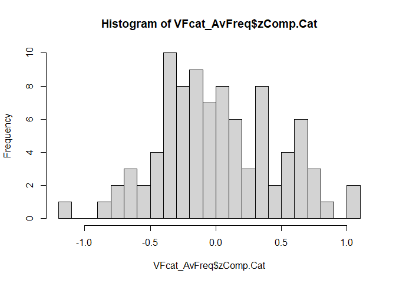<!-- -->

#### Visualisation AvFreq Semantic Fluency

``` r
#Convert to long format for visualisation
VFcat_AvFreq.long <- VFcat_AvFreq %>%
  pivot_longer(cols=Total:Writing.Utensils, names_to = "category", values_to = "AvFreq")

#Boxplot VF Average frequency (AvFreq)

#Write figure to png file
# png(file="./Figures and Tables/Boxplot_VFcatAvFreq.png",
# width=800, height=350)


(Boxplot_VF <- VFcat_AvFreq.long %>%
    dplyr::filter(category!="Total") %>%
    ggplot(aes(x=factor(category, levels=c("Animals", "Vehicles", "Fruits.and.Vegetables", "Fluid", "Writing.Utensils")), y=AvFreq, 
                                               fill = as.factor(Age.Category))) +
    geom_boxplot(outlier.shape = NA, colour="grey50")+
    stat_summary(aes(label=round(..y..,1), group=as.factor(Age.Category)), 
               fun=mean, geom = "label", size=4,
               fill="white", show.legend=NA, label.size=NA,
               position = position_dodge(.75), vjust=-3) +
      stat_summary(fun = "mean", position = position_dodge(.75), 
               show.legend=F, colour="white")+ #Mean as white dot
    labs(x = "Category",
         y = "AvFreq (raw scores)",
         title = "Average Word Frequency per Age Group and Category")+
        scale_fill_discrete(guide=guide_legend(title = "Age Group"), labels=c("18 to 30 years old","40 to 55 years old", "65 to 80 years old")) +
  coord_cartesian(ylim = c(3,5)))
```

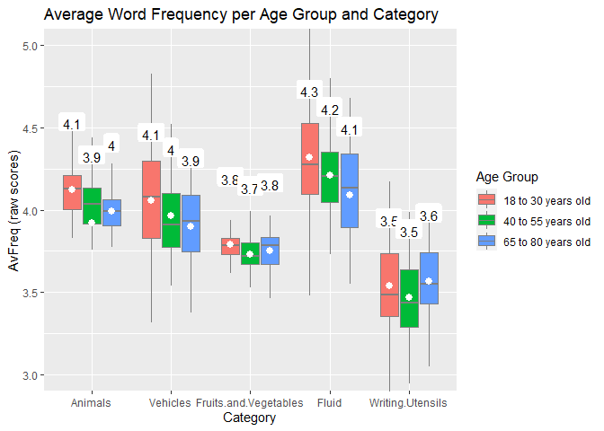<!-- -->

``` r
# dev.off() #Closes png() function
```

``` r
#Boxplot VF AvFreq Raw Total
# png(file="./Figures and Tables/Boxplot_VFcatAvFreq_RawTotal.png",
# width=600, height=350)

(Boxplot_VF <- VFcat_AvFreq.long %>%
    dplyr::filter(category=="Total") %>%
    ggplot(aes(x=category, y=AvFreq,fill = as.factor(Age.Category)),show.legend=FALSE) +
    geom_boxplot(outlier.shape = NA, colour="grey50",show.legend=FALSE)+
    stat_summary(aes(label=round(..y..,2), group=as.factor(Age.Category)), 
               fun=mean, geom = "label", size=5,
               fill="white", show.legend=NA, label.size=NA,
               position = position_dodge(.75), vjust=-2) +
      stat_summary(fun = "mean", position = position_dodge(.75), 
               show.legend=F, colour="grey")+ #Mean as white dot
    labs(x = "Semantic Fluency",
         y = "Average Frequency (raw scores)")+
        scale_fill_manual(values = cbPalette) + # , guide=guide_legend(title = "Age Group"), labels=c("18 to 30 years old","40 to 55 years old", "65 to 80 years old")
       theme(text = element_text(size = 20),
             axis.ticks.x = element_blank(),
             axis.text.x = element_blank(),
          panel.background  = element_rect(fill="white"),
          plot.background = element_rect(fill = "white"),
          strip.background = element_rect(fill="white"),
          axis.line.x = element_line(color="black"),
         axis.line.y = element_line(color="black")) +
  coord_cartesian(ylim = c(3,5))+
     scale_y_continuous(minor_breaks = seq(3,5,1),
                     breaks = seq(3,5, 0.5)))
```

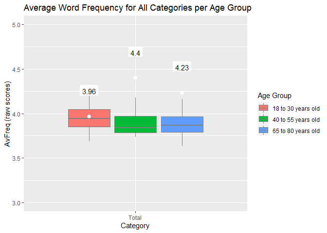<!-- -->

``` r
# dev.off()

# tiff(file="../Figures and Tables/descrVFcat_BarPlot.tiff",
# width=800, height=400)

(descr.VFcat_BarPlot <- VFcat_AvFreq.long %>%
    dplyr::filter(category=="Total") %>%
       mutate(Age.Category_ordered = factor(Age.Category, levels=c("Younger", "Middle-Aged", "Older"))) %>%
    ggplot(aes(x=category, y=AvFreq,fill = as.factor(Age.Category)),show.legend=FALSE) +
    stat_summary(fun=mean, position=position_dodge(0.95), geom = "bar",show.legend = FALSE , colour = "black") +
    stat_summary(fun.data=mean_cl_normal,position=position_dodge(0.95),geom="errorbar", width=0.4, colour="#999999") + 
  # geom_errorbar(stat="summary", fun.data = mean_sdl, fun.args = list(mult=0.5),  
  #               width=0.4, position=position_dodge(0.9), colour="grey50") +
    #   stat_summary(fun = "mean", position = position_dodge(.75), 
    #            show.legend=F, colour="grey")+ #Mean as white dot
    labs(x = "Semantic Fluency",
         y = "Average Frequency (raw scores)",
         title = "Semantic Fluency - Average Frequency per Age group")+
        scale_fill_manual(values = cbPalette) + # , guide=guide_legend(title = "Age Group"), labels=c("18 to 30 years old","40 to 55 years old", "65 to 80 years old")
       theme(text = element_text(size = 20),
             axis.ticks.x = element_blank(),
             axis.text.x = element_blank(),
          panel.background  = element_rect(fill="white"),
          plot.background = element_rect(fill = "white"),
          strip.background = element_rect(fill="white"),
          axis.line.x = element_line(color="black"),
         axis.line.y = element_line(color="black")) +
  coord_cartesian(ylim = c(0,5.5))+
     scale_y_continuous(minor_breaks = seq(0,5,0.1),
                     breaks = seq(0,5,1)))
```

<!-- -->

``` r
# dev.off()

# ggsave(descr.VFcat_BarPlot, filename = "../Figures and Tables/descrVFcat_BarPlot.tiff", height = 15, width=20)
```

*Figures AvFreq Semantic Fluency zscores*

``` r
#Convert to long format for visualisation
VFcat_AvFreq.long.zscores <- VFcat_AvFreq %>%
  pivot_longer(cols=zComp.Cat:zWriting, names_to = "zcategory", values_to = "zAvFreq")

#Boxplot VF Average frequency (AvFreq)

#Write figure to png file
# png(file="./Figures and Tables/Boxplot_VFcatAvFreq_zscores.png",
# width=800, height=350)

(Boxplot_VFcat.zscores <- VFcat_AvFreq.long.zscores %>%
    dplyr::filter(zcategory!="zComp.Cat") %>%
    ggplot(aes(x=factor(zcategory, levels=c("zAnimals", "zVehicles", "zFandV", "zFluid", "zWriting")), y=zAvFreq, 
                                               fill = as.factor(Age.Category))) +
    geom_boxplot(colour="grey50")+
      stat_summary(fun = "mean", position = position_dodge(.75), 
               show.legend=F, colour="white")+ #Mean as white dot
    labs(x = "Category",
         y = "AvFreq (z scores)",
         title = "Average Word Frequency per Age Group and Category")+
        scale_fill_discrete(guide=guide_legend(title = "Age Group"), labels=c("18 to 30 years old","40 to 55 years old", "65 to 80 years old")) +
  coord_cartesian(ylim = c(-3,3)))
```

<!-- -->

``` r
# dev.off() #Closes png() function
```

``` r
#Boxplot VF AvFreq Raw Total
# png(file="./Figures and Tables/Boxplot_VFcatAvFreq_Total_zscores.png",
# width=600, height=350)

(Boxplot_VFcat.Totalzscore <- VFcat_AvFreq.long.zscores %>%
    dplyr::filter(zcategory=="zComp.Cat") %>%
    ggplot(aes(x=zcategory, y=zAvFreq,fill = as.factor(Age.Category)),show.legend=FALSE) +
    geom_boxplot(colour="grey50",show.legend=FALSE)+
    stat_summary(aes(label=round(..y..,2), group=as.factor(Age.Category)), 
               fun=mean, geom = "label", size=5,
               fill="white", show.legend=FALSE, label.size=NA,
               position = position_dodge(.75), vjust=-2) +
    stat_summary(fun = "mean", position = position_dodge(.75), 
               show.legend=F, colour="white")+ #Mean as white dot
    labs(x = "Semantic Fluency",
         y = "Average Frequency (z scores)")+
        scale_fill_manual(values = cbPalette) + # , guide=guide_legend(title = "Age Group"), labels=c("18 to 30 years old","40 to 55 years old", "65 to 80 years old")
       theme(text = element_text(size = 20),
             axis.ticks.x = element_blank(),
             axis.text.x = element_blank(),
          panel.background  = element_rect(fill="white"),
          plot.background = element_rect(fill = "white"),
          strip.background = element_rect(fill="white"),
          axis.line.x = element_line(color="black"),
         axis.line.y = element_line(color="black")) +
  coord_cartesian(ylim = c(-3,3))+
     scale_y_continuous(minor_breaks = seq(-3,3,0.5),
                     breaks = seq(-3,3,1)))
```

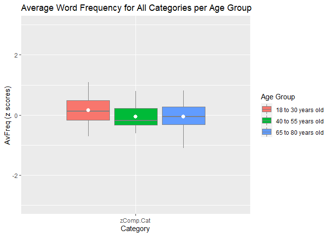<!-- -->

``` r
# dev.off()
```

## Multiple Linear Regression - Semantic Fluency

*Create user-defined contrasts for the Age Category variable*

``` r
VFcat_AvFreq <- mutate(VFcat_AvFreq,
                    Age.Category = 
                      factor(Age.Category, levels = c("Middle-Aged", "Younger", "Older")))

VFcat_AvFreq_coded <- VFcat_AvFreq
contrasts(VFcat_AvFreq_coded$Age.Category) <- contr.helmert(3)
contrasts(VFcat_AvFreq_coded$Age.Category)
```

    ##             [,1] [,2]
    ## Middle-Aged   -1   -1
    ## Younger        1   -1
    ## Older          0    2

*Unconditional model, i.e. without covariates*

``` r
lmUncond.VFcat.AvFreq <- lm(zComp.Cat ~ Age.Category*CR.composite.before, data = VFcat_AvFreq_coded)
# broom::tidy(lmUncond.VFcat.AvFreq, conf.int=T)
```

*Full model of AvFreq in z-distribution, including covariates*

``` r
lmFull.VFcat.AvFreq <- lm(zComp.Cat ~ Age.Category*CR.composite.before + GenCogProc.composite, data = VFcat_AvFreq_coded)
summary(lmFull.VFcat.AvFreq)
```

    ## 
    ## Call:
    ## lm(formula = zComp.Cat ~ Age.Category * CR.composite.before + 
    ##     GenCogProc.composite, data = VFcat_AvFreq_coded)
    ## 
    ## Residuals:
    ##      Min       1Q   Median       3Q      Max 
    ## -0.97621 -0.27870 -0.06062  0.29881  0.98589 
    ## 
    ## Coefficients:
    ##                                   Estimate Std. Error t value Pr(>|t|)  
    ## (Intercept)                        0.01654    0.04624   0.358   0.7215  
    ## Age.Category1                      0.12093    0.05983   2.021   0.0465 *
    ## Age.Category2                     -0.05218    0.03771  -1.384   0.1701  
    ## CR.composite.before               -0.04559    0.04709  -0.968   0.3358  
    ## GenCogProc.composite              -0.08321    0.10726  -0.776   0.4401  
    ## Age.Category1:CR.composite.before -0.05309    0.05778  -0.919   0.3609  
    ## Age.Category2:CR.composite.before -0.04303    0.03325  -1.294   0.1993  
    ## ---
    ## Signif. codes:  0 '***' 0.001 '**' 0.01 '*' 0.05 '.' 0.1 ' ' 1
    ## 
    ## Residual standard error: 0.4386 on 83 degrees of freedom
    ## Multiple R-squared:  0.09732,    Adjusted R-squared:  0.03207 
    ## F-statistic: 1.491 on 6 and 83 DF,  p-value: 0.1912

``` r
#Tidy table output
(tidylmFull.VFcat.AvFreq <- broom::tidy(lmFull.VFcat.AvFreq, conf.int=T)%>%
  mutate_if(is.numeric, round, 3))
```

    ## # A tibble: 7 x 7
    ##   term                   estimate std.error statistic p.value conf.low conf.high
    ##   <chr>                     <dbl>     <dbl>     <dbl>   <dbl>    <dbl>     <dbl>
    ## 1 (Intercept)               0.017     0.046     0.358   0.721   -0.075     0.109
    ## 2 Age.Category1             0.121     0.06      2.02    0.046    0.002     0.24 
    ## 3 Age.Category2            -0.052     0.038    -1.38    0.17    -0.127     0.023
    ## 4 CR.composite.before      -0.046     0.047    -0.968   0.336   -0.139     0.048
    ## 5 GenCogProc.composite     -0.083     0.107    -0.776   0.44    -0.297     0.13 
    ## 6 Age.Category1:CR.comp~   -0.053     0.058    -0.919   0.361   -0.168     0.062
    ## 7 Age.Category2:CR.comp~   -0.043     0.033    -1.29    0.199   -0.109     0.023

``` r
# write.csv(tidylmFull.VFcat.AvFreq, "./Figures and Tables/VFcat_AvFreq_zlmFull.csv", row.names = F)
```

``` r
#Look at pairwise comparisons between contrasts
lmFull.VFcat.AvFreq.emmeans <- emmeans::emtrends(lmFull.VFcat.AvFreq, ~Age.Category, var = "CR.composite.before")
pairs(lmFull.VFcat.AvFreq.emmeans)
```

    ##  contrast                estimate    SE df t.ratio p.value
    ##  (Middle-Aged) - Younger    0.106 0.116 83   0.919  0.6300
    ##  (Middle-Aged) - Older      0.182 0.115 83   1.580  0.2601
    ##  Younger - Older            0.076 0.115 83   0.659  0.7876
    ## 
    ## P value adjustment: tukey method for comparing a family of 3 estimates

*Full model of AvFreq as raw score, including covariates*

``` r
lmFull.VFcat.AvFreq.raw <- lm(Total ~ Age.Category*CR.composite.before + GenCogProc.composite, data = VFcat_AvFreq_coded)

#Tidy table output
broom::tidy(lmFull.VFcat.AvFreq.raw, conf.int=T) %>%
  mutate_if(is.numeric, round, 3)
```

    ## # A tibble: 7 x 7
    ##   term                   estimate std.error statistic p.value conf.low conf.high
    ##   <chr>                     <dbl>     <dbl>     <dbl>   <dbl>    <dbl>     <dbl>
    ## 1 (Intercept)               4.20      0.22     19.1     0        3.76      4.64 
    ## 2 Age.Category1            -0.186     0.285    -0.654   0.515   -0.753     0.381
    ## 3 Age.Category2            -0.013     0.18     -0.071   0.944   -0.37      0.345
    ## 4 CR.composite.before       0.265     0.224     1.18    0.241   -0.181     0.711
    ## 5 GenCogProc.composite     -0.173     0.511    -0.338   0.736   -1.19      0.844
    ## 6 Age.Category1:CR.comp~   -0.396     0.275    -1.44    0.155   -0.943     0.152
    ## 7 Age.Category2:CR.comp~   -0.147     0.158    -0.928   0.356   -0.462     0.168

The unconditional model and the model with the raw total scores do not
seem to predict the outcome variable for Verbal Fluency Categories. In
the full model with the average z-score as outcome variable, middle-aged
adults seem to significantly produce higher frequency words than young
adults.

Let’s check the model assumptions + fit.

*Assumption 1 - Linearity*

``` r
## Unconditional model with z composite score
plot(lmUncond.VFcat.AvFreq, 1, main = "Unconditional model")
```

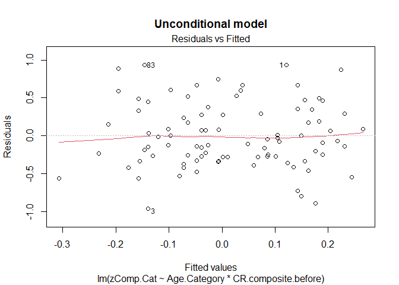<!-- -->

``` r
## Full model with z composite score
plot(lmFull.VFcat.AvFreq, 1, main = "Full model (z-score composite score)")
```

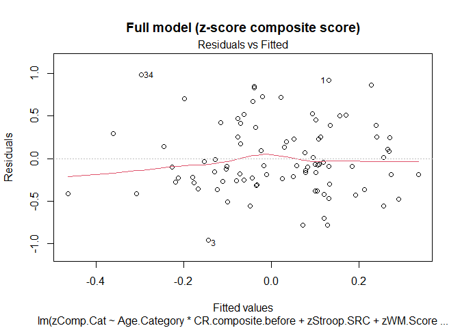<!-- -->

``` r
## Full model with raw total score
plot(lmFull.VFcat.AvFreq.raw, 1, main = "Full model (raw total score)")
```

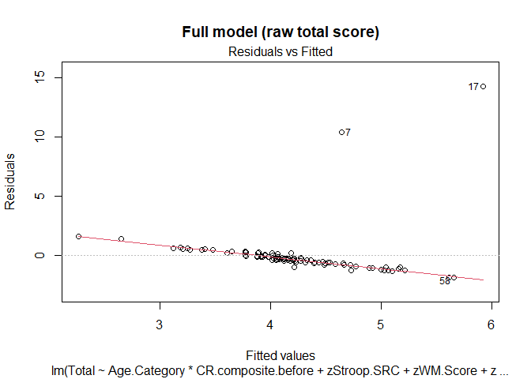<!-- -->

For the models with the z-composite score as outcome variable, the red
line is mostly horizontal, meaning that there is a linear relationship
between the fitted line and the residual value. The model with the raw
average frequency scores seems to violate the assumption.

*Assumption 2 - Independence of Variables*

``` r
# Z composite of VF cat
## Create table with correlation values between predictor variables
tibble::as_tibble(cor(VFcat_AvFreq_coded[,c(17,18)]), rownames="rowname") 
```

    ## # A tibble: 2 x 3
    ##   rowname              GenCogProc.composite CR.composite.before
    ##   <chr>                               <dbl>               <dbl>
    ## 1 GenCogProc.composite               1                  -0.0439
    ## 2 CR.composite.before               -0.0439              1

``` r
## Create correlation plot between predictor variables
corrplot(cor(VFcat_AvFreq_coded[,c(17,18)]),method='circle') 
```

<!-- -->

``` r
## Raw scores
## Create table with correlation values between predictor variables
tibble::as_tibble(cor(VFcat_AvFreq_coded[,c(17,18)]), rownames = "rowname")
```

    ## # A tibble: 2 x 3
    ##   rowname              GenCogProc.composite CR.composite.before
    ##   <chr>                               <dbl>               <dbl>
    ## 1 GenCogProc.composite               1                  -0.0439
    ## 2 CR.composite.before               -0.0439              1

``` r
## Create correlation plot between predictor variables
corrplot(cor(VFcat_AvFreq_coded[,c(17,18)]))
```

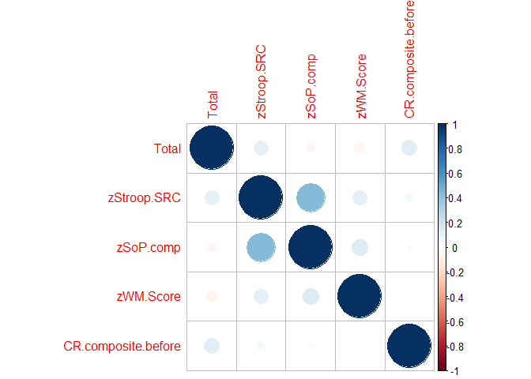<!-- -->

There seems to be no strong relationship between the predictor
variables. Hence, we can assume Independence of Variables.

*Assumption 3 - Normal Distribution of Residuals*

Full model with z composite score

``` r
plot(lmFull.VFcat.AvFreq, 2, main = "Full model (z-score composite score)")
```

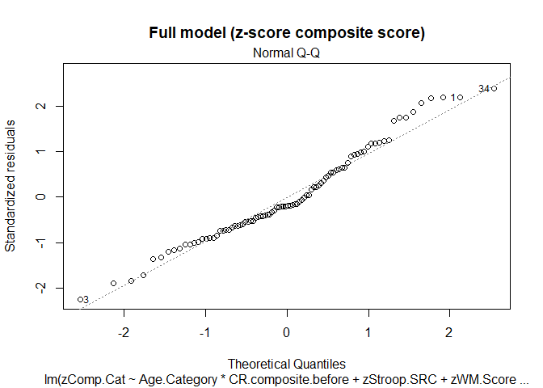<!-- -->
Full model with raw total score

``` r
plot(lmFull.VFcat.AvFreq.raw, 2, main = "Full model (raw total score)")
```

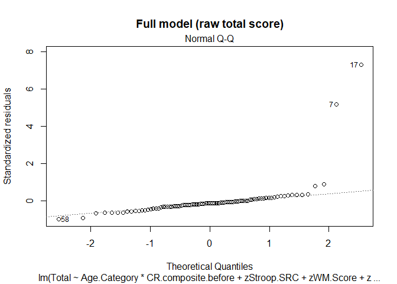<!-- -->

The model with the raw scores violates the assumption. This is likely
due to the two outliers on the right (point 7 and 17). The points in
both the unconditional and full model with the z-composite score seem to
roughly follow the straight line. There’s a little bit of a bulk on the
right for the full z-model and a small dip in both models. One
explanation could be the online format of the study. For example, some
participants might have scored lower than they would in a lab-based
study, due to unclear instructions. Also, it could have caused more
distractions than there would have been in a lab based study.

*Assumption 4 - Homoscedasticity or Equal Variance of Variables*

Full model with z composite score

``` r
plot(lmFull.VFcat.AvFreq, 3, main = "Full model (z-score composite score)")
```

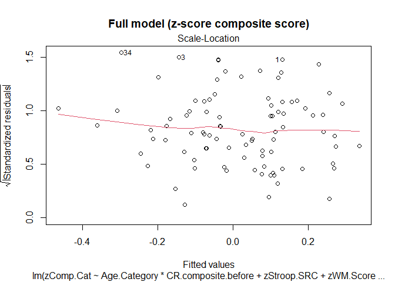<!-- -->
Full model with raw total score

``` r
plot(lmFull.VFcat.AvFreq.raw, 3, main = "Full model (raw total score)")
```

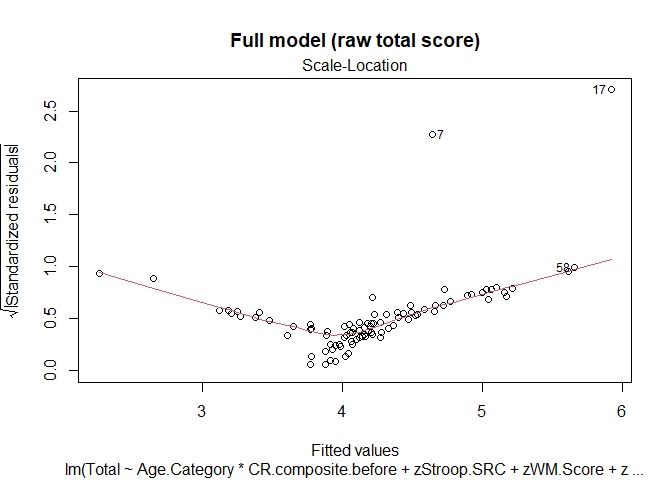<!-- -->
Again, the full model with the raw total score as outcome variable
violates the assumption. For the other two models, the variance of
residuals seems relatively equal across the predictors. Hence, the error
terms are relatively the same across all values of the independent
variable for all three models.

Conclusion: the full model with the z-composite variable as outcome
variable seem to meet the assumptions for multiple linear regression.

#### Model fit diagnostics

*Variation Inflation Factor*

Any VIF value above 4 needs further investigation. There seems to be no
concerning signs of collinearity (VIF values higher than 4). The
tolerance values indicate the percentage of variance that cannot be
explained for by the other predictor variables.

``` r
ols_vif_tol(lmFull.VFcat.AvFreq)
```

    ##                           Variables Tolerance      VIF
    ## 1                     Age.Category1 0.8958833 1.116217
    ## 2                     Age.Category2 0.7518193 1.330107
    ## 3               CR.composite.before 0.9971961 1.002812
    ## 4              GenCogProc.composite 0.6869407 1.455730
    ## 5 Age.Category1:CR.composite.before 0.9935202 1.006522
    ## 6 Age.Category2:CR.composite.before 0.9999277 1.000072

*Plot Diagnositcs Full model with z composite score for Semantic
Fluency*

``` r
ols_plot_diagnostics(lmFull.VFcat.AvFreq)
```

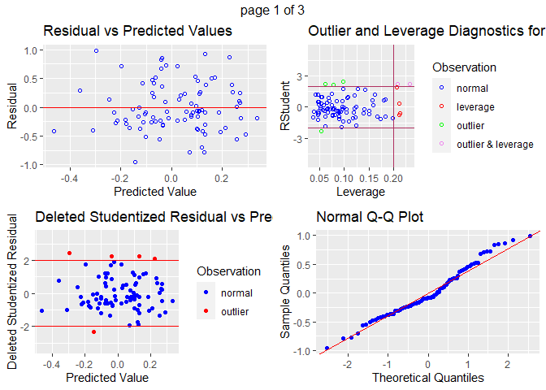<!-- -->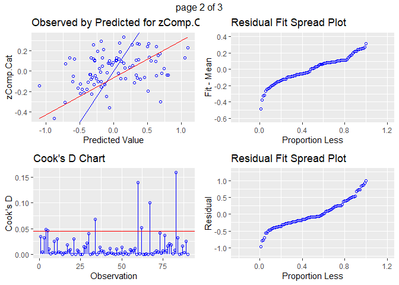<!-- -->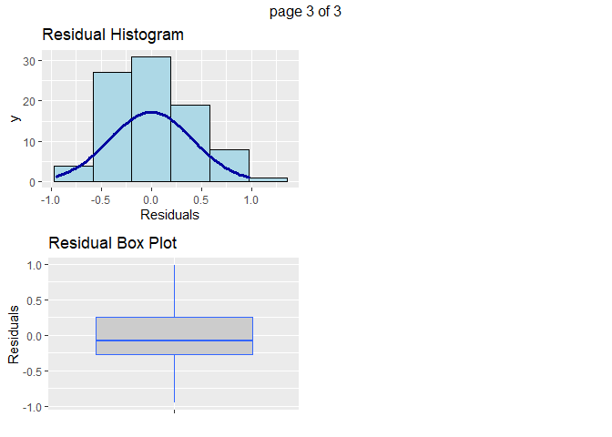<!-- -->

The Observed vs Predicted Plot shows that the model doesn’t fit the data
very well (pity) –&gt; due to outliers?? What to do….

### Model comparisons for the CR measure preciding and coinciding with the COVID-19 pandemic

The effect of the COVID-19 pandemic on CR and subsequent behavioural
performance

``` r
lmFull.VFcat.AvFreq.during <- lm(zComp.Cat ~ Age.Category*CR.composite.during + 
                                   GenCogProc.composite, data = 
                                   VFcat_AvFreq_coded)
summary(lmFull.VFcat.AvFreq.during)
```

    ## 
    ## Call:
    ## lm(formula = zComp.Cat ~ Age.Category * CR.composite.during + 
    ##     GenCogProc.composite, data = VFcat_AvFreq_coded)
    ## 
    ## Residuals:
    ##      Min       1Q   Median       3Q      Max 
    ## -1.02796 -0.27289 -0.07309  0.28903  0.97745 
    ## 
    ## Coefficients:
    ##                                   Estimate Std. Error t value Pr(>|t|)  
    ## (Intercept)                        0.01637    0.04683   0.350   0.7275  
    ## Age.Category1                      0.12308    0.06069   2.028   0.0458 *
    ## Age.Category2                     -0.05439    0.03833  -1.419   0.1597  
    ## CR.composite.during               -0.02586    0.04816  -0.537   0.5927  
    ## GenCogProc.composite              -0.09614    0.11021  -0.872   0.3855  
    ## Age.Category1:CR.composite.during -0.03884    0.05939  -0.654   0.5149  
    ## Age.Category2:CR.composite.during -0.02566    0.03421  -0.750   0.4553  
    ## ---
    ## Signif. codes:  0 '***' 0.001 '**' 0.01 '*' 0.05 '.' 0.1 ' ' 1
    ## 
    ## Residual standard error: 0.4442 on 83 degrees of freedom
    ## Multiple R-squared:  0.07417,    Adjusted R-squared:  0.007237 
    ## F-statistic: 1.108 on 6 and 83 DF,  p-value: 0.3647

``` r
anova(lmFull.VFcat.AvFreq, lmFull.VFcat.AvFreq.during)
```

    ## Analysis of Variance Table
    ## 
    ## Model 1: zComp.Cat ~ Age.Category * CR.composite.before + GenCogProc.composite
    ## Model 2: zComp.Cat ~ Age.Category * CR.composite.during + GenCogProc.composite
    ##   Res.Df    RSS Df Sum of Sq F Pr(>F)
    ## 1     83 15.969                      
    ## 2     83 16.379  0  -0.40961

Models are not significantly different from each other.

``` r
AIC(lmFull.VFcat.AvFreq)
```

    ## [1] 115.7846

``` r
AIC(lmFull.VFcat.AvFreq.during)
```

    ## [1] 118.064

Although very similar, the model with the CR composite score
pre-pandemic seems to fit the data slightly better. (Lower AIC indicates
better fit)

## Verbal Fluency - Letters

``` r
## Create dataset that only includes data of the Subtlex Average Frequency of the produced words
VFlet_AvFreq <- VFlet %>%
  dplyr::filter(Measures=="AvWordFreq_subtlex") %>%
  dplyr::select(-Measures) %>%
    #Recode age groups
  dplyr::mutate(Age.Category=as.factor(dplyr::recode(Age.Category, '18 to 30 years old'="Younger",
                                    '40 to 55 years old'="Middle-Aged",
                                    '65 to 80 years old'="Older")))

range(VFlet_AvFreq$zComp.Let) #No outliers
```

    ## [1] -1.783088  1.961524

``` r
# head(VFlet_AvFreq, L=6)
```

### Descriptives

``` r
(Descr_VFlet <- VFlet_AvFreq %>%
  #Per Age Group
  group_by(Age.Category) %>%
  summarise(Nppt = length(unique(ID)), #Number of participants
            total = mean(Total, na.rm=T), #Total words correctly produced            
            sdtotal = sd(Total, na.rm=T),#Total words correctly produced
            ztotal = mean(zComp.Let, na.rm=T), #Z-score per age group of total words correctly produced
            letterM = mean(M, na.rm=T), #Total words correctly produced for the letter M
            letterS = mean(S, na.rm=T), #Total words correctly produced for the letter S
            letterP = mean(P, na.rm=T))) #Total words correctly produced for the letter P
```

    ## # A tibble: 3 x 8
    ##   Age.Category  Nppt total sdtotal  ztotal letterM letterS letterP
    ##   <fct>        <int> <dbl>   <dbl>   <dbl>   <dbl>   <dbl>   <dbl>
    ## 1 Middle-Aged     30  4.08   0.255 -0.0355    4.07    4.13    4.03
    ## 2 Older           30  4.92   2.64  -0.0746    4.06    4.21    3.96
    ## 3 Younger         30  4.22   0.239  0.264     4.25    4.24    4.17

``` r
# write.csv(Descr_VFlet, "./Figures and Tables/Descr_VFlet_AvFreq.csv", row.names = F)
```

``` r
#Visualise z-distribution of the composite score for letter fluency Average word frequency
hist(VFlet_AvFreq$zComp.Let, breaks=20) #Composite z-score of Letter Fluency
```

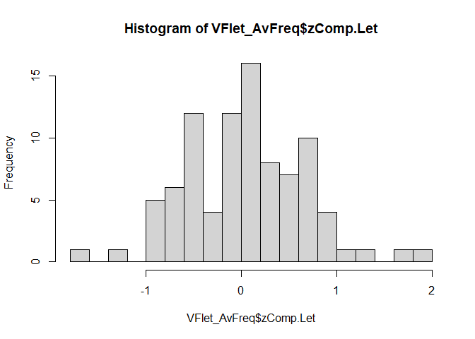<!-- -->

#### Visualisation AvFreq Semantic Fluency

``` r
#Convert to long format for visualisation
VFlet_AvFreq.long <- VFlet_AvFreq %>%
  pivot_longer(cols=Total:S, names_to = "letter", values_to = "AvFreq")

# Boxplot VFlet AvFreq

# png(file="./Figures and Tables/Boxplot_VFletAvFreq.png",
# width=600, height=350)

(Boxplot_VF <- VFlet_AvFreq.long %>%
    dplyr::filter(letter!="Total") %>%
    ggplot(aes(x=letter, y=AvFreq, 
                                               fill = as.factor(Age.Category))) +
    geom_boxplot(colour="grey50")+
    stat_summary(aes(label=round(..y..,2), group=as.factor(Age.Category)), 
               fun=mean, geom = "label", size=4,
               fill="white", show.legend=NA, label.size=NA,
               position = position_dodge(.75), vjust=-3) +
      stat_summary(fun = "mean", position = position_dodge(.75), 
               show.legend=F, colour="white")+ #Mean as white dot
    labs(x = "Letter",
         y = "AvFreq (raw scores)",
         title = "Average Word Frequency per Age Group and Letter")+
        scale_fill_discrete(guide=guide_legend(title = "Age Group"), labels=c("18 to 30 years old","40 to 55 years old", "65 to 80 years old")))
```

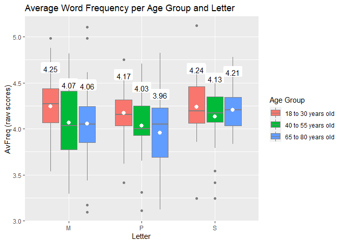<!-- -->

``` r
# dev.off()
```

``` r
# Boxplot VFlet AvFreq raw total
# png(file="./Figures and Tables/Boxplot_VFletAvFreq_RawTotal.png",
# width=600, height=350)

(Boxplot_VF <- VFlet_AvFreq.long %>%
    dplyr::filter(letter=="Total") %>%
    ggplot(aes(x=letter, y=AvFreq,fill = as.factor(Age.Category)), show.legend=FALSE) +
    geom_boxplot(outlier.shape = NA, colour="grey50", show.legend=FALSE)+
    stat_summary(aes(label=round(..y.., 2), group=as.factor(Age.Category)), 
               fun=mean, geom = "label", size=5,
               fill="white", show.legend=NA, label.size=NA,
               position = position_dodge(.75), vjust=c(-2,3.5,-1.5)) +
      stat_summary(fun = "mean", position = position_dodge(.75), 
               show.legend=F, colour="white")+ #Mean as white dot
    labs(x = "Letter Fluency",
         y = "Average Frequency (raw scores)")+
        scale_fill_manual(values = cbPalette) + # , guide=guide_legend(title = "Age Group"), labels=c("18 to 30 years old","40 to 55 years old", "65 to 80 years old")
       theme(text = element_text(size = 20),
             axis.ticks.x = element_blank(),
             axis.text.x = element_blank(),
          panel.background  = element_rect(fill="white"),
          plot.background = element_rect(fill = "white"),
          strip.background = element_rect(fill="white"),
          axis.line.x = element_line(color="black"),
         axis.line.y = element_line(color="black")) +
  coord_cartesian(ylim = c(3,5))+
     scale_y_continuous(minor_breaks = seq(3,5,1),
                     breaks = seq(3,5, 0.5)))
```

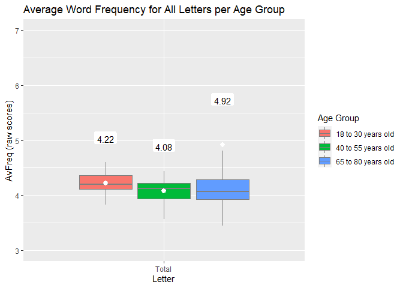<!-- -->

``` r
# dev.off()
```

*Figures AvFreq Letter Fluency zscores*

``` r
#Convert to long format for visualisation
VFlet_AvFreq.long.zscores <- VFlet_AvFreq %>%
  pivot_longer(cols=zComp.Let:zP, names_to = "zletter", values_to = "zAvFreq")

# Boxplot VFlet AvFreq
# png(file="./Figures and Tables/Boxplot_VFletAvFreq_zscores.png",
# width=600, height=350)

(Boxplot_VFlet.zscores <- VFlet_AvFreq.long.zscores %>%
    dplyr::filter(zletter!="zComp.Let") %>%
    ggplot(aes(x=zletter, y=zAvFreq, 
                                               fill = as.factor(Age.Category))) +
    geom_boxplot(colour="grey50")+
    # stat_summary(aes(label=round(..y..,2), group=as.factor(Age.Category)), 
    #            fun=mean, geom = "label", size=4,
    #            fill="white", show.legend=NA, label.size=NA,
    #            position = position_dodge(.75), vjust=-3) +
      stat_summary(fun = "mean", position = position_dodge(.75), 
               show.legend=F, colour="white")+ #Mean as white dot
    labs(x = "Letter",
         y = "AvFreq (z scores)",
         title = "Average Word Frequency per Age Group and Letter")+
        scale_fill_discrete(guide=guide_legend(title = "Age Group"), labels=c("18 to 30 years old","40 to 55 years old", "65 to 80 years old")))
```

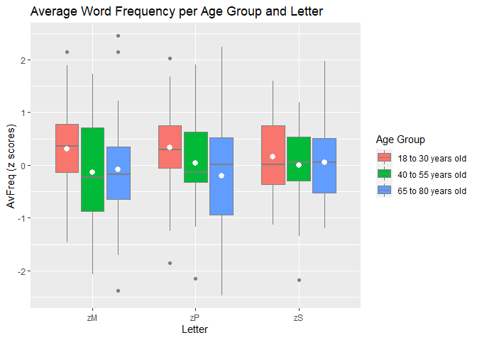<!-- -->

``` r
# dev.off()
```

``` r
# Boxplot VFlet AvFreq raw total
# png(file="./Figures and Tables/Boxplot_VFletAvFreq_Total_zscores.png",
# width=600, height=350)

(Boxplot_VFlet.zscoreTotal <- VFlet_AvFreq.long.zscores %>%
    dplyr::filter(zletter=="zComp.Let") %>%
    ggplot(aes(x=zletter, y=zAvFreq,fill = as.factor(Age.Category)),show.legend=FALSE) +
    geom_boxplot(colour="grey50",show.legend=FALSE)+
       stat_summary(aes(label=round(..y..,2), group=as.factor(Age.Category)), 
               fun=mean, geom = "label", size=5,
               fill="white", show.legend=FALSE, label.size=NA,
               position = position_dodge(.75), vjust=-2) +
      stat_summary(fun = "mean", position = position_dodge(.75), 
               show.legend=F, colour="white")+ #Mean as white dot
    labs(x = "Letter Fluency",
         y = "Average Frequency (z scores)")+
        scale_fill_manual(values = cbPalette) + # , guide=guide_legend(title = "Age Group"), labels=c("18 to 30 years old","40 to 55 years old", "65 to 80 years old")
       theme(text = element_text(size = 20),
             axis.ticks.x = element_blank(),
             axis.text.x = element_blank(),
          panel.background  = element_rect(fill="white"),
          plot.background = element_rect(fill = "white"),
          strip.background = element_rect(fill="white"),
          axis.line.x = element_line(color="black"),
         axis.line.y = element_line(color="black")) +
  coord_cartesian(ylim = c(-3,3))+
     scale_y_continuous(minor_breaks = seq(-3,3,0.5),
                     breaks = seq(-3,3,1)))
```

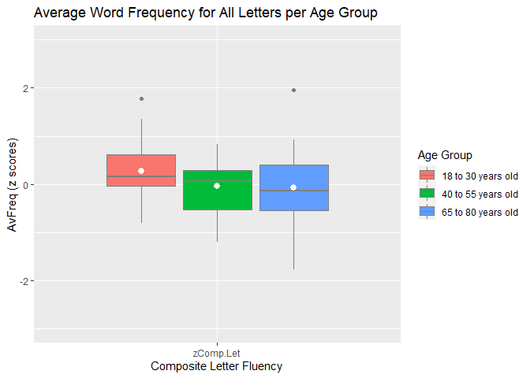<!-- -->

``` r
# dev.off()
```

## Multiple Linear Regression - Letter Fluency

*Create user-defined contrasts for the Age Category variable*

``` r
VFlet_AvFreq <- mutate(VFlet_AvFreq,
                    Age.Category = 
                      factor(Age.Category, levels = c("Middle-Aged", "Younger", "Older")))

VFlet_AvFreq_coded <- VFlet_AvFreq
contrasts(VFlet_AvFreq_coded$Age.Category) <- contr.helmert(3)
contrasts(VFlet_AvFreq_coded$Age.Category)
```

    ##             [,1] [,2]
    ## Middle-Aged   -1   -1
    ## Younger        1   -1
    ## Older          0    2

*Unconditional model, i.e. without covariates*

``` r
lmUncond.VFlet.AvFreq <- lm(zComp.Let ~ Age.Category*CR.composite.before, data = VFlet_AvFreq_coded)
# broom::tidy(lmUncond.VFlet.AvFreq, conf.int=T)
```

*Full model of AvFreq in z-distribution, including covariates*

``` r
lmFull.VFlet.AvFreq <- lm(zComp.Let ~ Age.Category*CR.composite.before + GenCogProc.composite, data = VFlet_AvFreq_coded)
summary(lmFull.VFlet.AvFreq)
```

    ## 
    ## Call:
    ## lm(formula = zComp.Let ~ Age.Category * CR.composite.before + 
    ##     GenCogProc.composite, data = VFlet_AvFreq_coded)
    ## 
    ## Residuals:
    ##      Min       1Q   Median       3Q      Max 
    ## -1.66527 -0.41451 -0.01097  0.35743  1.82439 
    ## 
    ## Coefficients:
    ##                                    Estimate Std. Error t value Pr(>|t|)  
    ## (Intercept)                        0.051243   0.066275   0.773   0.4416  
    ## Age.Category1                      0.148597   0.085754   1.733   0.0868 .
    ## Age.Category2                     -0.061866   0.054046  -1.145   0.2556  
    ## CR.composite.before               -0.009201   0.067500  -0.136   0.8919  
    ## GenCogProc.composite               0.005995   0.153738   0.039   0.9690  
    ## Age.Category1:CR.composite.before  0.052311   0.082823   0.632   0.5294  
    ## Age.Category2:CR.composite.before -0.064943   0.047665  -1.363   0.1767  
    ## ---
    ## Signif. codes:  0 '***' 0.001 '**' 0.01 '*' 0.05 '.' 0.1 ' ' 1
    ## 
    ## Residual standard error: 0.6287 on 83 degrees of freedom
    ## Multiple R-squared:  0.08272,    Adjusted R-squared:  0.01641 
    ## F-statistic: 1.247 on 6 and 83 DF,  p-value: 0.2908

``` r
#Tidy table output
(tidylmFull.VFlet.AvFreq <- broom::tidy(lmFull.VFlet.AvFreq, conf.int=T)%>%
  mutate_if(is.numeric, round, 3))
```

    ## # A tibble: 7 x 7
    ##   term                   estimate std.error statistic p.value conf.low conf.high
    ##   <chr>                     <dbl>     <dbl>     <dbl>   <dbl>    <dbl>     <dbl>
    ## 1 (Intercept)               0.051     0.066     0.773   0.442   -0.081     0.183
    ## 2 Age.Category1             0.149     0.086     1.73    0.087   -0.022     0.319
    ## 3 Age.Category2            -0.062     0.054    -1.14    0.256   -0.169     0.046
    ## 4 CR.composite.before      -0.009     0.068    -0.136   0.892   -0.143     0.125
    ## 5 GenCogProc.composite      0.006     0.154     0.039   0.969   -0.3       0.312
    ## 6 Age.Category1:CR.comp~    0.052     0.083     0.632   0.529   -0.112     0.217
    ## 7 Age.Category2:CR.comp~   -0.065     0.048    -1.36    0.177   -0.16      0.03

``` r
# write.csv(tidylmFull.VFlet.AvFreq, "./Figures and Tables/VFlet_zAvFreq_lmFull.csv")
```

*Full model of AvFreq as raw score, including covariates*

``` r
lmFull.VFlet.AvFreq.raw <- lm(Total ~ Age.Category*CR.composite.before + GenCogProc.composite, data = VFlet_AvFreq_coded)
summary(lmFull.VFlet.AvFreq.raw)
```

    ## 
    ## Call:
    ## lm(formula = Total ~ Age.Category * CR.composite.before + GenCogProc.composite, 
    ##     data = VFlet_AvFreq_coded)
    ## 
    ## Residuals:
    ##     Min      1Q  Median      3Q     Max 
    ## -1.7988 -0.6158 -0.1065  0.1666  8.2945 
    ## 
    ## Coefficients:
    ##                                   Estimate Std. Error t value Pr(>|t|)    
    ## (Intercept)                        4.40304    0.16478  26.721   <2e-16 ***
    ## Age.Category1                      0.11671    0.21321   0.547    0.586    
    ## Age.Category2                      0.21010    0.13437   1.564    0.122    
    ## CR.composite.before               -0.07834    0.16782  -0.467    0.642    
    ## GenCogProc.composite              -0.26441    0.38223  -0.692    0.491    
    ## Age.Category1:CR.composite.before  0.02017    0.20592   0.098    0.922    
    ## Age.Category2:CR.composite.before -0.09345    0.11851  -0.789    0.433    
    ## ---
    ## Signif. codes:  0 '***' 0.001 '**' 0.01 '*' 0.05 '.' 0.1 ' ' 1
    ## 
    ## Residual standard error: 1.563 on 83 degrees of freedom
    ## Multiple R-squared:  0.07011,    Adjusted R-squared:  0.002884 
    ## F-statistic: 1.043 on 6 and 83 DF,  p-value: 0.4038

``` r
#Tidy table output
broom::tidy(lmFull.VFlet.AvFreq.raw, conf.int=T)%>%
  mutate_if(is.numeric, round, 3)
```

    ## # A tibble: 7 x 7
    ##   term                   estimate std.error statistic p.value conf.low conf.high
    ##   <chr>                     <dbl>     <dbl>     <dbl>   <dbl>    <dbl>     <dbl>
    ## 1 (Intercept)               4.40      0.165    26.7     0        4.08      4.73 
    ## 2 Age.Category1             0.117     0.213     0.547   0.586   -0.307     0.541
    ## 3 Age.Category2             0.21      0.134     1.56    0.122   -0.057     0.477
    ## 4 CR.composite.before      -0.078     0.168    -0.467   0.642   -0.412     0.255
    ## 5 GenCogProc.composite     -0.264     0.382    -0.692   0.491   -1.02      0.496
    ## 6 Age.Category1:CR.comp~    0.02      0.206     0.098   0.922   -0.389     0.43 
    ## 7 Age.Category2:CR.comp~   -0.093     0.119    -0.789   0.433   -0.329     0.142

The model doesn’t seem to predict the raw Total score for Verbal Fluency
Letter. However, in the Full model with the z-composite score, older
adults seem to produce significantly higher frequent words than younger
adults.

Let’s check the model assumptions + fit.

*Assumption 1 - Linearity*

``` r
## Unconditional model with z composite score
plot(lmUncond.VFlet.AvFreq, 1, main = "Unconditional model")
```

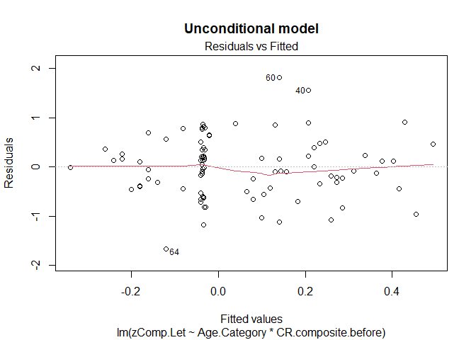<!-- -->

``` r
## Full model with z composite score
plot(lmFull.VFlet.AvFreq, 1, main = "Full model (z-score composite score)")
```

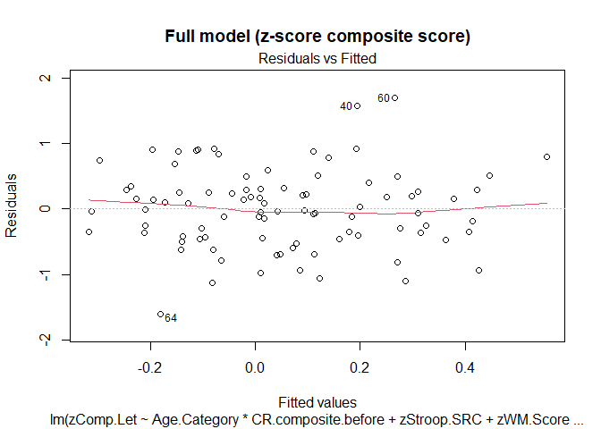<!-- -->

``` r
## Full model with raw total score
plot(lmFull.VFlet.AvFreq.raw, 1, main = "Full model (raw total score)")
```

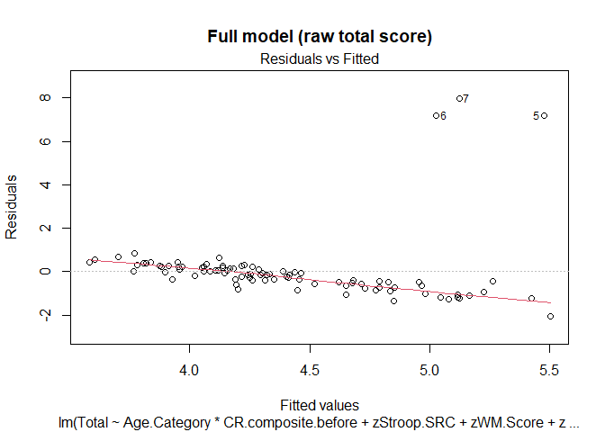<!-- -->

For the models with the z-composite score as outcome variable, the red
line is mostly horizontal, meaning that there is a linear relationship
between the fitted line and the residual value. The model with the raw
average frequency scores seems to violate the assumption.

*Assumption 2 - Independence of Variables*

``` r
## z composite of VF let
## Create table with correlation values between predictor variables
tibble::as_tibble(cor(VFlet_AvFreq_coded[,c(13,14)]), rownames="rowname")
```

    ## # A tibble: 2 x 3
    ##   rowname              GenCogProc.composite CR.composite.before
    ##   <chr>                               <dbl>               <dbl>
    ## 1 GenCogProc.composite               1                  -0.0439
    ## 2 CR.composite.before               -0.0439              1

``` r
## Create correlation plot between predictor variables
corrplot(cor(VFlet_AvFreq_coded[,c(13,14)]),method='circle')
```

<!-- -->

``` r
## Raw scores
## Create table with correlation values between predictor variables
tibble::as_tibble(cor(VFlet_AvFreq_coded[,c(14,13)]), rownames = "rowname")
```

    ## # A tibble: 2 x 3
    ##   rowname              CR.composite.before GenCogProc.composite
    ##   <chr>                              <dbl>                <dbl>
    ## 1 CR.composite.before               1                   -0.0439
    ## 2 GenCogProc.composite             -0.0439               1

``` r
## Create correlation plot between predictor variables
corrplot(cor(VFlet_AvFreq_coded[,c(14,13)]))
```

<!-- -->

There seems to be no strong relationship between the predictor
variables. Hence, we can assume Independence of Variables.

*Assumption 3 - Normal Distribution of Residuals*

Full model with z composite score

``` r
plot(lmFull.VFlet.AvFreq, 2, main = "Full model (z-score composite score)")
```

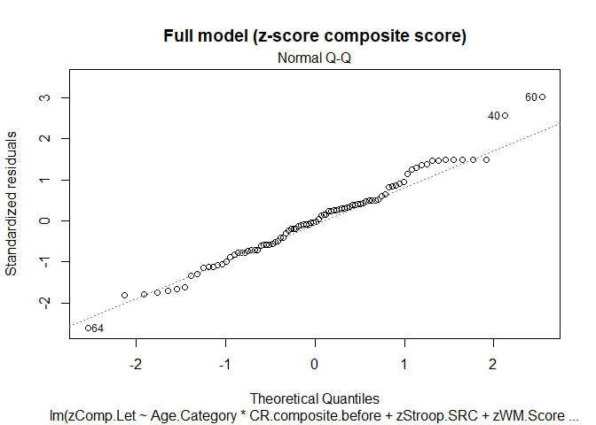<!-- -->
Full model with raw total score

``` r
plot(lmFull.VFlet.AvFreq.raw, 2, main = "Full model (raw total score)")
```

<!-- -->

For the unconditional and full model with the z-score as outcome
variable, the points seem to roughly follow a straight line, except for
two outliers on right. So, these two models seem to roughly meet the
assumption. The full model with the raw score as outcome variable, there
are three massive outliers on the right. Hence, other
relationships/predictors that have not been included into the models
could explain the variance.

*Assumption 4 - Homoscedasticity or Equal Variance of Variables*

Full model with z composite score

``` r
plot(lmFull.VFlet.AvFreq, 3, main = "Full model (z-score composite score)")
```

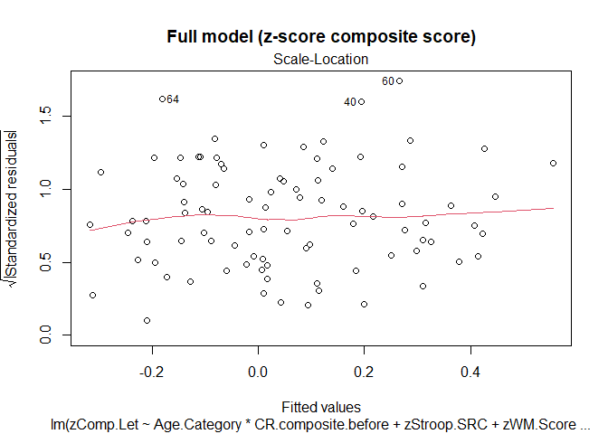<!-- -->
Full model with raw total score

``` r
plot(lmFull.VFlet.AvFreq.raw, 3, main = "Full model (raw total score)")
```

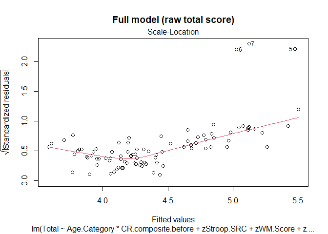<!-- -->
The full model with the raw score seem to violates the assumption of
Homoscedasticity So, the variance of residuals does not seem equal
across the predictors. The full model with the z-scores does seem to
meet the assumption of Homoscedasticity. Hence, the error terms are
relatively the same across all values of the independent variable for
this model.

Conclusion: only the full model with the outcome variable along the
z-distribution seems to meet all the assumptions.

#### Model fit diagnostics

*Variation Inflation Factor*

Any VIF value above 4 needs further investigation. There seems to be no
concerning signs of collinearity (VIF values higher than 4). The
tolerance values indicate the percentage of variance that cannot be
explained for by the other predictor variables.

``` r
ols_vif_tol(lmFull.VFlet.AvFreq)
```

    ##                           Variables Tolerance      VIF
    ## 1                     Age.Category1 0.8958833 1.116217
    ## 2                     Age.Category2 0.7518193 1.330107
    ## 3               CR.composite.before 0.9971961 1.002812
    ## 4              GenCogProc.composite 0.6869407 1.455730
    ## 5 Age.Category1:CR.composite.before 0.9935202 1.006522
    ## 6 Age.Category2:CR.composite.before 0.9999277 1.000072

*Plot Diagnositcs Full model with z composite score for Semantic
Fluency*

``` r
ols_plot_diagnostics(lmFull.VFlet.AvFreq)
```

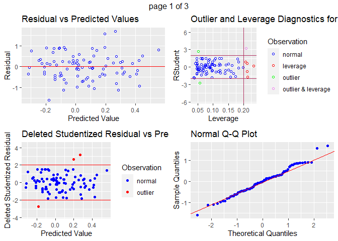<!-- -->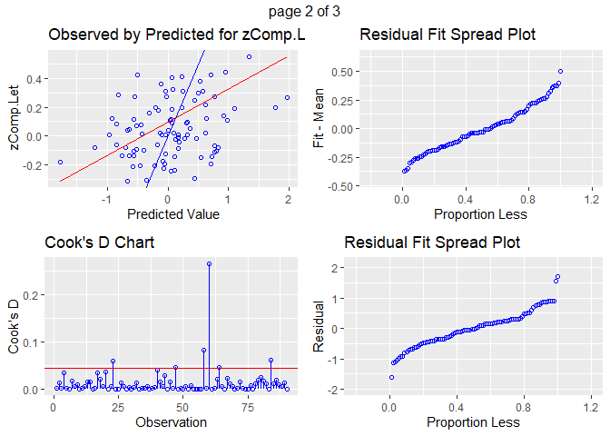<!-- -->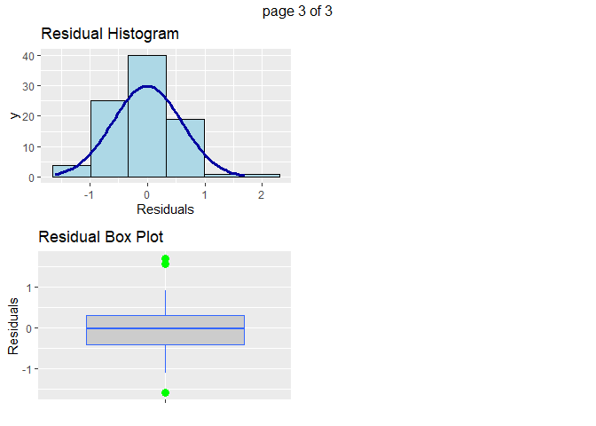<!-- -->

The Observed vs Predicted Plot shows that the model doesn’t fit the data
very well (pity) –&gt; due to outliers?? What to do…. –&gt; perhaps
identify outliers using the Cook chart and residual plot and rerun the
models?

### Model comparisons for the CR measure preciding and coinciding with the COVID-19 pandemic

The effect of the COVID-19 pandemic on CR and subsequent behavioural
performance

``` r
lmFull.VFlet.AvFreq.during <- lm(zComp.Let ~ Age.Category*CR.composite.during + 
                                   GenCogProc.composite, data = 
                                   VFlet_AvFreq_coded)
summary(lmFull.VFlet.AvFreq.during)
```

    ## 
    ## Call:
    ## lm(formula = zComp.Let ~ Age.Category * CR.composite.during + 
    ##     GenCogProc.composite, data = VFlet_AvFreq_coded)
    ## 
    ## Residuals:
    ##     Min      1Q  Median      3Q     Max 
    ## -1.7031 -0.4011 -0.0280  0.3257  1.7996 
    ## 
    ## Coefficients:
    ##                                    Estimate Std. Error t value Pr(>|t|)  
    ## (Intercept)                        0.051328   0.066556   0.771   0.4428  
    ## Age.Category1                      0.153172   0.086266   1.776   0.0795 .
    ## Age.Category2                     -0.066149   0.054480  -1.214   0.2281  
    ## CR.composite.during               -0.007990   0.068445  -0.117   0.9073  
    ## GenCogProc.composite              -0.017966   0.156640  -0.115   0.9090  
    ## Age.Category1:CR.composite.during  0.006183   0.084410   0.073   0.9418  
    ## Age.Category2:CR.composite.during -0.060386   0.048618  -1.242   0.2177  
    ## ---
    ## Signif. codes:  0 '***' 0.001 '**' 0.01 '*' 0.05 '.' 0.1 ' ' 1
    ## 
    ## Residual standard error: 0.6314 on 83 degrees of freedom
    ## Multiple R-squared:  0.07495,    Adjusted R-squared:  0.008077 
    ## F-statistic: 1.121 on 6 and 83 DF,  p-value: 0.3575

``` r
# Model comparison
anova(lmFull.VFlet.AvFreq, lmFull.VFlet.AvFreq.during)
```

    ## Analysis of Variance Table
    ## 
    ## Model 1: zComp.Let ~ Age.Category * CR.composite.before + GenCogProc.composite
    ## Model 2: zComp.Let ~ Age.Category * CR.composite.during + GenCogProc.composite
    ##   Res.Df    RSS Df Sum of Sq F Pr(>F)
    ## 1     83 32.809                      
    ## 2     83 33.087  0  -0.27801

Models are not significantly different from each other.

``` r
# Mode comparison with AIC
AIC(lmFull.VFlet.AvFreq)
```

    ## [1] 180.5884

``` r
AIC(lmFull.VFlet.AvFreq.during)
```

    ## [1] 181.3478

Although very similar, the model with the CR composite score
pre-pandemic seems to fit the data slightly better.

## Verbal Fluency - Actions

### Descriptive Statistics

``` r
## Create dataset that only includes data of the Subtlex Average Frequency of the produced words
VFact_AvFreq <- VFact %>%
  dplyr::filter(Measures=="AvWordFreq_subtlex") %>%
  #Remove column called Measures (which now only contains "AvWordFreq_subtlex")
  dplyr::select(-Measures) %>%  #Recode age groups
  dplyr::mutate(Age.Category=as.factor(dplyr::recode(Age.Category, '18 to 30 years old'="Younger",
                                    '40 to 55 years old'="Middle-Aged",
                                    '65 to 80 years old'="Older")))

range(VFact_AvFreq$zComp.Act) #No outliers
```

    ## [1] -1.726795  1.329460

``` r
# head(VFact_AvFreq, L=6)
```

``` r
#Create a descriptives table by summarising data of the semantic fluency task
(Descr_VFact <- VFact_AvFreq %>%
#Per Age Group
  group_by(Age.Category) %>%
  summarise(Nppt = length(unique(ID)), #Number of participants
            total = round(mean(Total, na.rm=T),2), #Total words correctly produced
            sdtotal = round(sd(Total, na.rm=T),2),#Total words correctly produced
            ztotal = round(mean(zComp.Act, na.rm=T),2), #Z-score per age group of total words correctly produced
            people = round(mean(Things.people.do, na.rm=T),2), #Total words correctly produced in category "Things people do"
            eggs = round(mean(Egg, na.rm=T),2))) #Total words correctly produced in category "Things you can do to an egg"
```

    ## # A tibble: 3 x 7
    ##   Age.Category  Nppt total sdtotal ztotal people  eggs
    ##   <fct>        <int> <dbl>   <dbl>  <dbl>  <dbl> <dbl>
    ## 1 Middle-Aged     30  4.21    0.16   0.05   4.41  4   
    ## 2 Older           30  4.32    0.88   0      4.35  3.99
    ## 3 Younger         30  4.2     0.17   0.02   4.4   4

``` r
# write.csv(Descr_VFact, "./Figures and Tables/Descr_VFact_AvFreq.csv")
```

``` r
hist(VFact_AvFreq$zComp.Act, breaks=20) #Composite z-score of Semantic Fluency
```

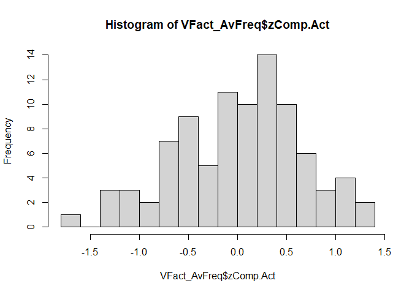<!-- -->

#### Visualisation AvFreq Action Fluency

``` r
#Convert to long format for visualisation
VFact_AvFreq.long <- VFact_AvFreq %>%
  pivot_longer(cols=Total:Egg, names_to = "action", values_to = "AvFreq")

#Boxplot VF act AvFreq
# png(file="./Figures and Tables/Boxplot_VFactAvFreq.png",
# width=600, height=350)

(Boxplot_VF <- VFact_AvFreq.long %>%
    dplyr::filter(action!="Total") %>%
    ggplot(aes(x=factor(action), y=AvFreq, 
                                               fill = as.factor(Age.Category))) +
    geom_boxplot(colour="grey50")+
    stat_summary(aes(label=round(..y..,2), group=as.factor(Age.Category)), 
               fun=mean, geom = "label", size=4,
               fill="white", show.legend=NA, label.size=NA,
               position = position_dodge(.75), vjust=-3) +
      stat_summary(fun = "mean", position = position_dodge(.75), 
               show.legend=F, colour="white")+ #Mean as white dot
    labs(x = "Action Category",
         y = "AvFreq (raw scores)",
         title = "Average Word frequency per Age Group and Action Category")+
        scale_fill_discrete(guide=guide_legend(title = "Age Group"), labels=c("18 to 30 years old","40 to 55 years old", "65 to 80 years old")))
```

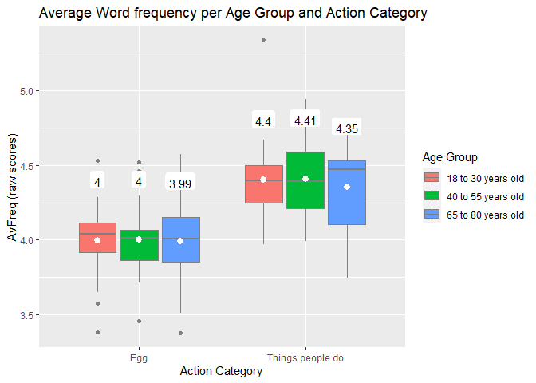<!-- -->

``` r
# dev.off()
```

``` r
#Boxplot VFact Raw Total
# png(file="./Figures and Tables/Boxplot_VFactAvFreq_RawTotal.png",
# width=600, height=350)

(Boxplot_VF <- VFact_AvFreq.long %>%
    dplyr::filter(action=="Total") %>%
    ggplot(aes(x=action, y=AvFreq,fill = as.factor(Age.Category)), show.legend=FALSE) +
    geom_boxplot(colour="grey50", show.legend=FALSE)+
    stat_summary(aes(label=round(..y..,2), group=as.factor(Age.Category)), 
               fun=mean, geom = "label", size=5,
               fill="white", show.legend=NA, label.size=NA,
               position = position_dodge(.75), vjust=c(-3.25,-2.5,-3.25)) +
      stat_summary(fun = "mean", position = position_dodge(.75), 
               show.legend=F, colour="white")+ #Mean as white dot
    labs(x = "Action Fluency",
         y = "Average Frequency (raw scores)")+
        scale_fill_manual(values = cbPalette) + # , guide=guide_legend(title = "Age Group"), labels=c("18 to 30 years old","40 to 55 years old", "65 to 80 years old")
       theme(text = element_text(size = 20),
             axis.ticks.x = element_blank(),
             axis.text.x = element_blank(),
          panel.background  = element_rect(fill="white"),
          plot.background = element_rect(fill = "white"),
          strip.background = element_rect(fill="white"),
          axis.line.x = element_line(color="black"),
         axis.line.y = element_line(color="black")) +
  coord_cartesian(ylim = c(3,5))+
     scale_y_continuous(minor_breaks = seq(3,5,1),
                     breaks = seq(3,5, 0.5)))
```

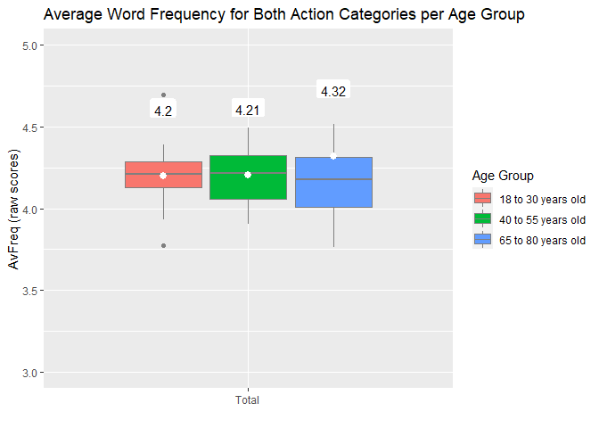<!-- -->

``` r
# dev.off()
```

*Figures AvFreq Action Fluency zscores*

``` r
#Convert to long format for visualisation
VFact_AvFreq.long.zscores <- VFact_AvFreq %>%
  pivot_longer(cols=zComp.Act:zEggs, names_to = "zaction", values_to = "zAvFreq")

#Boxplot VF act AvFreq
# png(file="./Figures and Tables/Boxplot_VFactAvFreq_zscores.png",
# width=600, height=350)

(Boxplot_VF_sub.zscores <- VFact_AvFreq.long.zscores %>%
    dplyr::filter(zaction!="zComp.Act") %>%
    ggplot(aes(x=factor(zaction), y=zAvFreq, 
                                               fill = as.factor(Age.Category))) +
    geom_boxplot(colour="grey50")+
    stat_summary(aes(label=round(..y..,2), group=as.factor(Age.Category)), 
               fun=mean, geom = "label", size=4,
               fill="white", show.legend=NA, label.size=NA,
               position = position_dodge(.75), vjust=-3) +
      stat_summary(fun = "mean", position = position_dodge(.75), 
               show.legend=F, colour="white")+ #Mean as white dot
    labs(x = "Action Category",
         y = "AvFreq (z scores)",
         title = "Average Word frequency per Age Group and Action Category")+
        scale_fill_discrete(guide=guide_legend(title = "Age Group"), labels=c("18 to 30 years old","40 to 55 years old", "65 to 80 years old")))
```

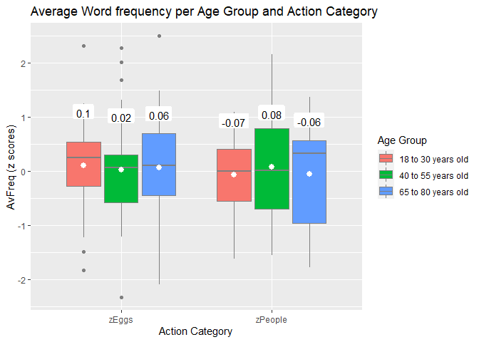<!-- -->

``` r
# dev.off()
```

``` r
#Boxplot VFact Raw Total
# png(file="./Figures and Tables/Boxplot_VFactAvFreq_Total_zscores.png",
# width=600, height=350)

(Boxplot_VFact_zscoreTotal <- VFact_AvFreq.long.zscores %>%
    dplyr::filter(zaction=="zComp.Act") %>%
    ggplot(aes(x=zaction, y=zAvFreq,fill = as.factor(Age.Category)), show.legend=FALSE) +
    geom_boxplot(colour="grey50", show.legend=FALSE)+
       stat_summary(aes(label=round(..y..,2), group=as.factor(Age.Category)), 
               fun=mean, geom = "label", size=5,
               fill="white", show.legend=FALSE, label.size=NA,
               position = position_dodge(.75), vjust=-2) +
      stat_summary(fun = "mean", position = position_dodge(.75), 
               show.legend=F, colour="white")+ #Mean as white dot
    labs(x = "Action Fluency",
         y = "Average Frequency (z scores)") +
        scale_fill_manual(values = cbPalette) + # , guide=guide_legend(title = "Age Group"), labels=c("18 to 30 years old","40 to 55 years old", "65 to 80 years old")
       theme(text = element_text(size = 20),
             axis.ticks.x = element_blank(),
             axis.text.x = element_blank(),
          panel.background  = element_rect(fill="white"),
          plot.background = element_rect(fill = "white"),
          strip.background = element_rect(fill="white"),
          axis.line.x = element_line(color="black"),
         axis.line.y = element_line(color="black")) +
  coord_cartesian(ylim = c(-3,3))+
     scale_y_continuous(minor_breaks = seq(-3,3,0.5),
                     breaks = seq(-3,3,1)))
```

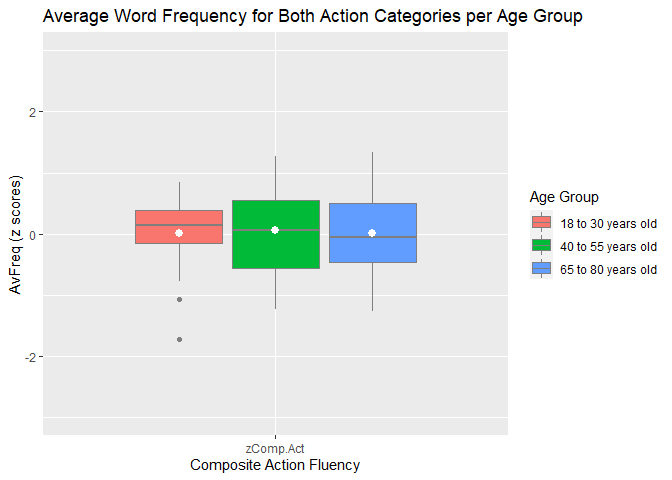<!-- -->

``` r
# dev.off()

(Boxplots.VFall_Totalz <- Boxplot_VFcat.Totalzscore + Boxplot_VFlet.zscoreTotal  + Boxplot_VFact_zscoreTotal + plot_layout(widths = 4))
```

<!-- -->

``` r
# ggsave(Boxplots.VFall_Totalz, filename = "../Figures and Tables/Boxplots_VFall_Totalz.tiff", height = 15, width=30)
```

## Multiple Linear Regression - Action Fluency

*Create user-defined contrasts for the Age Category variable*

``` r
VFact_AvFreq <- mutate(VFact_AvFreq,
                    Age.Category = 
                      factor(Age.Category, levels = c("Middle-Aged", "Younger", "Older")))

VFact_AvFreq_coded <- VFact_AvFreq
contrasts(VFact_AvFreq_coded$Age.Category) <- contr.helmert(3)
contrasts(VFact_AvFreq_coded$Age.Category)
```

    ##             [,1] [,2]
    ## Middle-Aged   -1   -1
    ## Younger        1   -1
    ## Older          0    2

*Unconditional model, i.e. without covariates*

``` r
lmUncond.VFact.AvFreq <- lm(zComp.Act ~ Age.Category*CR.composite.before, data = VFact_AvFreq_coded)
# broom::tidy(lmUncond.VFact.AvFreq, conf.int=T)
```

*Full model of AvFreq in z-distribution, including covariates*

``` r
lmFull.VFact.AvFreq <- lm(zComp.Act ~ Age.Category*CR.composite.before +GenCogProc.composite, data = VFact_AvFreq_coded)
summary(lmFull.VFact.AvFreq)
```

    ## 
    ## Call:
    ## lm(formula = zComp.Act ~ Age.Category * CR.composite.before + 
    ##     GenCogProc.composite, data = VFact_AvFreq_coded)
    ## 
    ## Residuals:
    ##      Min       1Q   Median       3Q      Max 
    ## -1.65851 -0.47263  0.04028  0.49310  1.29057 
    ## 
    ## Coefficients:
    ##                                    Estimate Std. Error t value Pr(>|t|)
    ## (Intercept)                        0.022739   0.070212   0.324    0.747
    ## Age.Category1                     -0.001872   0.090848  -0.021    0.984
    ## Age.Category2                     -0.025122   0.057256  -0.439    0.662
    ## CR.composite.before               -0.004880   0.071510  -0.068    0.946
    ## GenCogProc.composite              -0.087538   0.162870  -0.537    0.592
    ## Age.Category1:CR.composite.before  0.046677   0.087743   0.532    0.596
    ## Age.Category2:CR.composite.before -0.019476   0.050496  -0.386    0.701
    ## 
    ## Residual standard error: 0.6661 on 83 degrees of freedom
    ## Multiple R-squared:  0.009122,   Adjusted R-squared:  -0.06251 
    ## F-statistic: 0.1273 on 6 and 83 DF,  p-value: 0.9926

``` r
#Tidy table output
(tidylmFull.VFact.AvFreq <- broom::tidy(lmFull.VFact.AvFreq, conf.int=T)%>%
  mutate_if(is.numeric, round, 3))
```

    ## # A tibble: 7 x 7
    ##   term                   estimate std.error statistic p.value conf.low conf.high
    ##   <chr>                     <dbl>     <dbl>     <dbl>   <dbl>    <dbl>     <dbl>
    ## 1 (Intercept)               0.023     0.07      0.324   0.747   -0.117     0.162
    ## 2 Age.Category1            -0.002     0.091    -0.021   0.984   -0.183     0.179
    ## 3 Age.Category2            -0.025     0.057    -0.439   0.662   -0.139     0.089
    ## 4 CR.composite.before      -0.005     0.072    -0.068   0.946   -0.147     0.137
    ## 5 GenCogProc.composite     -0.088     0.163    -0.537   0.592   -0.411     0.236
    ## 6 Age.Category1:CR.comp~    0.047     0.088     0.532   0.596   -0.128     0.221
    ## 7 Age.Category2:CR.comp~   -0.019     0.05     -0.386   0.701   -0.12      0.081

``` r
# write.csv(tidylmFull.VFact.AvFreq, "./Figures and Tables/VFact_zAvFreq_lmFull.csv")
```

*Full model of AvFreq as raw score, including covariates*

``` r
lmFull.VFact.AvFreq.raw <- lm(Total ~ Age.Category*CR.composite.before + GenCogProc.composite, data = VFact_AvFreq_coded)
summary(lmFull.VFact.AvFreq.raw)
```

    ## 
    ## Call:
    ## lm(formula = Total ~ Age.Category * CR.composite.before + GenCogProc.composite, 
    ##     data = VFact_AvFreq_coded)
    ## 
    ## Residuals:
    ##     Min      1Q  Median      3Q     Max 
    ## -0.6033 -0.1639 -0.0229  0.0741  4.4932 
    ## 
    ## Coefficients:
    ##                                    Estimate Std. Error t value Pr(>|t|)    
    ## (Intercept)                        4.241752   0.056298  75.345   <2e-16 ***
    ## Age.Category1                     -0.013872   0.072844  -0.190    0.849    
    ## Age.Category2                      0.050003   0.045910   1.089    0.279    
    ## CR.composite.before                0.006145   0.057338   0.107    0.915    
    ## GenCogProc.composite               0.064573   0.130594   0.494    0.622    
    ## Age.Category1:CR.composite.before  0.018952   0.070355   0.269    0.788    
    ## Age.Category2:CR.composite.before -0.009494   0.040489  -0.234    0.815    
    ## ---
    ## Signif. codes:  0 '***' 0.001 '**' 0.01 '*' 0.05 '.' 0.1 ' ' 1
    ## 
    ## Residual standard error: 0.5341 on 83 degrees of freedom
    ## Multiple R-squared:  0.01596,    Adjusted R-squared:  -0.05517 
    ## F-statistic: 0.2244 on 6 and 83 DF,  p-value: 0.9678

``` r
#Tidy table output
broom::tidy(lmFull.VFact.AvFreq.raw, conf.int=T)%>%
  mutate_if(is.numeric, round, 3)
```

    ## # A tibble: 7 x 7
    ##   term                   estimate std.error statistic p.value conf.low conf.high
    ##   <chr>                     <dbl>     <dbl>     <dbl>   <dbl>    <dbl>     <dbl>
    ## 1 (Intercept)               4.24      0.056    75.3     0        4.13      4.35 
    ## 2 Age.Category1            -0.014     0.073    -0.19    0.849   -0.159     0.131
    ## 3 Age.Category2             0.05      0.046     1.09    0.279   -0.041     0.141
    ## 4 CR.composite.before       0.006     0.057     0.107   0.915   -0.108     0.12 
    ## 5 GenCogProc.composite      0.065     0.131     0.494   0.622   -0.195     0.324
    ## 6 Age.Category1:CR.comp~    0.019     0.07      0.269   0.788   -0.121     0.159
    ## 7 Age.Category2:CR.comp~   -0.009     0.04     -0.234   0.815   -0.09      0.071

None of the models seem to predict either the outcome variable for
Verbal Fluency Action Categories. Let’s check the model assumptions +
fit.

*Assumption 1 - Linearity*

``` r
## Unconditional model with z composite score
plot(lmUncond.VFact.AvFreq, 1, main = "Unconditional model")
```

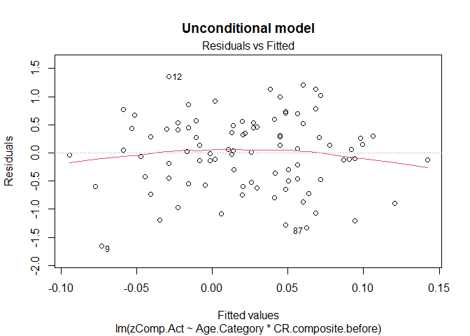<!-- -->

``` r
## Full model with z composite score
plot(lmFull.VFact.AvFreq, 1, main = "Full model (z-score composite score)")
```

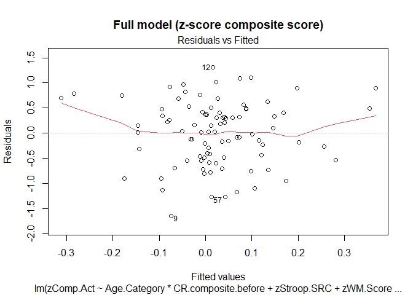<!-- -->

``` r
## Full model with raw total score
plot(lmFull.VFact.AvFreq.raw, 1, main = "Full model (raw total score)")
```

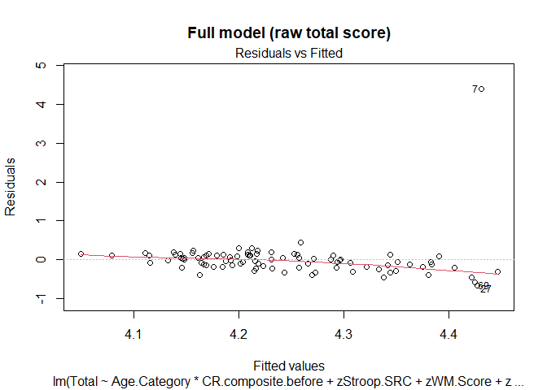<!-- -->
For the unconditional model and the full model with raw scores, the red
line is mostly horizontal, meaning that there is a linear relationship
between the fitted line and the residual value. However, residuals seem
to be higher for the extreme min and max fitted values. Hence, we can’t
assume linearity. Possibly due to outliers?

*Assumption 2 - Independence of Variables*

``` r
# Z composite of VF action
## Create table with correlation values between predictor variables
tibble::as_tibble(cor(VFact_AvFreq_coded[,c(11,13)]), rownames="rowname")
```

    ## # A tibble: 2 x 3
    ##   rowname              GenCogProc.composite CR.composite.before
    ##   <chr>                               <dbl>               <dbl>
    ## 1 GenCogProc.composite               1                  -0.0439
    ## 2 CR.composite.before               -0.0439              1

``` r
## Create correlation plot between predictor variables
corrplot(cor(VFact_AvFreq_coded[,c(11,13)]),method='circle')
```

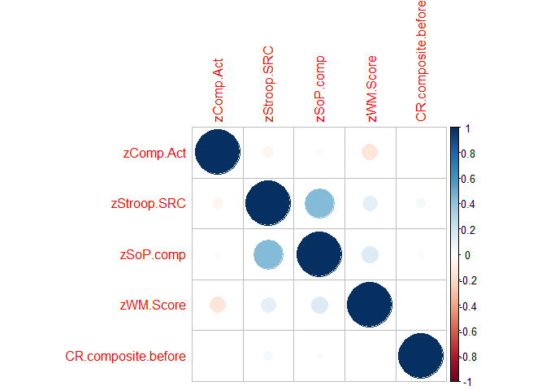<!-- -->

``` r
## Raw scores
## Create table with correlation values between predictor variables
tibble::as_tibble(cor(VFact_AvFreq_coded[,c(11,13)]), rownames = "rowname")
```

    ## # A tibble: 2 x 3
    ##   rowname              GenCogProc.composite CR.composite.before
    ##   <chr>                               <dbl>               <dbl>
    ## 1 GenCogProc.composite               1                  -0.0439
    ## 2 CR.composite.before               -0.0439              1

``` r
## Create correlation plot between predictor variables
corrplot(cor(VFact_AvFreq_coded[,c(11,13)]))
```

<!-- -->

There seems to be no strong relationship between the predictor
variables. Hence, we can assume Independence of Variables.

*Assumption 3 - Normal Distribution of Residuals*

Full model with z composite score

``` r
## Full model with z composite score
plot(lmFull.VFact.AvFreq, 2, main = "Full model (z-score composite score)")
```

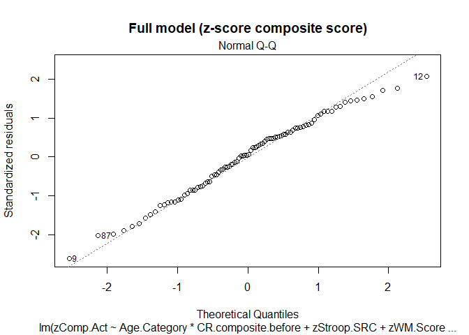<!-- -->

Full model with raw total score

``` r
plot(lmFull.VFact.AvFreq.raw, 2, main = "Full model (raw total score)")
```

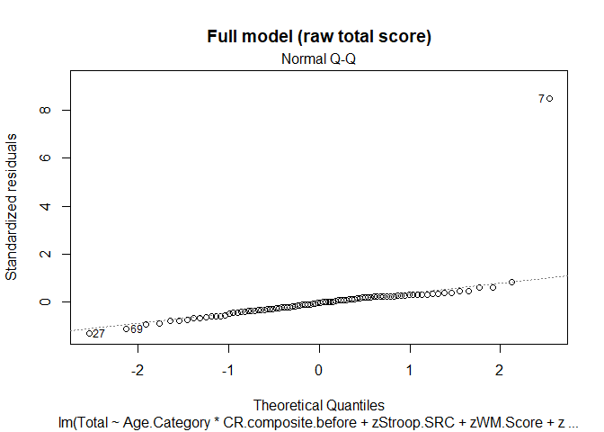<!-- -->

For the unconditional and full model with z-composite score, the points
seem to roughly follow a straight line. However, there is a dip on the
right and an influential point (point 12). Hence, other
relationships/predictors that have not been included into the models
could explain the variance for these models. One explanation could be
the online format of the study. For example, some participants might
have scored lower than they would in a lab-based study, due to unclear
instructions. Also, it could have caused more distractions than there
would have been in a lab based study. For the full model with the raw
scores, there is one massive outlier (point 7).

*Assumption 4 - Homoscedasticity or Equal Variance of Variables*

Full model with z composite score

``` r
plot(lmFull.VFact.AvFreq, 3, main = "Full model (z-score composite score)")
```

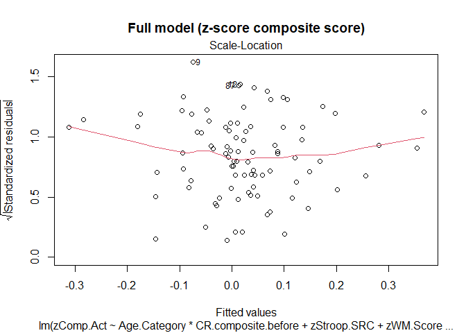<!-- -->

Full model with raw total score

``` r
plot(lmFull.VFact.AvFreq.raw, 3, main = "Full model (raw total score)")
```

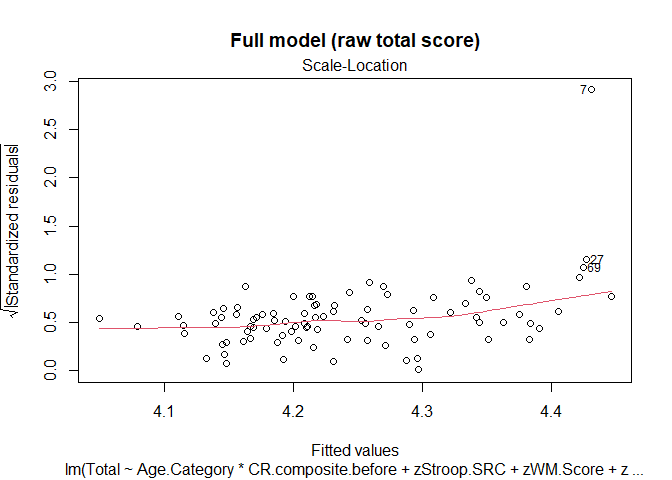<!-- -->

#### Model fit diagnostics

*Variation Inflation Factor*

Any VIF value above 4 needs further investigation. There seems to be no
concerning signs of collinearity (VIF values higher than 4). The
tolerance values indicate the percentage of variance that cannot be
explained for by the other predictor variables.

``` r
ols_vif_tol(lmFull.VFact.AvFreq) #zscores only 
```

    ##                           Variables Tolerance      VIF
    ## 1                     Age.Category1 0.8958833 1.116217
    ## 2                     Age.Category2 0.7518193 1.330107
    ## 3               CR.composite.before 0.9971961 1.002812
    ## 4              GenCogProc.composite 0.6869407 1.455730
    ## 5 Age.Category1:CR.composite.before 0.9935202 1.006522
    ## 6 Age.Category2:CR.composite.before 0.9999277 1.000072

*Plot Diagnositcs Full model with z composite score for Action Fluency*

``` r
ols_plot_diagnostics(lmFull.VFact.AvFreq)
```

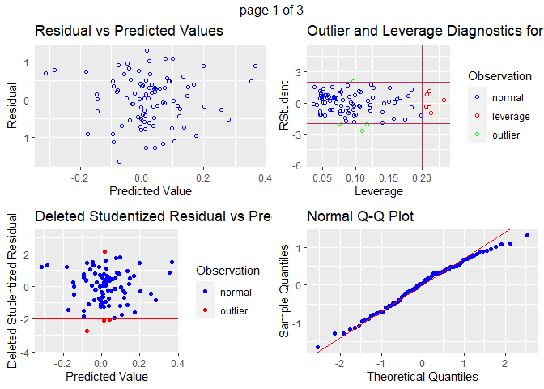<!-- -->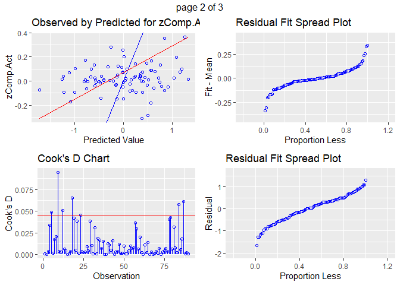<!-- -->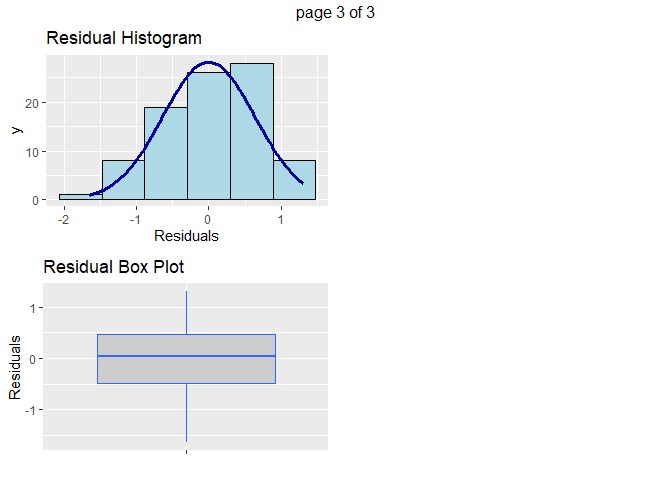<!-- -->

For all models, the Observed vs Predicted Plot shows that the model
doesn’t fit the data very well (pity) –&gt; due to outliers?? What to
do….

It can explain the fact that the models do not explain the outcome
variable in any case.

### Model comparisons for the CR measure preciding and coinciding with the COVID-19 pandemic

The effect of the COVID-19 pandemic on CR and subsequent behavioural
performance

``` r
lmFull.VFact.AvFreq.during <- lm(zComp.Act ~ Age.Category*CR.composite.during + 
                                   GenCogProc.composite, data = 
                                   VFact_AvFreq_coded)
summary(lmFull.VFact.AvFreq.during)
```

    ## 
    ## Call:
    ## lm(formula = zComp.Act ~ Age.Category * CR.composite.during + 
    ##     GenCogProc.composite, data = VFact_AvFreq_coded)
    ## 
    ## Residuals:
    ##      Min       1Q   Median       3Q      Max 
    ## -1.68491 -0.43690  0.03357  0.45613  1.24564 
    ## 
    ## Coefficients:
    ##                                     Estimate Std. Error t value Pr(>|t|)
    ## (Intercept)                        0.0229924  0.0701166   0.328    0.744
    ## Age.Category1                     -0.0006908  0.0908810  -0.008    0.994
    ## Age.Category2                     -0.0260132  0.0573951  -0.453    0.652
    ## CR.composite.during                0.0177849  0.0721062   0.247    0.806
    ## GenCogProc.composite              -0.0918584  0.1650199  -0.557    0.579
    ## Age.Category1:CR.composite.during  0.0693409  0.0889255   0.780    0.438
    ## Age.Category2:CR.composite.during -0.0031660  0.0512192  -0.062    0.951
    ## 
    ## Residual standard error: 0.6652 on 83 degrees of freedom
    ## Multiple R-squared:  0.01183,    Adjusted R-squared:  -0.0596 
    ## F-statistic: 0.1657 on 6 and 83 DF,  p-value: 0.9852

``` r
#Model comparison
anova(lmFull.VFact.AvFreq, lmFull.VFact.AvFreq.during)
```

    ## Analysis of Variance Table
    ## 
    ## Model 1: zComp.Act ~ Age.Category * CR.composite.before + GenCogProc.composite
    ## Model 2: zComp.Act ~ Age.Category * CR.composite.during + GenCogProc.composite
    ##   Res.Df    RSS Df Sum of Sq F Pr(>F)
    ## 1     83 36.822                      
    ## 2     83 36.721  0   0.10082

Models are not significantly different from each other.

``` r
#Model comparison through AIC comparison
AIC(lmFull.VFact.AvFreq)
```

    ## [1] 190.9754

``` r
AIC(lmFull.VFact.AvFreq.during)
```

    ## [1] 190.7286

Although very similar, the model with the CR composite score
during-pandemic seems to fit the data slightly better.

## References

<div id="refs" class="references csl-bib-body hanging-indent">

<div id="ref-R-rio" class="csl-entry">

Chan, Chung-hong, and Thomas J. Leeper. 2021. *Rio: A Swiss-Army Knife
for Data i/o*. <https://github.com/leeper/rio>.

</div>

<div id="ref-car2019" class="csl-entry">

Fox, John, and Sanford Weisberg. 2019. *An R Companion to Applied
Regression*. Third. Thousand Oaks CA: Sage.
<https://socialsciences.mcmaster.ca/jfox/Books/Companion/>.

</div>

<div id="ref-R-carData" class="csl-entry">

Fox, John, Sanford Weisberg, and Brad Price. 2020. *carData: Companion
to Applied Regression Data Sets*.
<https://CRAN.R-project.org/package=carData>.

</div>

<div id="ref-R-car" class="csl-entry">

———. 2021. *Car: Companion to Applied Regression*.
<https://CRAN.R-project.org/package=car>.

</div>

<div id="ref-R-olsrr" class="csl-entry">

Hebbali, Aravind. 2020. *Olsrr: Tools for Building OLS Regression
Models*. <https://CRAN.R-project.org/package=olsrr>.

</div>

<div id="ref-R-purrr" class="csl-entry">

Henry, Lionel, and Hadley Wickham. 2020. *Purrr: Functional Programming
Tools*. <https://CRAN.R-project.org/package=purrr>.

</div>

<div id="ref-R-fs" class="csl-entry">

Hester, Jim, and Hadley Wickham. 2020. *Fs: Cross-Platform File System
Operations Based on Libuv*. <https://CRAN.R-project.org/package=fs>.

</div>

<div id="ref-R-emmeans" class="csl-entry">

Lenth, Russell V. 2021. *Emmeans: Estimated Marginal Means, Aka
Least-Squares Means*. <https://github.com/rvlenth/emmeans>.

</div>

<div id="ref-performance2021" class="csl-entry">

Lüdecke, Daniel, Mattan S. Ben-Shachar, Indrajeet Patil, Philip
Waggoner, and Dominique Makowski. 2021. “<span
class="nocase">performance</span>: An R Package for Assessment,
Comparison and Testing of Statistical Models.” *Journal of Open Source
Software* 6 (60): 3139. <https://doi.org/10.21105/joss.03139>.

</div>

<div id="ref-R-performance" class="csl-entry">

Lüdecke, Daniel, Dominique Makowski, Mattan S. Ben-Shachar, Indrajeet
Patil, Philip Waggoner, and Brenton M. Wiernik. 2021. *Performance:
Assessment of Regression Models Performance*.
<https://easystats.github.io/performance/>.

</div>

<div id="ref-R-e1071" class="csl-entry">

Meyer, David, Evgenia Dimitriadou, Kurt Hornik, Andreas Weingessel, and
Friedrich Leisch. 2021. *E1071: Misc Functions of the Department of
Statistics, Probability Theory Group (Formerly: E1071), TU Wien*.
<https://CRAN.R-project.org/package=e1071>.

</div>

<div id="ref-R-tibble" class="csl-entry">

Müller, Kirill, and Hadley Wickham. 2021. *Tibble: Simple Data Frames*.
<https://CRAN.R-project.org/package=tibble>.

</div>

<div id="ref-R-patchwork" class="csl-entry">

Pedersen, Thomas Lin. 2020. *Patchwork: The Composer of Plots*.
<https://CRAN.R-project.org/package=patchwork>.

</div>

<div id="ref-R-base" class="csl-entry">

R Core Team. 2020. *R: A Language and Environment for Statistical
Computing*. Vienna, Austria: R Foundation for Statistical Computing.
<https://www.R-project.org/>.

</div>

<div id="ref-R-broom" class="csl-entry">

Robinson, David, Alex Hayes, and Simon Couch. 2021. *Broom: Convert
Statistical Objects into Tidy Tibbles*.
<https://CRAN.R-project.org/package=broom>.

</div>

<div id="ref-lattice2008" class="csl-entry">

Sarkar, Deepayan. 2008. *Lattice: Multivariate Data Visualization with
r*. New York: Springer. <http://lmdvr.r-forge.r-project.org>.

</div>

<div id="ref-R-lattice" class="csl-entry">

———. 2021. *Lattice: Trellis Graphics for r*.
<http://lattice.r-forge.r-project.org/>.

</div>

<div id="ref-R-corrplot" class="csl-entry">

Wei, Taiyun, and Viliam Simko. 2021a. *Corrplot: Visualization of a
Correlation Matrix*. <https://github.com/taiyun/corrplot>.

</div>

<div id="ref-corrplot2021" class="csl-entry">

———. 2021b. *R Package ’Corrplot’: Visualization of a Correlation
Matrix*. <https://github.com/taiyun/corrplot>.

</div>

<div id="ref-ggplot22016" class="csl-entry">

Wickham, Hadley. 2016. *Ggplot2: Elegant Graphics for Data Analysis*.
Springer-Verlag New York. <https://ggplot2.tidyverse.org>.

</div>

<div id="ref-R-stringr" class="csl-entry">

———. 2019. *Stringr: Simple, Consistent Wrappers for Common String
Operations*. <https://CRAN.R-project.org/package=stringr>.

</div>

<div id="ref-R-forcats" class="csl-entry">

———. 2021a. *Forcats: Tools for Working with Categorical Variables
(Factors)*. <https://CRAN.R-project.org/package=forcats>.

</div>

<div id="ref-R-tidyr" class="csl-entry">

———. 2021b. *Tidyr: Tidy Messy Data*.
<https://CRAN.R-project.org/package=tidyr>.

</div>

<div id="ref-R-tidyverse" class="csl-entry">

———. 2021c. *Tidyverse: Easily Install and Load the Tidyverse*.
<https://CRAN.R-project.org/package=tidyverse>.

</div>

<div id="ref-tidyverse2019" class="csl-entry">

Wickham, Hadley, Mara Averick, Jennifer Bryan, Winston Chang, Lucy
D’Agostino McGowan, Romain François, Garrett Grolemund, et al. 2019.
“Welcome to the <span class="nocase">tidyverse</span>.” *Journal of Open
Source Software* 4 (43): 1686. <https://doi.org/10.21105/joss.01686>.

</div>

<div id="ref-R-readxl" class="csl-entry">

Wickham, Hadley, and Jennifer Bryan. 2019. *Readxl: Read Excel Files*.
<https://CRAN.R-project.org/package=readxl>.

</div>

<div id="ref-R-ggplot2" class="csl-entry">

Wickham, Hadley, Winston Chang, Lionel Henry, Thomas Lin Pedersen,
Kohske Takahashi, Claus Wilke, Kara Woo, Hiroaki Yutani, and Dewey
Dunnington. 2021. *Ggplot2: Create Elegant Data Visualisations Using the
Grammar of Graphics*. <https://CRAN.R-project.org/package=ggplot2>.

</div>

<div id="ref-R-dplyr" class="csl-entry">

Wickham, Hadley, Romain François, Lionel Henry, and Kirill Müller. 2021.
*Dplyr: A Grammar of Data Manipulation*.
<https://CRAN.R-project.org/package=dplyr>.

</div>

<div id="ref-R-readr" class="csl-entry">

Wickham, Hadley, and Jim Hester. 2021. *Readr: Read Rectangular Text
Data*. <https://CRAN.R-project.org/package=readr>.

</div>

</div>
