R Code Full Analysis Verbal Fluency Number of Correctly Produced Words
================
Elise Oosterhuis
Last compiled on 23/12/21

# Analysis Verbal Fluency Data - Number of Correctly Produced Words

##### Read in data

``` r
##Semantic Fluency
VFcat <- read.csv("../Data/Tidy/VFcat_complete_final.csv")
# head(VFcat[1:6,1:11]) #shows top 6 rows and the 1st to 11th column.
# tail(VFcat[1:6,1:11]) #shows bottom 6 rows and the 1st to 11th column.

##Letter Fluency
VFlet <- read.csv("../Data/Tidy/VFlet_complete_final.csv")
# head(VFlet[1:6,1:9])
# tail(VFlet[1:6,1:9])

##Action Fluency
VFact <- read.csv("../Data/Tidy/VFact_complete_final.csv")
# head(VFact[1:6,1:8])
# tail(VFact[1:6,1:8])
```

## Verbal Fluency - Semantic/Categories

### Descriptive Statistics

``` r
## Create dataset that only includes data of the Number of Correct words Produced
VFcat_Ncorrect <- VFcat %>%
  dplyr::filter(Measures=="Ncorrect") %>%
  dplyr::select(-Measures)

# head(VFcat_Ncorrect, L=6)
```

``` r
#Summarise data to present descriptives in a table
(Descr_VFcat <- VFcat_Ncorrect %>%
#Per Age Group
  group_by(Age.Category) %>%
  summarise(Nppt = length(unique(ID)), #Number of participants
            total = mean(Total, na.rm=T), #Total words correctly produced
            ztotal = mean(zComp.Cat, na.rm=T), #Z-score per age group of total words correctly produced
            animals = mean(Animals, na.rm=T), #Total words correctly produced in category Animals
            vehicles = mean(Vehicles, na.rm=T), #Total words correctly produced in category vehicles
            vandF = mean(Fruits.and.Vegetables, na.rm=T), #Total words correctly produced in category Fruits and Vegetables
            fluid = mean(Fluid, na.rm=T), #Total words correctly produced in category fluid
            writing = mean(Writing.Utensils, na.rm=T))) #Total words correctly produced in category writing utensils
```

    ## # A tibble: 3 x 9
    ##   Age.Category        Nppt total ztotal animals vehicles vandF fluid writing
    ##   <chr>              <int> <dbl>  <dbl>   <dbl>    <dbl> <dbl> <dbl>   <dbl>
    ## 1 18 to 30 years old    30  88.2 -0.124    26.2     15.4  24.5  11.3    10.8
    ## 2 40 to 55 years old    30  93.5  0.116    22.8     17.2  26.6  14.4    12.5
    ## 3 65 to 80 years old    30  85.3 -0.106    23.4     15.5  23.2  14.6    10.1

``` r
#Save table
# write.csv(Descr_VFcat, "./Figures and Tables/Descr_VFcat_Ncorrect.csv", row.names = F)
```

``` r
#z-distribution of composite score for semantic fluency
hist(VFcat_Ncorrect$zComp.Cat, breaks=20) #Composite z-score of Semantic Fluency
```

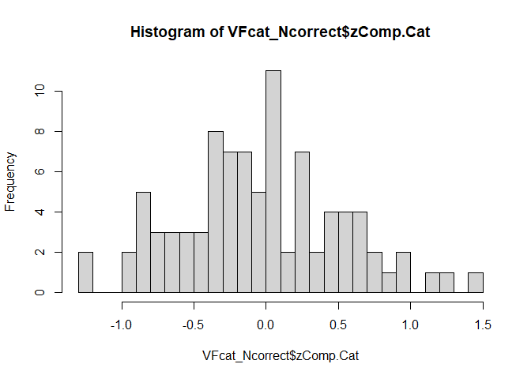<!-- -->

#### Visualisation Ncorrect Semantic Fluency

``` r
## Convert wide to long format for visualisation of data
VFcat_Ncorrect.longz.scores <- VFcat_Ncorrect %>%
  pivot_longer(cols=zComp.Cat:zWriting, names_to = "zcategory", values_to = "zNcorrect")

# Boxplot VF cat Ncorrect per category
# png(file="./Figures and Tables/Boxplot_VFcatNcorrect_zscores.png",
# width=600, height=350) #writes boxplot below to a .png file

(Boxplot_VF <- VFcat_Ncorrect.longz.scores %>%
    dplyr::filter(zcategory!="zComp.Cat") %>%
    ggplot(aes(x=factor(zcategory, levels=c("zAnimals", "zVehicles", "zFandV", "zFluid", "zWriting")), y=zNcorrect, 
                                               fill = as.factor(Age.Category))) +
    geom_boxplot(colour="grey50")+
      stat_summary(fun = "mean", position = position_dodge(.75),
               show.legend=F, colour="white")+ #Mean as white dot
    labs(x = "Category",
         y = "Ncorrect (z scores)",
         title = "Number of Correctly Produced Words per Age Group and Category")+
        scale_fill_discrete(guide=guide_legend(title = "Age Group"), labels=c("18 to 30 years old","40 to 55 years old", "65 to 80 years old")))
```

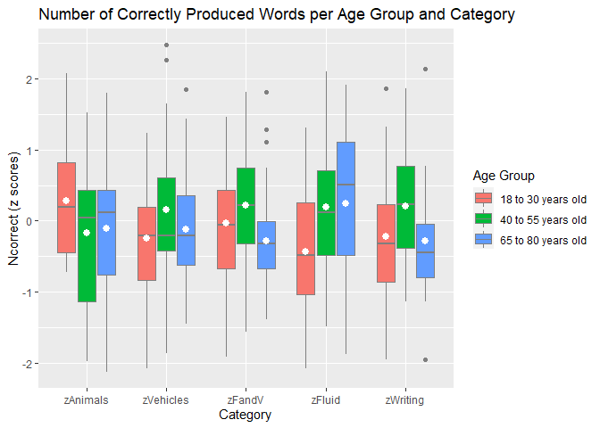<!-- -->

``` r
# dev.off() #close png() function
```

``` r
# Boxplot VF cat N correct for total score
# png(file="./Figures and Tables/Boxplot_VFcatNcorrect_RawTotal_zscores.png",
# width=600, height=350)

(Boxplot_VF <- VFcat_Ncorrect.longz.scores %>%
    dplyr::filter(zcategory=="zComp.Cat") %>%
    ggplot(aes(x=zcategory, y=zNcorrect,fill = as.factor(Age.Category))) +
    geom_boxplot(colour="grey50")+
      stat_summary(fun = "mean", position = position_dodge(.75),
               show.legend=F, colour="white")+ #Mean as white dot
    labs(x = "Category",
         y = "Ncorrect (z scores)",
         title = "Total Number of Correctly Produced Words for All Categories per Age Group")+
        scale_fill_discrete(guide=guide_legend(title = "Age Group"), labels=c("18 to 30 years old","40 to 55 years old", "65 to 80 years old")))
```

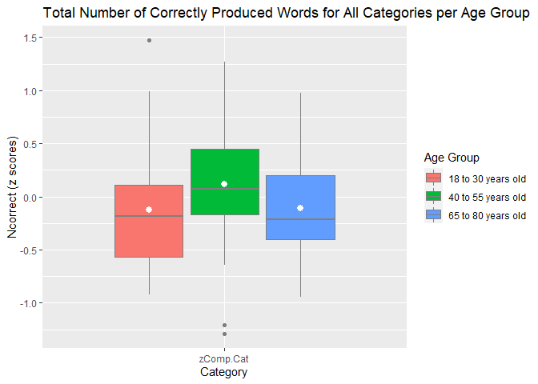<!-- -->

``` r
# dev.off()
```

## Multiple Linear Regression - Semantic Fluency

*Unconditional model, i.e. without covariates*

``` r
lmUncond.VFcat.Ncorrect <- lm(zComp.Cat ~ Age.Category*CR.composite.before, data = VFcat_Ncorrect)
# broom::tidy(lmUncond.VFcat.Ncorrect, conf.int=T)
```

*Full model including the covariates; outcome variable in
z-distribution*

``` r
lmFull.VFcat.Ncorrect <- lm(zComp.Cat ~ Age.Category*CR.composite.before + zStroop.SRC + 
                              zWM.Score + zSoP.comp, data = VFcat_Ncorrect)
#Tidy table output
(tidylmFull.VFcat.Ncorrect <- broom::tidy(lmFull.VFcat.Ncorrect, conf.int=T))
```

    ## # A tibble: 9 x 7
    ##   term                   estimate std.error statistic p.value conf.low conf.high
    ##   <chr>                     <dbl>     <dbl>     <dbl>   <dbl>    <dbl>     <dbl>
    ## 1 (Intercept)             -0.109     0.122     -0.892   0.375  -0.352     0.134 
    ## 2 Age.Category40 to 55 ~   0.252     0.156      1.61    0.110  -0.0586    0.563 
    ## 3 Age.Category65 to 80 ~  -0.0347    0.197     -0.176   0.861  -0.428     0.358 
    ## 4 CR.composite.before     -0.0953    0.103     -0.924   0.358  -0.300     0.110 
    ## 5 zStroop.SRC             -0.106     0.0687    -1.55    0.126  -0.243     0.0305
    ## 6 zWM.Score               -0.0361    0.0755    -0.478   0.634  -0.186     0.114 
    ## 7 zSoP.comp                0.123     0.110      1.11    0.269  -0.0966    0.342 
    ## 8 Age.Category40 to 55 ~   0.169     0.146      1.16    0.251  -0.122     0.459 
    ## 9 Age.Category65 to 80 ~   0.238     0.147      1.61    0.111  -0.0554    0.531

``` r
# write.csv(tidylmFull.VFcat.Ncorrect, "./Figures and tables/VFcat_zNcorrect_lmFull.csv", row.names = F) #write tidy output table to file
```

*Full model including the covariates; outcome variable as raw score*

``` r
lmFull.VFcat.Ncorrect.raw <- lm(Total ~ Age.Category*CR.composite.before + zStroop.SRC + 
                              zWM.Score + zSoP.comp, data = VFcat_Ncorrect)
#Tidy table output
broom::tidy(lmFull.VFcat.Ncorrect.raw, conf.int=T)
```

    ## # A tibble: 9 x 7
    ##   term                  estimate std.error statistic  p.value conf.low conf.high
    ##   <chr>                    <dbl>     <dbl>     <dbl>    <dbl>    <dbl>     <dbl>
    ## 1 (Intercept)              88.6       3.81    23.3   1.36e-37   81.0      96.2  
    ## 2 Age.Category40 to 55~     5.86      4.87     1.20  2.32e- 1   -3.83     15.5  
    ## 3 Age.Category65 to 80~    -4.05      6.16    -0.659 5.12e- 1  -16.3       8.19 
    ## 4 CR.composite.before      -5.78      3.21    -1.80  7.57e- 2  -12.2       0.612
    ## 5 zStroop.SRC              -4.01      2.14    -1.88  6.43e- 2   -8.27      0.244
    ## 6 zWM.Score                 1.45      2.35     0.617 5.39e- 1   -3.23      6.13 
    ## 7 zSoP.comp                 3.77      3.43     1.10  2.75e- 1   -3.06     10.6  
    ## 8 Age.Category40 to 55~     9.20      4.55     2.02  4.62e- 2    0.160    18.2  
    ## 9 Age.Category65 to 80~     8.28      4.59     1.80  7.53e- 2   -0.863    17.4

The model doesn’t seem to predict the composite score (z-distribution)
for Verbal Fluency Categories. However, the interaction between middle
age (40-55 years) and CR before seems to show a small significance.
Let’s check the model assumptions + fit.

*Assumption 1 - Linearity*

``` r
## Unconditional model with z composite score
plot(lmUncond.VFcat.Ncorrect, 1, main = "Unconditional model")
```

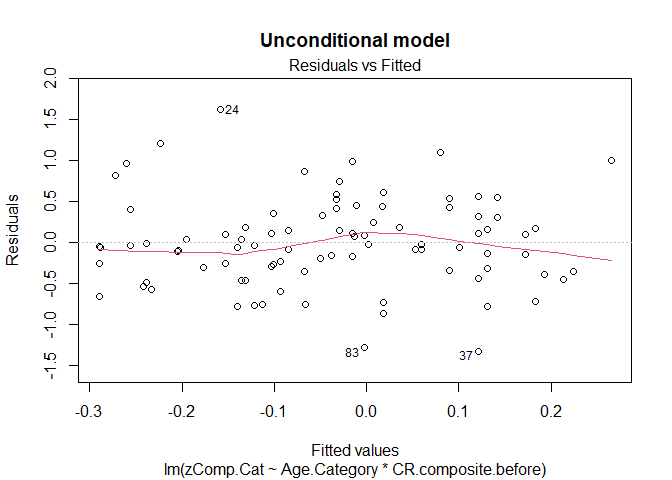<!-- -->

``` r
## Full model with z composite score
plot(lmFull.VFcat.Ncorrect, 1, main = "Full model (z-score composite score)")
```

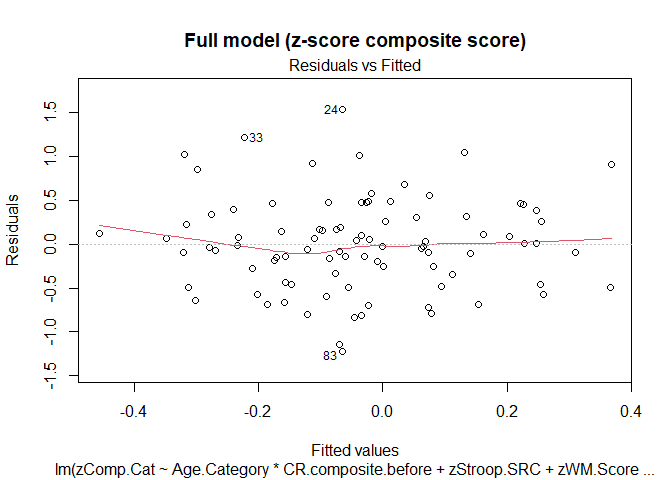<!-- -->

``` r
## Full model with raw total score
plot(lmFull.VFcat.Ncorrect.raw, 1, main = "Full model (raw total score)")
```

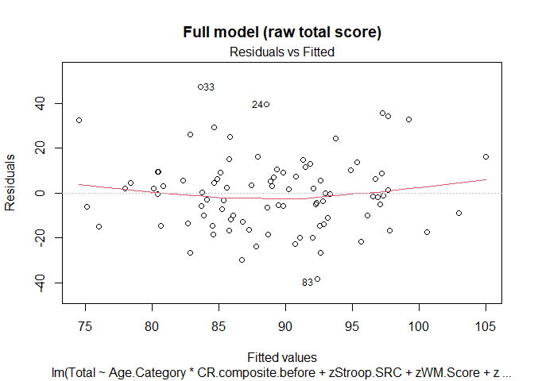<!-- -->

For all models, the red line is mostly horizontal, meaning that there is
a linear relationship between the fitted line and the residual value&gt;

*Assumption 2 - Independence of Variables*

``` r
# Z composite of VF cat
## Create table with correlation values between predictor variables
tibble::as_tibble(cor(VFcat_Ncorrect[,c(5,20,25,27,28)]), rownames="rowname")
```

    ## # A tibble: 5 x 6
    ##   rowname             zComp.Cat zStroop.SRC zSoP.comp zWM.Score CR.composite.be~
    ##   <chr>                   <dbl>       <dbl>     <dbl>     <dbl>            <dbl>
    ## 1 zComp.Cat              1          -0.0796    0.0491  -0.0240           0.0665 
    ## 2 zStroop.SRC           -0.0796      1         0.432    0.116            0.0483 
    ## 3 zSoP.comp              0.0491      0.432     1        0.144            0.0228 
    ## 4 zWM.Score             -0.0240      0.116     0.144    1               -0.00547
    ## 5 CR.composite.before    0.0665      0.0483    0.0228  -0.00547          1

``` r
## Create correlation plot between predictor variables
corrplot(cor(VFcat_Ncorrect[,c(5,20,25,27,28)]),method='circle')
```

<!-- -->

``` r
## Raw scores
## Create table with correlation values between predictor variables
tibble::as_tibble(cor(VFcat_Ncorrect[,c(11,20,25,27,28)]), rownames = "rowname")
```

    ## # A tibble: 5 x 6
    ##   rowname                 Total zStroop.SRC zSoP.comp zWM.Score CR.composite.be~
    ##   <chr>                   <dbl>       <dbl>     <dbl>     <dbl>            <dbl>
    ## 1 Total                1            -0.131  -0.000525   0.0807          -0.00494
    ## 2 zStroop.SRC         -0.131         1       0.432      0.116            0.0483 
    ## 3 zSoP.comp           -0.000525      0.432   1          0.144            0.0228 
    ## 4 zWM.Score            0.0807        0.116   0.144      1               -0.00547
    ## 5 CR.composite.before -0.00494       0.0483  0.0228    -0.00547          1

``` r
## Create correlation plot between predictor variables
corrplot(cor(VFcat_Ncorrect[,c(11,20,25,27,28)]))
```

<!-- -->

There seems to be no strong relationship between the predictor
variables. Hence, we can assume Independence of Variables.

*Assumption 3 - Normal Distribution of Residuals*

Full model with z composite score

``` r
plot(lmFull.VFcat.Ncorrect, 2, main = "Full model (z-score composite score)")
```

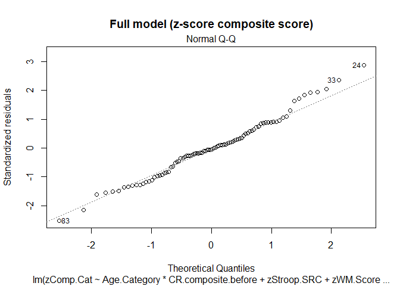<!-- -->
Full model with raw total score

``` r
plot(lmFull.VFcat.Ncorrect.raw, 2, main = "Full model (raw total score)")
```

<!-- -->

For all models, the points seem to roughly follow a straight line,
except for some points on the left and the bulk on the right. Hence,
other relationships/predictors that have not been included into the
models could explain the variance. One explanation could be the online
format of the study. For example, some participants might have scored
lower than they would in a lab-based study, due to unclear instructions.
Also, it could have caused more distractions than there would have been
in a lab based study.

*Assumption 4 - Homoscedasticity or Equal Variance of Variables*

Full model with z composite score

``` r
plot(lmFull.VFcat.Ncorrect, 3, main = "Full model (z-score composite score)")
```

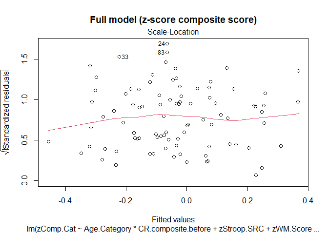<!-- -->

Full model with raw total score

``` r
plot(lmFull.VFcat.Ncorrect.raw, 3, main = "Full model (raw total score)")
```

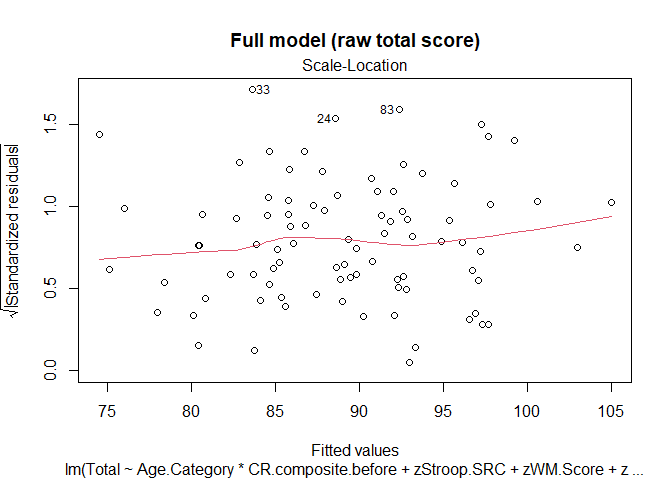<!-- -->

For all models, the variance of residuals seems relatively equal across
the predictors. Hence, the error terms are relatively the same across
all values of the independent variable for all three models.

#### Model fit diagnostics

*Variation Inflation Factor*

Any VIF value above 4 needs further investigation. There seems to be no
concerning signs of colinearity (VIF values higher than 4). The
tolerance values indicate the percentage of variance that cannot be
explained for by the other predictor variables.

``` r
ols_vif_tol(lmFull.VFcat.Ncorrect)
```

    ##                                            Variables Tolerance      VIF
    ## 1                     Age.Category40 to 55 years old 0.6255213 1.598667
    ## 2                     Age.Category65 to 80 years old 0.3910939 2.556931
    ## 3                                CR.composite.before 0.3297057 3.033008
    ## 4                                        zStroop.SRC 0.7584502 1.318478
    ## 5                                          zWM.Score 0.9498853 1.052759
    ## 6                                          zSoP.comp 0.4868349 2.054084
    ## 7 Age.Category40 to 55 years old:CR.composite.before 0.4944811 2.022322
    ## 8 Age.Category65 to 80 years old:CR.composite.before 0.4842401 2.065091

``` r
ols_vif_tol(lmFull.VFcat.Ncorrect.raw)
```

    ##                                            Variables Tolerance      VIF
    ## 1                     Age.Category40 to 55 years old 0.6255213 1.598667
    ## 2                     Age.Category65 to 80 years old 0.3910939 2.556931
    ## 3                                CR.composite.before 0.3297057 3.033008
    ## 4                                        zStroop.SRC 0.7584502 1.318478
    ## 5                                          zWM.Score 0.9498853 1.052759
    ## 6                                          zSoP.comp 0.4868349 2.054084
    ## 7 Age.Category40 to 55 years old:CR.composite.before 0.4944811 2.022322
    ## 8 Age.Category65 to 80 years old:CR.composite.before 0.4842401 2.065091

*Plot Diagnositcs Full model with z composite score for Semantic
Fluency*

``` r
ols_plot_diagnostics(lmFull.VFcat.Ncorrect)
```

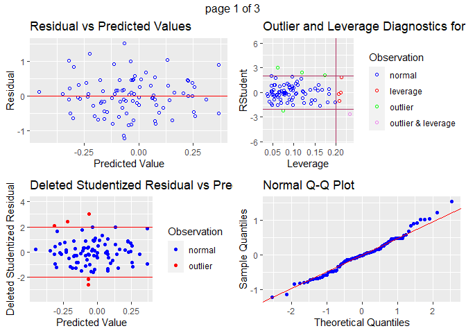<!-- -->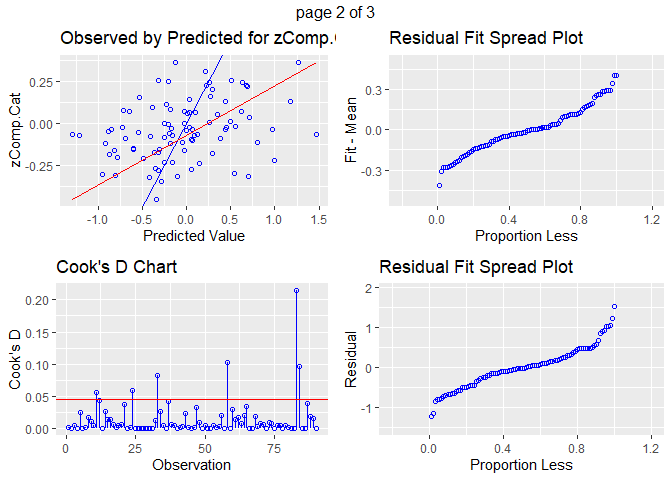<!-- --><!-- -->

*Plot Diagnositcs Full model with raw score for Semantic Fluency*

``` r
ols_plot_diagnostics(lmFull.VFcat.Ncorrect.raw)
```

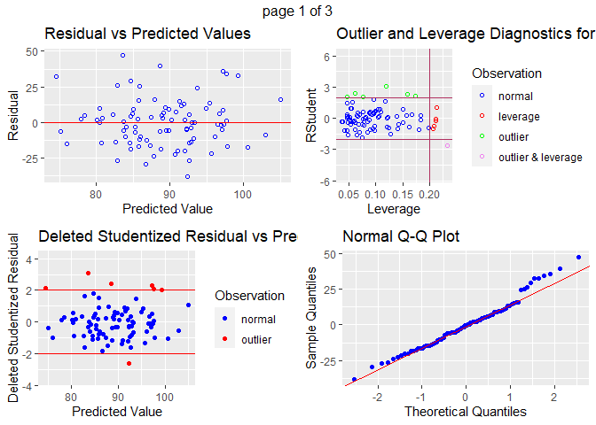<!-- -->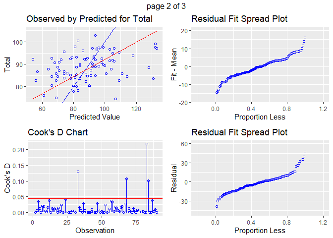<!-- -->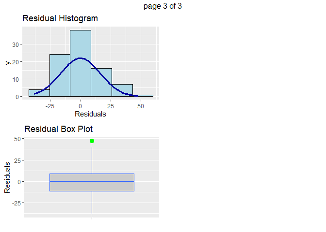<!-- -->

For all models, the Observed vs Predicted Plot shows that the model
doesn’t fit the data very well (pity) –&gt; due to outliers?? What to
do….

### Model comparisons for the CR measure preciding and coinciding with the COVID-19 pandemic

The effect of the COVID-19 pandemic on CR and subsequent behavioural
performance

``` r
lmFull.VFcat.Ncorrect.during <- lm(zComp.Cat ~ Age.Category*CR.composite.during + zStroop.SRC + 
                              zWM.Score + zSoP.comp, data = VFcat_Ncorrect)
summary(lmFull.VFcat.Ncorrect.during)
```

    ## 
    ## Call:
    ## lm(formula = zComp.Cat ~ Age.Category * CR.composite.during + 
    ##     zStroop.SRC + zWM.Score + zSoP.comp, data = VFcat_Ncorrect)
    ## 
    ## Residuals:
    ##      Min       1Q   Median       3Q      Max 
    ## -1.17284 -0.44321 -0.01767  0.33298  1.50749 
    ## 
    ## Coefficients:
    ##                                                    Estimate Std. Error t value
    ## (Intercept)                                        -0.11189    0.12348  -0.906
    ## Age.Category40 to 55 years old                      0.25430    0.15738   1.616
    ## Age.Category65 to 80 years old                     -0.02690    0.19971  -0.135
    ## CR.composite.during                                -0.05902    0.10660  -0.554
    ## zStroop.SRC                                        -0.10690    0.06977  -1.532
    ## zWM.Score                                          -0.01890    0.07561  -0.250
    ## zSoP.comp                                           0.11631    0.11104   1.047
    ## Age.Category40 to 55 years old:CR.composite.during  0.18154    0.14912   1.217
    ## Age.Category65 to 80 years old:CR.composite.during  0.15446    0.15177   1.018
    ##                                                    Pr(>|t|)
    ## (Intercept)                                           0.368
    ## Age.Category40 to 55 years old                        0.110
    ## Age.Category65 to 80 years old                        0.893
    ## CR.composite.during                                   0.581
    ## zStroop.SRC                                           0.129
    ## zWM.Score                                             0.803
    ## zSoP.comp                                             0.298
    ## Age.Category40 to 55 years old:CR.composite.during    0.227
    ## Age.Category65 to 80 years old:CR.composite.during    0.312
    ## 
    ## Residual standard error: 0.5547 on 81 degrees of freedom
    ## Multiple R-squared:  0.09281,    Adjusted R-squared:  0.003211 
    ## F-statistic: 1.036 on 8 and 81 DF,  p-value: 0.4164

``` r
# Model comparisons
anova(lmFull.VFcat.Ncorrect, lmFull.VFcat.Ncorrect.during)
```

    ## Analysis of Variance Table
    ## 
    ## Model 1: zComp.Cat ~ Age.Category * CR.composite.before + zStroop.SRC + 
    ##     zWM.Score + zSoP.comp
    ## Model 2: zComp.Cat ~ Age.Category * CR.composite.during + zStroop.SRC + 
    ##     zWM.Score + zSoP.comp
    ##   Res.Df    RSS Df Sum of Sq F Pr(>F)
    ## 1     81 24.708                      
    ## 2     81 24.920  0  -0.21149

No differences between the two models

``` r
#Model comparisons through AIC values
AIC(lmFull.VFcat.Ncorrect)
```

    ## [1] 159.0678

``` r
AIC(lmFull.VFcat.Ncorrect.during)
```

    ## [1] 159.8349

The model with the composite score before Covid-19 seems to fit slightly
better

## Verbal Fluency - Letters

### Descriptive Statistics

``` r
## Create dataset that only includes data of the Number of Correct words Produced
VFlet_Ncorrect <- VFlet %>%
  dplyr::filter(Measures=="Ncorrect") %>%
  dplyr::select(-Measures)

# head(VFlet_Ncorrect, L=6)
```

``` r
#Summarise data to present descriptives in a table
(Descr_VFlet <- VFlet_Ncorrect %>%
  #Per Age Group
  group_by(Age.Category) %>%
  summarise(Nppt = length(unique(ID)),
            total = mean(Total, na.rm=T),
            ztotal = mean(zComp.Let, na.rm=T),
            letterM = mean(M, na.rm=T),
            letterS = mean(S, na.rm=T),
            letterP = mean(P, na.rm=T)))
```

    ## # A tibble: 3 x 7
    ##   Age.Category        Nppt total  ztotal letterM letterS letterP
    ##   <chr>              <int> <dbl>   <dbl>   <dbl>   <dbl>   <dbl>
    ## 1 18 to 30 years old    30  47.6 -0.142     15.0    17.3    15.3
    ## 2 40 to 55 years old    30  53.7  0.150     16.5    19.6    17.6
    ## 3 65 to 80 years old    30  51.1 -0.0192    16.1    18.4    16.6

``` r
#Save table
# write.csv(Descr_VFlet, "./Figures and Tables/Descr_VFlet_Ncorrect.csv", row.names = F)
```

``` r
hist(VFlet_Ncorrect$zComp.Let, breaks=20) #Composite z-score of Semantic Fluency
```

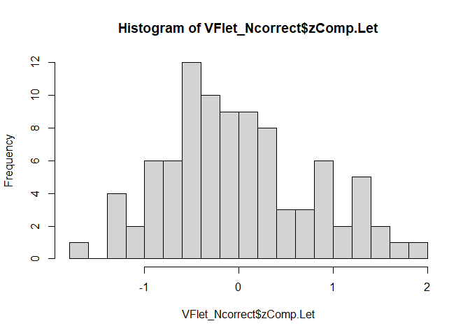<!-- -->

#### Visualisation Ncorrect Letter Fluency

``` r
VFlet_Ncorrect.long <- VFlet_Ncorrect %>%
  pivot_longer(cols=Total:S, names_to = "letter", values_to = "Ncorrect")

# Boxplot VFlet Ncorrect
# png(file="./Figures and Tables/Boxplot_VFletNcorrect.png",
# width=600, height=350)

(Boxplot_VF <- VFlet_Ncorrect.long %>%
    dplyr::filter(letter!="Total") %>%
    ggplot(aes(x=letter, y=Ncorrect, 
                                               fill = as.factor(Age.Category))) +
    geom_boxplot(colour="grey50")+
    stat_summary(aes(label=round(..y..), group=as.factor(Age.Category)), 
               fun=mean, geom = "label", size=4,
               fill="white", show.legend=NA, label.size=NA,
               position = position_dodge(.75), vjust=-3) +
      stat_summary(fun = "mean", position = position_dodge(.75), 
               show.legend=F, colour="white")+ #Mean as white dot
    labs(x = "Letter",
         y = "Ncorrect (raw scores)",
         title = "Number of Correctly Produced Words per Age Group and Letter")+
        scale_fill_discrete(guide=guide_legend(title = "Age Group"), labels=c("18 to 30 years old","40 to 55 years old", "65 to 80 years old")))
```

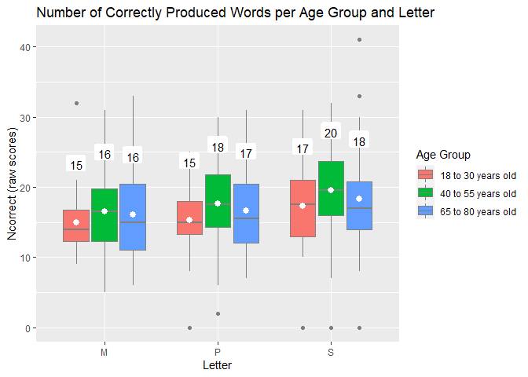<!-- -->

``` r
# dev.off()
```

``` r
# Boxplot VFlet Ncorrect Raw Total
# png(file="./Figures and Tables/Boxplot_VFletNcorrect_RawTotal.png",
# width=600, height=350)

(Boxplot_VF <- VFlet_Ncorrect.long %>%
    dplyr::filter(letter=="Total") %>%
    ggplot(aes(x=letter, y=Ncorrect,fill = as.factor(Age.Category))) +
    geom_boxplot(colour="grey50")+
    # stat_summary(aes(label=round(..y..), group=as.factor(Age.Category)), 
    #            fun=mean, geom = "label", size=4,
    #            fill="white", show.legend=NA, label.size=NA,
    #            position = position_dodge(.75), vjust=-3) +
      stat_summary(fun = "mean", position = position_dodge(.75), 
               show.legend=F, colour="white")+ #Mean as white dot
    labs(x = "Letter",
         y = "Ncorrect (raw scores)",
         title = "Total Number of Correctly Produced Words for All Letters per Age Group")+
        scale_fill_discrete(guide=guide_legend(title = "Age Group"), labels=c("18 to 30 years old","40 to 55 years old", "65 to 80 years old")))
```

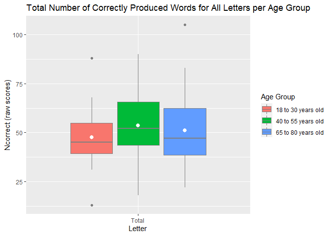<!-- -->

``` r
# dev.off()
```

*Figures Ncorrect Letter Fluency z-scores*

``` r
VFlet_Ncorrect.long.zScores <- VFlet_Ncorrect %>%
  pivot_longer(cols=zComp.Let:zP, names_to = "zletter", values_to = "zNcorrect")

# Boxplot VFlet Ncorrect
# png(file="./Figures and Tables/Boxplot_VFletNcorrect_zscores.png",
# width=600, height=350)

(Boxplot_VF <- VFlet_Ncorrect.long.zScores %>%
    dplyr::filter(zletter!="zComp.Let") %>%
    ggplot(aes(x=zletter, y=zNcorrect, 
                                               fill = as.factor(Age.Category))) +
    geom_boxplot(colour="grey50")+
    # stat_summary(aes(label=round(..y..), group=as.factor(Age.Category)), 
    #            fun=mean, geom = "label", size=4,
    #            fill="white", show.legend=NA, label.size=NA,
    #            position = position_dodge(.75), vjust=-3) +
      stat_summary(fun = "mean", position = position_dodge(.75), 
               show.legend=F, colour="white")+ #Mean as white dot
    labs(x = "Letter",
         y = "Ncorrect (z scores)",
         title = "Number of Correctly Produced Words per Age Group and Letter")+
        scale_fill_discrete(guide=guide_legend(title = "Age Group"), labels=c("18 to 30 years old","40 to 55 years old", "65 to 80 years old")))
```

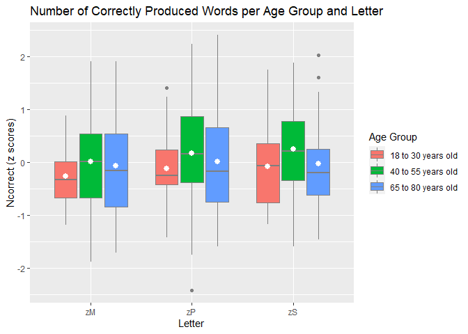<!-- -->

``` r
# dev.off()
```

``` r
# Boxplot VFlet Ncorrect Raw Total

# png(file="./Figures and Tables/Boxplot_VFletNcorrect_Total_zscores.png",
# width=600, height=350)


(Boxplot_VF <- VFlet_Ncorrect.long.zScores %>%
    dplyr::filter(zletter=="zComp.Let") %>%
    ggplot(aes(x=zletter, y=zNcorrect,fill = as.factor(Age.Category))) +
    geom_boxplot(colour="grey50")+
    # stat_summary(aes(label=round(..y..), group=as.factor(Age.Category)), 
    #            fun=mean, geom = "label", size=4,
    #            fill="white", show.legend=NA, label.size=NA,
    #            position = position_dodge(.75), vjust=-3) +
      stat_summary(fun = "mean", position = position_dodge(.75), 
               show.legend=F, colour="white")+ #Mean as white dot
    labs(x = "Letter",
         y = "Ncorrect (z scores)",
         title = "Total Number of Correctly Produced Words for All Letters per Age Group")+
        scale_fill_discrete(guide=guide_legend(title = "Age Group"), labels=c("18 to 30 years old","40 to 55 years old", "65 to 80 years old")))
```

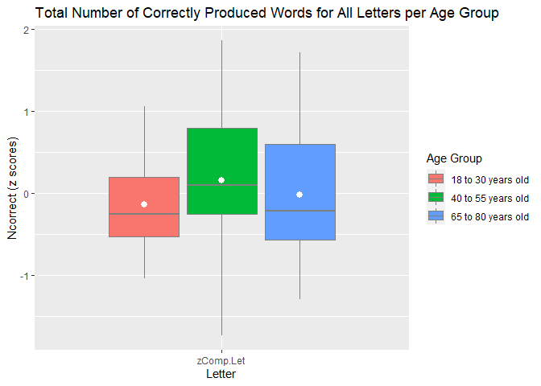<!-- -->

``` r
# dev.off()
```

## Multiple Linear Regression - Letter Fluency

*Unconditional model, i.e. without covariates*

``` r
lmUncond.VFlet.Ncorrect <- lm(zComp.Let ~ Age.Category*CR.composite.before, data = VFlet_Ncorrect)
# broom::tidy(lmUncond.VFlet.Ncorrect, conf.int=T)
```

*Full model including the covariates; outcome variable in
z-distribution*

``` r
lmFull.VFlet.Ncorrect <- lm(zComp.Let ~ Age.Category*CR.composite.before + zStroop.SRC + 
                              zWM.Score + zSoP.comp, data = VFlet_Ncorrect)
#Tidy table output
(tidylmFull.VFlet.Ncorrect <- broom::tidy(lmFull.VFlet.Ncorrect, conf.int=T))
```

    ## # A tibble: 9 x 7
    ##   term                   estimate std.error statistic p.value conf.low conf.high
    ##   <chr>                     <dbl>     <dbl>     <dbl>   <dbl>    <dbl>     <dbl>
    ## 1 (Intercept)             -0.157     0.172     -0.908  0.367   -0.500      0.187
    ## 2 Age.Category40 to 55 ~   0.308     0.220      1.40   0.165   -0.130      0.747
    ## 3 Age.Category65 to 80 ~   0.175     0.279      0.629  0.531   -0.379      0.730
    ## 4 CR.composite.before      0.0372    0.145      0.256  0.799   -0.252      0.327
    ## 5 zStroop.SRC             -0.0380    0.0969    -0.393  0.696   -0.231      0.155
    ## 6 zWM.Score                0.181     0.106      1.70   0.0934  -0.0311     0.393
    ## 7 zSoP.comp               -0.0243    0.155     -0.156  0.876   -0.333      0.285
    ## 8 Age.Category40 to 55 ~   0.0918    0.206      0.446  0.657   -0.318      0.501
    ## 9 Age.Category65 to 80 ~   0.110     0.208      0.529  0.598   -0.304      0.524

``` r
# write.csv(tidylmFull.VFlet.Ncorrect, "./Figures and Tables/VFlet_zNcorrect_lmFull.csv")
```

*Full model including the covariates; outcome variable as raw score*

``` r
lmFull.VFlet.Ncorrect.raw <- lm(Total ~ Age.Category*CR.composite.before + zStroop.SRC + 
                              zWM.Score + zSoP.comp, data = VFlet_Ncorrect)

#Tidy table output
broom::tidy(lmFull.VFlet.Ncorrect.raw, conf.int=T)
```

    ## # A tibble: 9 x 7
    ##   term                  estimate std.error statistic  p.value conf.low conf.high
    ##   <chr>                    <dbl>     <dbl>     <dbl>    <dbl>    <dbl>     <dbl>
    ## 1 (Intercept)             46.1        3.84    12.0   1.24e-19   38.4       53.7 
    ## 2 Age.Category40 to 55~    7.38       4.91     1.50  1.36e- 1   -2.38      17.1 
    ## 3 Age.Category65 to 80~    7.08       6.21     1.14  2.58e- 1   -5.27      19.4 
    ## 4 CR.composite.before      1.90       3.24     0.586 5.60e- 1   -4.55       8.35
    ## 5 zStroop.SRC             -0.556      2.16    -0.257 7.98e- 1   -4.85       3.74
    ## 6 zWM.Score                3.77       2.37     1.59  1.16e- 1   -0.950      8.49
    ## 7 zSoP.comp               -2.60       3.46    -0.752 4.54e- 1   -9.49       4.29
    ## 8 Age.Category40 to 55~    0.555      4.58     0.121 9.04e- 1   -8.57       9.68
    ## 9 Age.Category65 to 80~    0.803      4.63     0.173 8.63e- 1   -8.42      10.0

The model doesn’t seem to predict the composite score (z-distribution)
or raw Total score for Verbal Fluency Letter. Let’s check the model
assumptions + fit.

*Assumption 1 - Linearity*

``` r
## Unconditional model with z composite score
plot(lmUncond.VFlet.Ncorrect, 1, main = "Unconditional model")
```

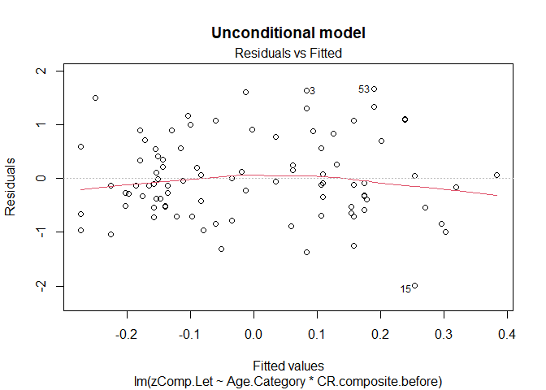<!-- -->

``` r
## Full model with z composite score
plot(lmFull.VFlet.Ncorrect, 1, main = "Full model (z-score composite score)")
```

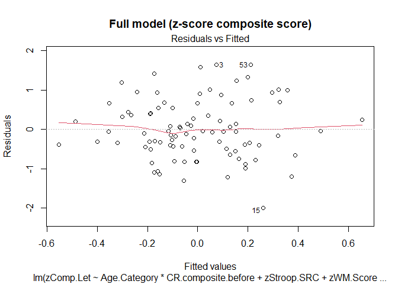<!-- -->

``` r
## Full model with raw total score
plot(lmFull.VFlet.Ncorrect.raw, 1, main = "Full model (raw total score)")
```

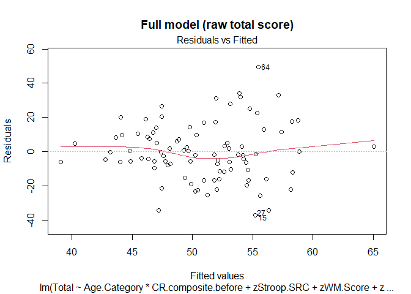<!-- -->

For all models, the red line is mostly horizontal, meaning that there is
a linear relationship between the fitted line and the residual value.

*Assumption 2 - Independence of Variables*

``` r
# Z composite of VF cat
## Create table with correlation values between predictor variables
tibble::as_tibble(cor(VFlet_Ncorrect[,c(5,16, 21, 23,24)]), rownames="rowname")
```

    ## # A tibble: 5 x 6
    ##   rowname             zComp.Let zStroop.SRC zSoP.comp zWM.Score CR.composite.be~
    ##   <chr>                   <dbl>       <dbl>     <dbl>     <dbl>            <dbl>
    ## 1 zComp.Let              1           0.0279    0.0395   0.191            0.129  
    ## 2 zStroop.SRC            0.0279      1         0.432    0.116            0.0483 
    ## 3 zSoP.comp              0.0395      0.432     1        0.144            0.0228 
    ## 4 zWM.Score              0.191       0.116     0.144    1               -0.00547
    ## 5 CR.composite.before    0.129       0.0483    0.0228  -0.00547          1

``` r
## Create correlation plot between predictor variables
corrplot(cor(VFlet_Ncorrect[,c(5,16, 21, 23,24)]),method='circle')
```

<!-- -->

``` r
## Raw scores
## Create table with correlation values between predictor variables
tibble::as_tibble(cor(VFlet_Ncorrect[,c(9, 16, 21, 23,24)]), rownames = "rowname")
```

    ## # A tibble: 5 x 6
    ##   rowname               Total zStroop.SRC zSoP.comp zWM.Score CR.composite.befo~
    ##   <chr>                 <dbl>       <dbl>     <dbl>     <dbl>              <dbl>
    ## 1 Total               1            0.0247   0.00698   0.167              0.130  
    ## 2 zStroop.SRC         0.0247       1        0.432     0.116              0.0483 
    ## 3 zSoP.comp           0.00698      0.432    1         0.144              0.0228 
    ## 4 zWM.Score           0.167        0.116    0.144     1                 -0.00547
    ## 5 CR.composite.before 0.130        0.0483   0.0228   -0.00547            1

``` r
## Create correlation plot between predictor variables
corrplot(cor(VFlet_Ncorrect[,c(9,16, 21, 23,24)]))
```

<!-- -->

There seems to be no strong relationship between the predictor
variables. Hence, we can assume Independence of Variables.

*Assumption 3 - Normal Distribution of Residuals*

Full model with z composite score

``` r
plot(lmFull.VFlet.Ncorrect, 2, main = "Full model (z-score composite score)")
```

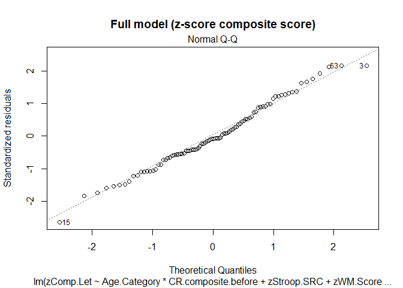<!-- -->
Full model with raw total score

``` r
plot(lmFull.VFlet.Ncorrect.raw, 2, main = "Full model (raw total score)")
```

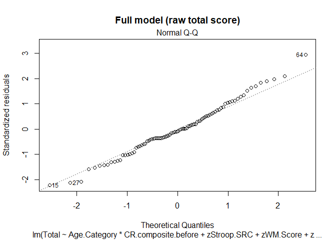<!-- -->

For all models, the points seem to roughly follow a straight line,
except for a few points on the left and right. Hence, other
relationships/predictors that have not been included into the models
could explain the variance. This could be caused by outliers in the
data.

*Assumption 4 - Homoscedasticity or Equal Variance of Variables*

Full model with z composite score

``` r
plot(lmFull.VFlet.Ncorrect, 3, main = "Full model (z-score composite score)")
```

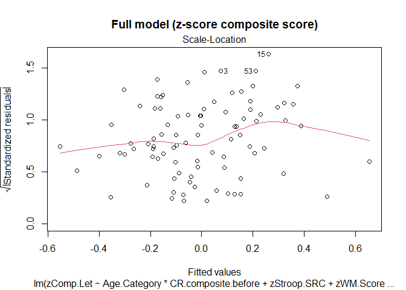<!-- -->

Full model with raw total score

``` r
plot(lmFull.VFlet.Ncorrect.raw, 3, main = "Full model (raw total score)")
```

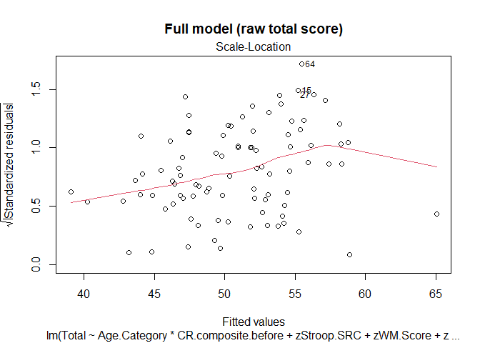<!-- -->
For the unconditional model, the variance of residuals seems relatively
equal across the predictors. Hence, the error terms are relatively the
same across all values of the independent variable for this model.
However, the variance of residuals doesn’t seem quite equally
distributed across the predictors. So, for the full models (z-score and
raw score), the spread is not entirely constant, hence, the error terms
does not appear to be the same across all values of the outcome
variable.

#### Model fit diagnostics

*Variation Inflation Factor*

Any VIF value above 4 needs further investigation. There seems to be no
concerning signs of collinearity (VIF values higher than 4). The
tolerance values indicate the percentage of variance that cannot be
explained for by the other predictor variables.

``` r
ols_vif_tol(lmFull.VFlet.Ncorrect)
```

    ##                                            Variables Tolerance      VIF
    ## 1                     Age.Category40 to 55 years old 0.6255213 1.598667
    ## 2                     Age.Category65 to 80 years old 0.3910939 2.556931
    ## 3                                CR.composite.before 0.3297057 3.033008
    ## 4                                        zStroop.SRC 0.7584502 1.318478
    ## 5                                          zWM.Score 0.9498853 1.052759
    ## 6                                          zSoP.comp 0.4868349 2.054084
    ## 7 Age.Category40 to 55 years old:CR.composite.before 0.4944811 2.022322
    ## 8 Age.Category65 to 80 years old:CR.composite.before 0.4842401 2.065091

``` r
ols_vif_tol(lmFull.VFlet.Ncorrect.raw)
```

    ##                                            Variables Tolerance      VIF
    ## 1                     Age.Category40 to 55 years old 0.6255213 1.598667
    ## 2                     Age.Category65 to 80 years old 0.3910939 2.556931
    ## 3                                CR.composite.before 0.3297057 3.033008
    ## 4                                        zStroop.SRC 0.7584502 1.318478
    ## 5                                          zWM.Score 0.9498853 1.052759
    ## 6                                          zSoP.comp 0.4868349 2.054084
    ## 7 Age.Category40 to 55 years old:CR.composite.before 0.4944811 2.022322
    ## 8 Age.Category65 to 80 years old:CR.composite.before 0.4842401 2.065091

*Plot Diagnositcs Full model with z composite score for Semantic
Fluency*

``` r
ols_plot_diagnostics(lmFull.VFlet.Ncorrect)
```

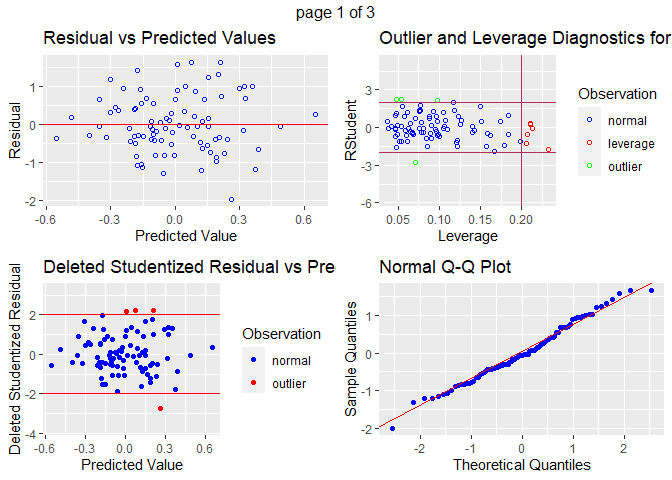<!-- -->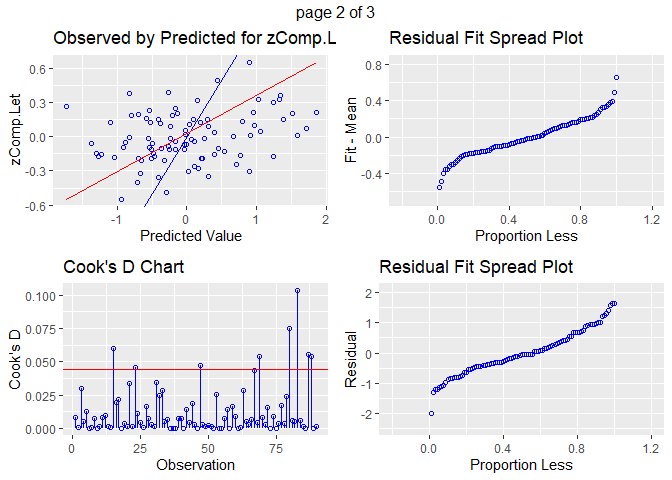<!-- -->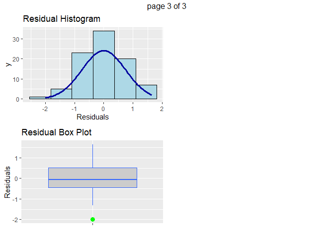<!-- -->

*Plot Diagnositcs Full model with raw score for Semantic Fluency*

``` r
ols_plot_diagnostics(lmFull.VFlet.Ncorrect.raw)
```

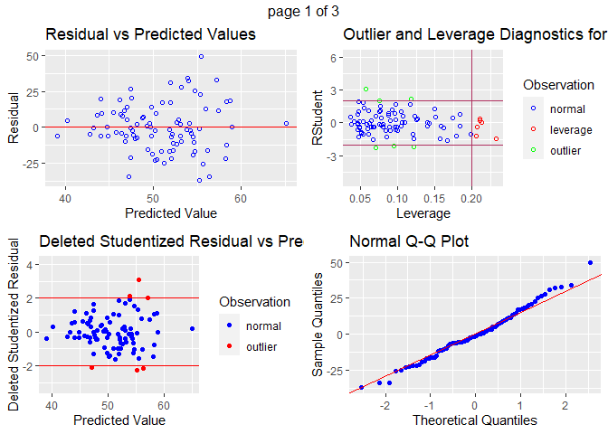<!-- -->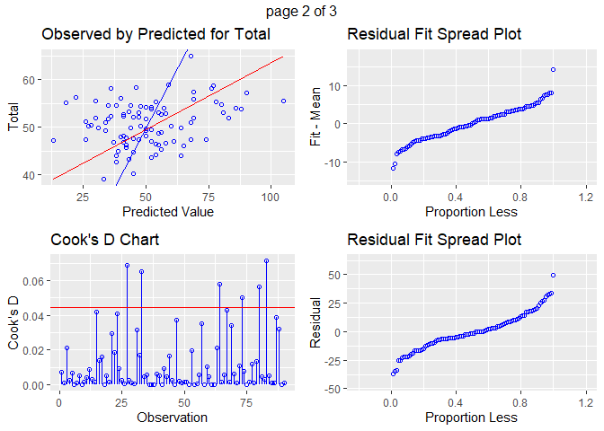<!-- -->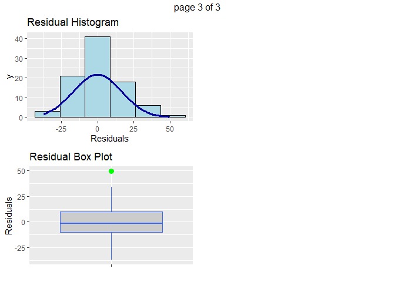<!-- -->

For all models, the Observed vs Predicted Plot shows that the model
doesn’t fit the data very well (pity) –&gt; due to outliers?? What to
do…. –&gt; perhaps identify outliers using the Cook chart and residual
plot and rerun the models?

### Model comparisons for the CR measure preciding and coinciding with the COVID-19 pandemic

The effect of the COVID-19 pandemic on CR and subsequent behavioural
performance

``` r
lmFull.VFlet.Ncorrect.during <- lm(zComp.Let ~ Age.Category*CR.composite.during + zStroop.SRC + 
                              zWM.Score + zSoP.comp, data = VFlet_Ncorrect)
summary(lmFull.VFlet.Ncorrect.during)
```

    ## 
    ## Call:
    ## lm(formula = zComp.Let ~ Age.Category * CR.composite.during + 
    ##     zStroop.SRC + zWM.Score + zSoP.comp, data = VFlet_Ncorrect)
    ## 
    ## Residuals:
    ##      Min       1Q   Median       3Q      Max 
    ## -1.94131 -0.44450 -0.06589  0.47154  1.68179 
    ## 
    ## Coefficients:
    ##                                                    Estimate Std. Error t value
    ## (Intercept)                                        -0.14983    0.17263  -0.868
    ## Age.Category40 to 55 years old                      0.29976    0.22002   1.362
    ## Age.Category65 to 80 years old                      0.16701    0.27921   0.598
    ## CR.composite.during                                 0.17773    0.14903   1.193
    ## zStroop.SRC                                        -0.02652    0.09754  -0.272
    ## zWM.Score                                           0.19106    0.10571   1.807
    ## zSoP.comp                                          -0.02810    0.15524  -0.181
    ## Age.Category40 to 55 years old:CR.composite.during -0.07806    0.20848  -0.374
    ## Age.Category65 to 80 years old:CR.composite.during -0.05513    0.21219  -0.260
    ##                                                    Pr(>|t|)  
    ## (Intercept)                                          0.3880  
    ## Age.Category40 to 55 years old                       0.1768  
    ## Age.Category65 to 80 years old                       0.5514  
    ## CR.composite.during                                  0.2365  
    ## zStroop.SRC                                          0.7864  
    ## zWM.Score                                            0.0744 .
    ## zSoP.comp                                            0.8568  
    ## Age.Category40 to 55 years old:CR.composite.during   0.7091  
    ## Age.Category65 to 80 years old:CR.composite.during   0.7957  
    ## ---
    ## Signif. codes:  0 '***' 0.001 '**' 0.01 '*' 0.05 '.' 0.1 ' ' 1
    ## 
    ## Residual standard error: 0.7754 on 81 degrees of freedom
    ## Multiple R-squared:  0.08821,    Adjusted R-squared:  -0.001845 
    ## F-statistic: 0.9795 on 8 and 81 DF,  p-value: 0.4581

``` r
# Model comparisons
anova(lmFull.VFlet.Ncorrect, lmFull.VFlet.Ncorrect.during)
```

    ## Analysis of Variance Table
    ## 
    ## Model 1: zComp.Let ~ Age.Category * CR.composite.before + zStroop.SRC + 
    ##     zWM.Score + zSoP.comp
    ## Model 2: zComp.Let ~ Age.Category * CR.composite.during + zStroop.SRC + 
    ##     zWM.Score + zSoP.comp
    ##   Res.Df    RSS Df Sum of Sq F Pr(>F)
    ## 1     81 49.160                      
    ## 2     81 48.706  0   0.45349

No differences between the two models

``` r
#Model comparisons through AIC values
AIC(lmFull.VFlet.Ncorrect)
```

    ## [1] 220.9826

``` r
AIC(lmFull.VFlet.Ncorrect.during)
```

    ## [1] 220.1485

The model with the composite score during Covid-19 seems to fit slightly
better

## Verbal Fluency - Actions

### Descriptive Statistics

``` r
## Create dataset that only includes data of the Number of Correct words Produced
VFact_Ncorrect <- VFact %>%
  dplyr::filter(Measures=="Ncorrect") %>%
  dplyr::select(-Measures)

# head(VFact_Ncorrect, L=6)
```

``` r
#Summarise data to present descriptives in a table
(Descr_VFact <- VFact_Ncorrect %>%
#Per Age Group
  group_by(Age.Category) %>%
  summarise(Nppt = length(unique(ID)),
            total = mean(Total, na.rm=T),
            ztotal = mean(zComp.Act, na.rm=T),
            people = mean(Things.people.do, na.rm=T),
            eggs = mean(Egg, na.rm=T)))
```

    ## # A tibble: 3 x 6
    ##   Age.Category        Nppt total  ztotal people  eggs
    ##   <chr>              <int> <dbl>   <dbl>  <dbl> <dbl>
    ## 1 18 to 30 years old    30  35.7  0.126    22.4  13.2
    ## 2 40 to 55 years old    30  35.9  0.0948   22.4  13.4
    ## 3 65 to 80 years old    30  32.9 -0.185    19.9  13.0

``` r
# write.csv(Descr_VFact, "./Figures and Tables/Descr_VFact_Ncorrect.csv", row.names = F)
```

``` r
#z-distribution of composite score for Action fluency
hist(VFact$zComp.Act, breaks=20)
```

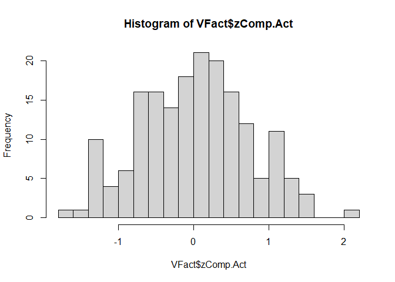<!-- -->
\#\#\#\# Visualisation Ncorrect Semantic Fluency

``` r
## Convert wide to long format for visualisation of data
VFact_Ncorrect.long <- VFact_Ncorrect %>%
  pivot_longer(cols=Total:Egg, names_to = "action", values_to = "Ncorrect")

#Boxplot VFact Ncorrect
# png(file="./Figures and Tables/Boxplot_VFactNcorrect.png",
# width=600, height=350)

(Boxplot_VF <- VFact_Ncorrect.long %>%
    dplyr::filter(action!="Total") %>%
    ggplot(aes(x=factor(action), y=Ncorrect, 
                                               fill = as.factor(Age.Category))) +
    geom_boxplot(colour="grey50")+
    stat_summary(aes(label=round(..y..), group=as.factor(Age.Category)), 
               fun=mean, geom = "label", size=4,
               fill="white", show.legend=NA, label.size=NA,
               position = position_dodge(.75), vjust=-3) +
      stat_summary(fun = "mean", position = position_dodge(.75), 
               show.legend=F, colour="white")+ #Mean as white dot
    labs(x = "Action Category",
         y = "Ncorrect (raw scores)",
         title = "Number of Correctly Produced Words per Age Group and Action Category")+
        scale_fill_discrete(guide=guide_legend(title = "Age Group"), labels=c("18 to 30 years old","40 to 55 years old", "65 to 80 years old")))
```

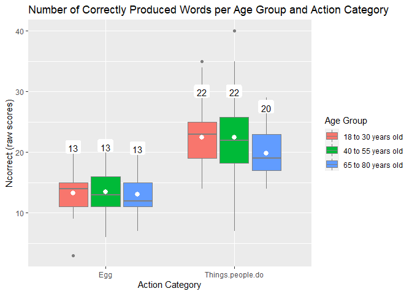<!-- -->

``` r
# dev.off()
```

``` r
# Boxplot VFact Ncorrect Raw Total
# png(file="./Figures and Tables/Boxplot_VFactNcorrect_RawTotal.png",
# width=600, height=350)

(Boxplot_VF <- VFact_Ncorrect.long %>%
    dplyr::filter(action=="Total") %>%
    ggplot(aes(x=action, y=Ncorrect,fill = as.factor(Age.Category))) +
    geom_boxplot(colour="grey50")+
    stat_summary(aes(label=round(..y..), group=as.factor(Age.Category)), 
               fun=mean, geom = "label", size=4,
               fill="white", show.legend=NA, label.size=NA,
               position = position_dodge(.75), vjust=-3) +
      stat_summary(fun = "mean", position = position_dodge(.75), 
               show.legend=F, colour="white")+ #Mean as white dot
    labs(x = "",
         y = "Ncorrect (raw scores)",
         title = "Total Number of Correctly Produced Words for Both Action Categories per Age Group")+
        scale_fill_discrete(guide=guide_legend(title = "Age Group"), labels=c("18 to 30 years old","40 to 55 years old", "65 to 80 years old")))
```

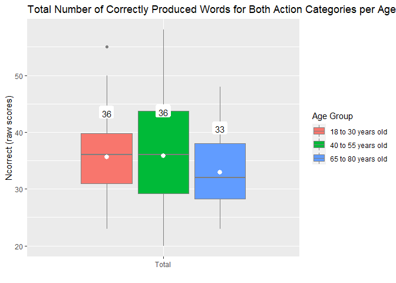<!-- -->

``` r
# dev.off()
```

*Figures Ncorrect Action Fluency z-scores*

``` r
## Convert wide to long format for visualisation of data
VFact_Ncorrect.long.zScores <- VFact_Ncorrect %>%
  pivot_longer(cols=zComp.Act:zEggs, names_to = "zaction", values_to = "zNcorrect")

#Boxplot VFact Ncorrect
# png(file="./Figures and Tables/Boxplot_VFactNcorrect_zscores.png",
# width=600, height=350)

(Boxplot_VF <- VFact_Ncorrect.long.zScores %>%
    dplyr::filter(zaction!="zComp.Act") %>%
    ggplot(aes(x=factor(zaction), y=zNcorrect, 
                                               fill = as.factor(Age.Category))) +
    geom_boxplot(colour="grey50")+
    # stat_summary(aes(label=round(..y..), group=as.factor(Age.Category)), 
    #            fun=mean, geom = "label", size=4,
    #            fill="white", show.legend=NA, label.size=NA,
    #            position = position_dodge(.75), vjust=-3) +
      stat_summary(fun = "mean", position = position_dodge(.75), 
               show.legend=F, colour="white")+ #Mean as white dot
    labs(x = "Action Category",
         y = "Ncorrect (z scores)",
         title = "Number of Correctly Produced Words per Age Group and Action Category")+
        scale_fill_discrete(guide=guide_legend(title = "Age Group"), labels=c("18 to 30 years old","40 to 55 years old", "65 to 80 years old")))
```

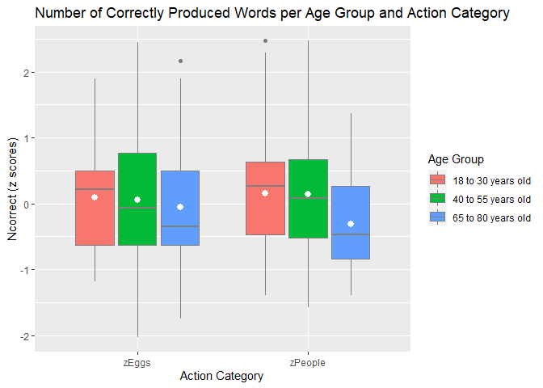<!-- -->

``` r
# dev.off()
```

``` r
# Boxplot VFact Ncorrect Raw Total
# png(file="./Figures and Tables/Boxplot_VFactNcorrect_Total_zscores.png",
# width=600, height=350)

(Boxplot_VF <- VFact_Ncorrect.long.zScores %>%
    dplyr::filter(zaction=="zComp.Act") %>%
    ggplot(aes(x=zaction, y=zNcorrect,fill = as.factor(Age.Category))) +
    geom_boxplot(colour="grey50")+
    # stat_summary(aes(label=round(..y..), group=as.factor(Age.Category)), 
    #            fun=mean, geom = "label", size=4,
    #            fill="white", show.legend=NA, label.size=NA,
    #            position = position_dodge(.75), vjust=-3) +
      stat_summary(fun = "mean", position = position_dodge(.75), 
               show.legend=F, colour="white")+ #Mean as white dot
    labs(x = "",
         y = "Ncorrect (z scores)",
         title = "Total Number of Correctly Produced Words for Both Action Categories per Age Group")+
        scale_fill_discrete(guide=guide_legend(title = "Age Group"), labels=c("18 to 30 years old","40 to 55 years old", "65 to 80 years old")))
```

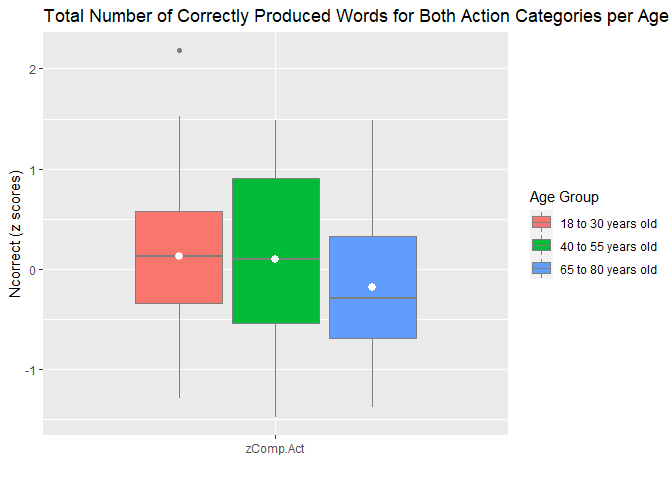<!-- -->

``` r
# dev.off()
```

## Multiple Linear Regression - Action Fluency

*Unconditional model, i.e. without covariates*

``` r
lmUncond.VFact.Ncorrect <- lm(zComp.Act ~ Age.Category*CR.composite.before, data = VFact_Ncorrect)
# broom::tidy(lmUncond.VFact.Ncorrect, conf.int=T)
```

*Full model including the covariates; outcome variable in
z-distribution*

``` r
lmFull.VFact.Ncorrect <- lm(zComp.Act ~ Age.Category*CR.composite.before + zStroop.SRC + 
                              zWM.Score + zSoP.comp, data = VFact_Ncorrect)
#Tidy table output
(tidylmFull.VFact.Ncorrect <- broom::tidy(lmFull.VFact.Ncorrect, conf.int=T))
```

    ## # A tibble: 9 x 7
    ##   term                   estimate std.error statistic p.value conf.low conf.high
    ##   <chr>                     <dbl>     <dbl>     <dbl>   <dbl>    <dbl>     <dbl>
    ## 1 (Intercept)             -0.108     0.171     -0.631  0.530   -0.448     0.232 
    ## 2 Age.Category40 to 55 ~   0.186     0.218      0.853  0.396   -0.248     0.621 
    ## 3 Age.Category65 to 80 ~   0.153     0.276      0.555  0.580   -0.396     0.703 
    ## 4 CR.composite.before     -0.0885    0.144     -0.613  0.542   -0.376     0.199 
    ## 5 zStroop.SRC             -0.109     0.0961    -1.13   0.260   -0.300     0.0823
    ## 6 zWM.Score                0.0828    0.106      0.784  0.435   -0.127     0.293 
    ## 7 zSoP.comp               -0.294     0.154     -1.90   0.0604  -0.600     0.0131
    ## 8 Age.Category40 to 55 ~   0.269     0.204      1.32   0.191   -0.137     0.675 
    ## 9 Age.Category65 to 80 ~   0.320     0.206      1.55   0.125   -0.0904    0.730

``` r
# write.csv(tidylmFull.VFact.Ncorrect, "./Figures and Tables/VFact_Ncorrect_lmFull.csv")
```

*Full model including the covariates; outcome variable as raw score*

``` r
lmFull.VFact.Ncorrect.raw <- lm(Total ~ Age.Category*CR.composite.before + zStroop.SRC + 
                              zWM.Score + zSoP.comp, data = VFact_Ncorrect)
#Tidy table output
broom::tidy(lmFull.VFact.Ncorrect.raw, conf.int=T)
```

    ## # A tibble: 9 x 7
    ##   term                  estimate std.error statistic  p.value conf.low conf.high
    ##   <chr>                    <dbl>     <dbl>     <dbl>    <dbl>    <dbl>     <dbl>
    ## 1 (Intercept)             33.7       1.68     20.1   3.45e-33   30.3      37.0  
    ## 2 Age.Category40 to 55~    2.16      2.14      1.01  3.16e- 1   -2.10      6.42 
    ## 3 Age.Category65 to 80~    1.21      2.71      0.449 6.55e- 1   -4.17      6.60 
    ## 4 CR.composite.before     -1.04      1.41     -0.739 4.62e- 1   -3.86      1.77 
    ## 5 zStroop.SRC             -1.35      0.941    -1.44  1.55e- 1   -3.22      0.522
    ## 6 zWM.Score                0.984     1.03      0.951 3.44e- 1   -1.07      3.04 
    ## 7 zSoP.comp               -2.22      1.51     -1.47  1.45e- 1   -5.22      0.784
    ## 8 Age.Category40 to 55~    3.33      2.00      1.66  9.99e- 2   -0.650     7.31 
    ## 9 Age.Category65 to 80~    3.18      2.02      1.58  1.19e- 1   -0.835     7.20

The model doesn’t seem to predict either the composite score
(z-distribution) or the raw Total score for Verbal Fluency Action
Categories. Let’s check the model assumptions + fit.

*Assumption 1 - Linearity*

``` r
## Unconditional model with z composite score
plot(lmUncond.VFact.Ncorrect, 1, main = "Unconditional model")
```

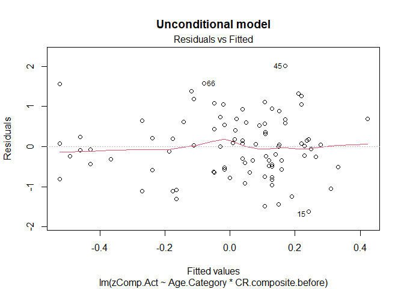<!-- -->

``` r
## Full model with z composite score
plot(lmFull.VFact.Ncorrect, 1, main = "Full model (z-score composite score)")
```

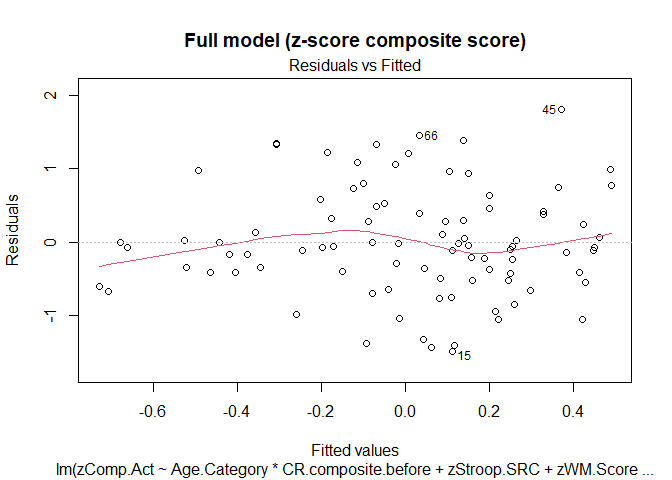<!-- -->

``` r
## Full model with raw total score
plot(lmFull.VFact.Ncorrect.raw, 1, main = "Full model (raw total score)")
```

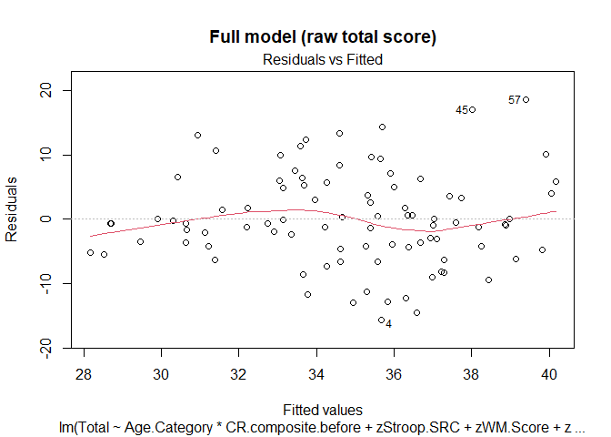<!-- -->

For all models, the red line is mostly horizontal, meaning that there is
a linear relationship between the fitted line and the residual value.

*Assumption 2 - Independence of Variables*

``` r
# Z composite of VF cat
## Create table with correlation values between predictor variables
tibble::as_tibble(cor(VFact_Ncorrect[,c(5,14,19,21,23)]), rownames="rowname")
```

    ## # A tibble: 5 x 6
    ##   rowname             zComp.Act zStroop.SRC zSoP.comp zWM.Score CR.composite.be~
    ##   <chr>                   <dbl>       <dbl>     <dbl>     <dbl>            <dbl>
    ## 1 zComp.Act              1          -0.179    -0.274    0.0450           0.121  
    ## 2 zStroop.SRC           -0.179       1         0.432    0.116            0.0483 
    ## 3 zSoP.comp             -0.274       0.432     1        0.144            0.0228 
    ## 4 zWM.Score              0.0450      0.116     0.144    1               -0.00547
    ## 5 CR.composite.before    0.121       0.0483    0.0228  -0.00547          1

``` r
## Create correlation plot between predictor variables
corrplot(cor(VFact_Ncorrect[,c(5,14,19,21,23)]),method='circle')
```

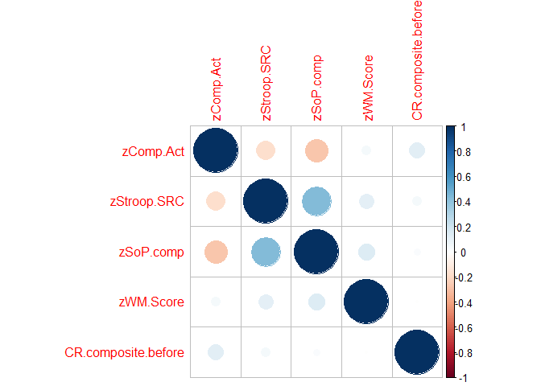<!-- -->

``` r
## Raw scores
## Create table with correlation values between predictor variables
tibble::as_tibble(cor(VFact_Ncorrect[,c(8,14,19,21,23)]), rownames = "rowname")
```

    ## # A tibble: 5 x 6
    ##   rowname               Total zStroop.SRC zSoP.comp zWM.Score CR.composite.befo~
    ##   <chr>                 <dbl>       <dbl>     <dbl>     <dbl>              <dbl>
    ## 1 Total                1          -0.185    -0.234    0.0660             0.129  
    ## 2 zStroop.SRC         -0.185       1         0.432    0.116              0.0483 
    ## 3 zSoP.comp           -0.234       0.432     1        0.144              0.0228 
    ## 4 zWM.Score            0.0660      0.116     0.144    1                 -0.00547
    ## 5 CR.composite.before  0.129       0.0483    0.0228  -0.00547            1

``` r
## Create correlation plot between predictor variables
corrplot(cor(VFact_Ncorrect[,c(8,14,19,21,23)]))
```

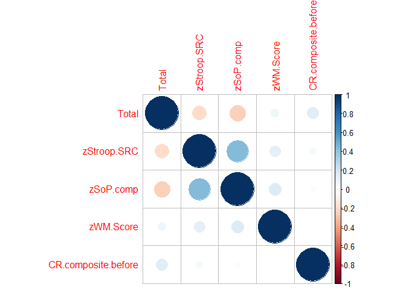<!-- -->

There seems to be no strong relationship between the predictor
variables. Hence, we can assume Independence of Variables.

*Assumption 3 - Normal Distribution of Residuals*

Full model with z composite score

``` r
plot(lmFull.VFact.Ncorrect, 2, main = "Full model (z-score composite score)")
```

<!-- -->
Full model with raw total score

``` r
## Full model with raw total score
plot(lmFull.VFact.Ncorrect.raw, 2, main = "Full model (raw total score)")
```

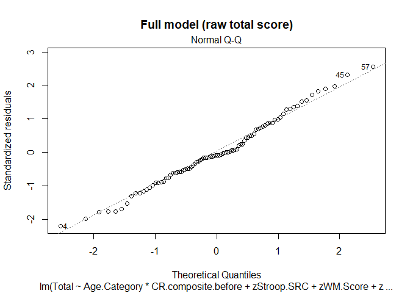<!-- -->

For the unconditional model and the full model with raw scores, the
points seem to roughly follow a straight line. For the full model with
the z-composite score, there is a small bulk on the left and right.
Hence, other relationships/predictors that have not been included into
the models could explain the variance for this model. One explanation
could be the online format of the study. For example, some participants
might have scored lower than they would in a lab-based study, due to
unclear instructions. Also, it could have caused more distractions than
there would have been in a lab based study.

*Assumption 4 - Homoscedasticity or Equal Variance of Variables*

Full model with z composite score

``` r
plot(lmFull.VFact.Ncorrect, 3, main = "Full model (z-score composite score)")
```

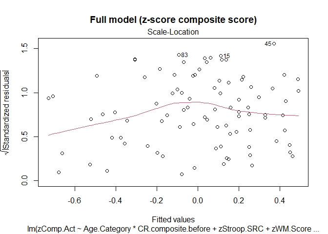<!-- -->

Full model with raw total score

``` r
plot(lmFull.VFact.Ncorrect.raw, 3, main = "Full model (raw total score)")
```

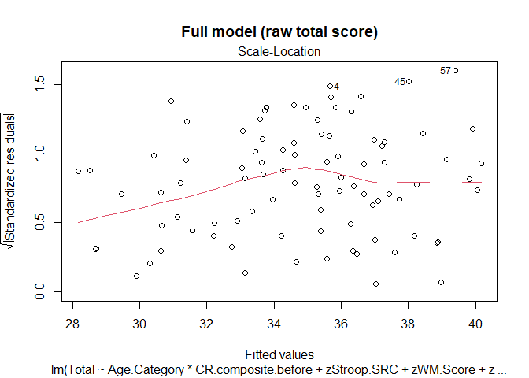<!-- -->
For all models, the variance of residuals seems relatively equal across
the predictors. Hence, the error terms are relatively the same across
all values of the independent variable for all three models.

#### Model fit diagnostics

*Variation Inflation Factor*

Any VIF value above 4 needs further investigation. There seems to be no
concerning signs of collinearity (VIF values higher than 4). The
tolerance values indicate the percentage of variance that cannot be
explained for by the other predictor variables.

``` r
ols_vif_tol(lmUncond.VFact.Ncorrect)
```

    ##                                            Variables Tolerance      VIF
    ## 1                     Age.Category40 to 55 years old 0.7500000 1.333333
    ## 2                     Age.Category65 to 80 years old 0.7500000 1.333333
    ## 3                                CR.composite.before 0.3333333 3.000000
    ## 4 Age.Category40 to 55 years old:CR.composite.before 0.5000000 2.000000
    ## 5 Age.Category65 to 80 years old:CR.composite.before 0.5000000 2.000000

``` r
ols_vif_tol(lmFull.VFact.Ncorrect)
```

    ##                                            Variables Tolerance      VIF
    ## 1                     Age.Category40 to 55 years old 0.6255213 1.598667
    ## 2                     Age.Category65 to 80 years old 0.3910939 2.556931
    ## 3                                CR.composite.before 0.3297057 3.033008
    ## 4                                        zStroop.SRC 0.7584502 1.318478
    ## 5                                          zWM.Score 0.9498853 1.052759
    ## 6                                          zSoP.comp 0.4868349 2.054084
    ## 7 Age.Category40 to 55 years old:CR.composite.before 0.4944811 2.022322
    ## 8 Age.Category65 to 80 years old:CR.composite.before 0.4842401 2.065091

``` r
ols_vif_tol(lmFull.VFact.Ncorrect.raw)
```

    ##                                            Variables Tolerance      VIF
    ## 1                     Age.Category40 to 55 years old 0.6255213 1.598667
    ## 2                     Age.Category65 to 80 years old 0.3910939 2.556931
    ## 3                                CR.composite.before 0.3297057 3.033008
    ## 4                                        zStroop.SRC 0.7584502 1.318478
    ## 5                                          zWM.Score 0.9498853 1.052759
    ## 6                                          zSoP.comp 0.4868349 2.054084
    ## 7 Age.Category40 to 55 years old:CR.composite.before 0.4944811 2.022322
    ## 8 Age.Category65 to 80 years old:CR.composite.before 0.4842401 2.065091

*Plot Diagnositcs Full model with z composite score for Semantic
Fluency*

``` r
ols_plot_diagnostics(lmFull.VFact.Ncorrect)
```

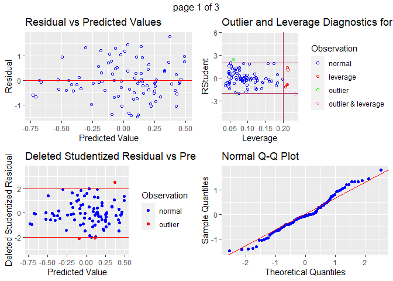<!-- -->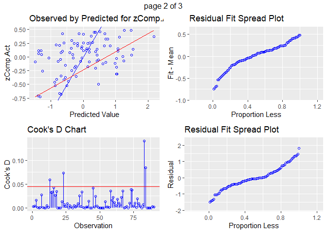<!-- -->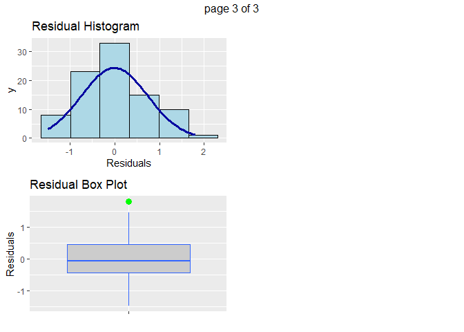<!-- -->

*Plot Diagnositcs Full model with raw score for Semantic Fluency*

``` r
ols_plot_diagnostics(lmFull.VFact.Ncorrect.raw)
```

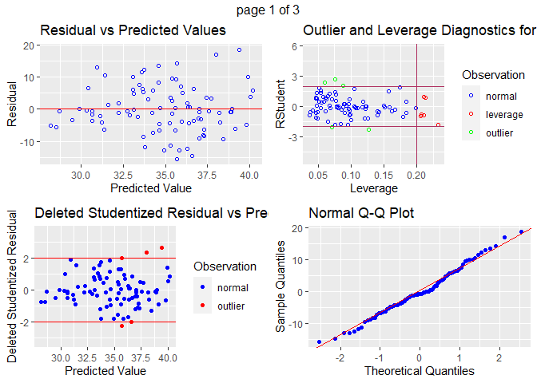<!-- -->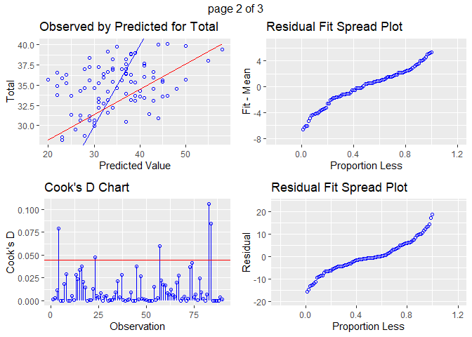<!-- -->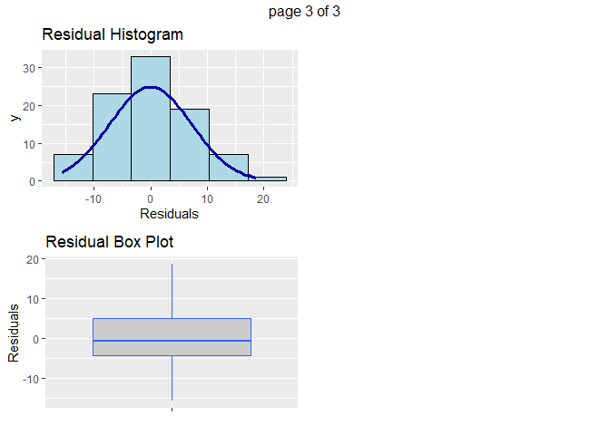<!-- -->

For all models, the Observed vs Predicted Plot shows that the model
doesn’t fit the data very well (pity) –&gt; due to outliers?? What to
do….

It can explain the fact that the models do not explain the outcome
variable in any case.

### Model comparisons for the CR measure preciding and coinciding with the COVID-19 pandemic

The effect of the COVID-19 pandemic on CR and subsequent behavioural
performance

``` r
lmFull.VFact.Ncorrect.during <- lm(zComp.Act ~ Age.Category*CR.composite.during + zStroop.SRC + 
                              zWM.Score + zSoP.comp, data = VFact_Ncorrect)
summary(lmFull.VFact.Ncorrect.during)
```

    ## 
    ## Call:
    ## lm(formula = zComp.Act ~ Age.Category * CR.composite.during + 
    ##     zStroop.SRC + zWM.Score + zSoP.comp, data = VFact_Ncorrect)
    ## 
    ## Residuals:
    ##      Min       1Q   Median       3Q      Max 
    ## -1.47356 -0.39914 -0.08344  0.48752  1.86899 
    ## 
    ## Coefficients:
    ##                                                    Estimate Std. Error t value
    ## (Intercept)                                        -0.11528    0.17059  -0.676
    ## Age.Category40 to 55 years old                      0.19456    0.21743   0.895
    ## Age.Category65 to 80 years old                      0.16958    0.27592   0.615
    ## CR.composite.during                                -0.10565    0.14727  -0.717
    ## zStroop.SRC                                        -0.12070    0.09639  -1.252
    ## zWM.Score                                           0.10993    0.10446   1.052
    ## zSoP.comp                                          -0.29851    0.15341  -1.946
    ## Age.Category40 to 55 years old:CR.composite.during  0.36914    0.20602   1.792
    ## Age.Category65 to 80 years old:CR.composite.during  0.31509    0.20969   1.503
    ##                                                    Pr(>|t|)  
    ## (Intercept)                                          0.5011  
    ## Age.Category40 to 55 years old                       0.3735  
    ## Age.Category65 to 80 years old                       0.5405  
    ## CR.composite.during                                  0.4752  
    ## zStroop.SRC                                          0.2141  
    ## zWM.Score                                            0.2957  
    ## zSoP.comp                                            0.0551 .
    ## Age.Category40 to 55 years old:CR.composite.during   0.0769 .
    ## Age.Category65 to 80 years old:CR.composite.during   0.1368  
    ## ---
    ## Signif. codes:  0 '***' 0.001 '**' 0.01 '*' 0.05 '.' 0.1 ' ' 1
    ## 
    ## Residual standard error: 0.7663 on 81 degrees of freedom
    ## Multiple R-squared:  0.1556, Adjusted R-squared:  0.07217 
    ## F-statistic: 1.865 on 8 and 81 DF,  p-value: 0.07691

``` r
# Model comparisons
anova(lmFull.VFact.Ncorrect, lmFull.VFact.Ncorrect.during)
```

    ## Analysis of Variance Table
    ## 
    ## Model 1: zComp.Act ~ Age.Category * CR.composite.before + zStroop.SRC + 
    ##     zWM.Score + zSoP.comp
    ## Model 2: zComp.Act ~ Age.Category * CR.composite.during + zStroop.SRC + 
    ##     zWM.Score + zSoP.comp
    ##   Res.Df    RSS Df Sum of Sq F Pr(>F)
    ## 1     81 48.373                      
    ## 2     81 47.565  0   0.80757

No differences between the two models

``` r
#Model comparisons through AIC values
AIC(lmFull.VFact.Ncorrect)
```

    ## [1] 219.5302

``` r
AIC(lmFull.VFact.Ncorrect.during)
```

    ## [1] 218.015

The model with the composite score during Covid-19 seems to fit slightly
better

## References

<div id="refs" class="references csl-bib-body hanging-indent">

<div id="ref-R-rio" class="csl-entry">

Chan, Chung-hong, and Thomas J. Leeper. 2021. *Rio: A Swiss-Army Knife
for Data i/o*. <https://github.com/leeper/rio>.

</div>

<div id="ref-car2019" class="csl-entry">

Fox, John, and Sanford Weisberg. 2019. *An R Companion to Applied
Regression*. Third. Thousand Oaks CA: Sage.
<https://socialsciences.mcmaster.ca/jfox/Books/Companion/>.

</div>

<div id="ref-R-carData" class="csl-entry">

Fox, John, Sanford Weisberg, and Brad Price. 2020. *carData: Companion
to Applied Regression Data Sets*.
<https://CRAN.R-project.org/package=carData>.

</div>

<div id="ref-R-car" class="csl-entry">

———. 2021. *Car: Companion to Applied Regression*.
<https://CRAN.R-project.org/package=car>.

</div>

<div id="ref-R-olsrr" class="csl-entry">

Hebbali, Aravind. 2020. *Olsrr: Tools for Building OLS Regression
Models*. <https://CRAN.R-project.org/package=olsrr>.

</div>

<div id="ref-R-purrr" class="csl-entry">

Henry, Lionel, and Hadley Wickham. 2020. *Purrr: Functional Programming
Tools*. <https://CRAN.R-project.org/package=purrr>.

</div>

<div id="ref-R-fs" class="csl-entry">

Hester, Jim, and Hadley Wickham. 2020. *Fs: Cross-Platform File System
Operations Based on Libuv*. <https://CRAN.R-project.org/package=fs>.

</div>

<div id="ref-performance2021" class="csl-entry">

Lüdecke, Daniel, Mattan S. Ben-Shachar, Indrajeet Patil, Philip
Waggoner, and Dominique Makowski. 2021. “<span
class="nocase">performance</span>: An R Package for Assessment,
Comparison and Testing of Statistical Models.” *Journal of Open Source
Software* 6 (60): 3139. <https://doi.org/10.21105/joss.03139>.

</div>

<div id="ref-R-performance" class="csl-entry">

Lüdecke, Daniel, Dominique Makowski, Mattan S. Ben-Shachar, Indrajeet
Patil, Philip Waggoner, and Brenton M. Wiernik. 2021. *Performance:
Assessment of Regression Models Performance*.
<https://easystats.github.io/performance/>.

</div>

<div id="ref-R-e1071" class="csl-entry">

Meyer, David, Evgenia Dimitriadou, Kurt Hornik, Andreas Weingessel, and
Friedrich Leisch. 2021. *E1071: Misc Functions of the Department of
Statistics, Probability Theory Group (Formerly: E1071), TU Wien*.
<https://CRAN.R-project.org/package=e1071>.

</div>

<div id="ref-R-tibble" class="csl-entry">

Müller, Kirill, and Hadley Wickham. 2021. *Tibble: Simple Data Frames*.
<https://CRAN.R-project.org/package=tibble>.

</div>

<div id="ref-R-base" class="csl-entry">

R Core Team. 2020. *R: A Language and Environment for Statistical
Computing*. Vienna, Austria: R Foundation for Statistical Computing.
<https://www.R-project.org/>.

</div>

<div id="ref-R-broom" class="csl-entry">

Robinson, David, Alex Hayes, and Simon Couch. 2021. *Broom: Convert
Statistical Objects into Tidy Tibbles*.
<https://CRAN.R-project.org/package=broom>.

</div>

<div id="ref-lattice2008" class="csl-entry">

Sarkar, Deepayan. 2008. *Lattice: Multivariate Data Visualization with
r*. New York: Springer. <http://lmdvr.r-forge.r-project.org>.

</div>

<div id="ref-R-lattice" class="csl-entry">

———. 2021. *Lattice: Trellis Graphics for r*.
<http://lattice.r-forge.r-project.org/>.

</div>

<div id="ref-R-corrplot" class="csl-entry">

Wei, Taiyun, and Viliam Simko. 2021a. *Corrplot: Visualization of a
Correlation Matrix*. <https://github.com/taiyun/corrplot>.

</div>

<div id="ref-corrplot2021" class="csl-entry">

———. 2021b. *R Package ’Corrplot’: Visualization of a Correlation
Matrix*. <https://github.com/taiyun/corrplot>.

</div>

<div id="ref-ggplot22016" class="csl-entry">

Wickham, Hadley. 2016. *Ggplot2: Elegant Graphics for Data Analysis*.
Springer-Verlag New York. <https://ggplot2.tidyverse.org>.

</div>

<div id="ref-R-stringr" class="csl-entry">

———. 2019. *Stringr: Simple, Consistent Wrappers for Common String
Operations*. <https://CRAN.R-project.org/package=stringr>.

</div>

<div id="ref-R-forcats" class="csl-entry">

———. 2021a. *Forcats: Tools for Working with Categorical Variables
(Factors)*. <https://CRAN.R-project.org/package=forcats>.

</div>

<div id="ref-R-tidyr" class="csl-entry">

———. 2021b. *Tidyr: Tidy Messy Data*.
<https://CRAN.R-project.org/package=tidyr>.

</div>

<div id="ref-R-tidyverse" class="csl-entry">

———. 2021c. *Tidyverse: Easily Install and Load the Tidyverse*.
<https://CRAN.R-project.org/package=tidyverse>.

</div>

<div id="ref-tidyverse2019" class="csl-entry">

Wickham, Hadley, Mara Averick, Jennifer Bryan, Winston Chang, Lucy
D’Agostino McGowan, Romain François, Garrett Grolemund, et al. 2019.
“Welcome to the <span class="nocase">tidyverse</span>.” *Journal of Open
Source Software* 4 (43): 1686. <https://doi.org/10.21105/joss.01686>.

</div>

<div id="ref-R-readxl" class="csl-entry">

Wickham, Hadley, and Jennifer Bryan. 2019. *Readxl: Read Excel Files*.
<https://CRAN.R-project.org/package=readxl>.

</div>

<div id="ref-R-ggplot2" class="csl-entry">

Wickham, Hadley, Winston Chang, Lionel Henry, Thomas Lin Pedersen,
Kohske Takahashi, Claus Wilke, Kara Woo, Hiroaki Yutani, and Dewey
Dunnington. 2021. *Ggplot2: Create Elegant Data Visualisations Using the
Grammar of Graphics*. <https://CRAN.R-project.org/package=ggplot2>.

</div>

<div id="ref-R-dplyr" class="csl-entry">

Wickham, Hadley, Romain François, Lionel Henry, and Kirill Müller. 2021.
*Dplyr: A Grammar of Data Manipulation*.
<https://CRAN.R-project.org/package=dplyr>.

</div>

<div id="ref-R-readr" class="csl-entry">

Wickham, Hadley, and Jim Hester. 2021. *Readr: Read Rectangular Text
Data*. <https://CRAN.R-project.org/package=readr>.

</div>

</div>
